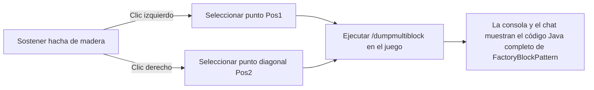

# Conjunto de herramientas KubeJS y exportador de multibloques (`/dumpmultiblock`)

GTE incorpora en los scripts de servidor KubeJS herramientas de desarrollo dedicadas a la construcción automatizada de multibloques y extracción de estructuras, liberando por completo el proceso de diseño de estructuras multibloque.

---

## 🪓 Exportador visual de multibloques (`/dumpmultiblock`)

Al desarrollar multibloques personalizados (ya sea en código Java o scripts KubeJS), escribir manualmente `FactoryBlockPattern.aisle(...)` compuesto por docenas de capas de caracteres es extremadamente lento y propenso a errores.

GTE incluye el **exportador de selección con hacha de madera `/dumpmultiblock`** (`server_scripts/easymultiblock.js`):



### Pasos de uso

1. Entra en modo creativo y sostén un **hacha de madera (`minecraft:wooden_axe`)**.
2. Construye en el mundo la estructura física completa del multibloque según tu diseño (incluyendo carcasa, compartimentos, bobinas, controlador principal).
3. Usa el hacha de madera y haz **clic izquierdo** en un bloque de la esquina inferior de la estructura (el chat mostrará `Pos1 establecido: x, y, z`).
4. Usa el hacha de madera y haz **clic derecho** en el bloque de la esquina superior diagonal de la estructura (el chat mostrará `Pos2 establecido: x, y, z`).
5. Escribe el comando en el chat:
   ```mcfunction
   /dumpmultiblock
   ```
6. El script escaneará automáticamente todos los tipos de bloques dentro del volumen delimitador tridimensional, asignará un mapeo de caracteres (`.` para aire, `A-Z/a-z/0-9` para bloques específicos) y generará el código de estructura directamente en el registro del servidor y en el cliente:

```java
// Plantilla FactoryBlockPattern exportada automáticamente
.pattern(definition -> FactoryBlockPattern.start()
    .aisle("BBB", "BBB", "BBB")
    .aisle("BBB", "BAB", "BBB")
    .aisle("BBB", "B#B", "BBB")
    .where('A', Predicates.blocks("minecraft:air"))
    .where('#', Predicates.controller(Predicates.blocks(definition.getBlock())))
    .where('B', Predicates.blocks("gtceu:steam_machine_casing").or(Predicates.autoAbilities(definition.getRecipeTypes())))
    .build()
)
```

---

## 🌌 Configuración de gases dimensionales y vetas de fluidos

GTE amplía la recolección de fluidos y gases en todas las dimensiones mediante KubeJS:

### 1. Extracción de gases en todas las dimensiones (`dimension_gas.js`)
Usando el colector de gas grande (`gas_collector`) con diferentes números de circuito, se puede extraer la atmósfera exclusiva de cada dimensión:
- **Aire del mundo principal**: `circuit(4)` ➜ Salida `gtceu:air 10000`
- **Aire infernal del Nether**: `circuit(5)` ➜ Salida `gtceu:nether_air 10000`
- **Aire del vacío del End**: `circuit(6)` ➜ Salida `gtceu:ender_air 10000`

### 2. Convertidor universal de circuitos (`universal_circuit.js`)
Para resolver la compleja acumulación de recetas entre diferentes mods y niveles de placas de circuito, GTE introduce el sistema de **circuito universal (`universal_circuit`)**:
- Permite en la empaquetadora (`packer`) convertir cualquier circuito del mismo voltaje (de ULV a MAX) a un objeto de circuito universal unificado sin pérdidas a **1 EU / 1 tick**.