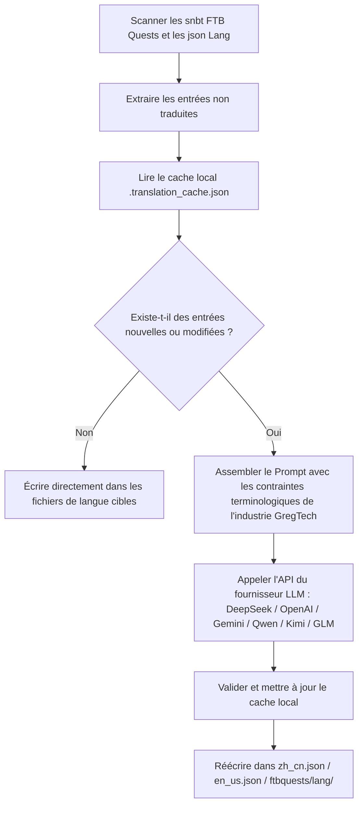

# Moteur de traduction internationalisé par IA (`opencode_translate.py`)

GTE a conçu et implémenté un système de traduction entièrement automatisé et internationalisé entre mods, basé sur des modèles de langage modernes (LLM) (situé dans `scripts/opencode_translate.py`).

---

## 🤖 Architecture du moteur de traduction

La localisation communautaire traditionnelle repose sur la maintenance manuelle de fichiers JSON et SNBT complexes, avec des mises à jour lentes et un risque élevé d'erreurs ou d'omissions.

Le moteur de traduction IA de GTE utilise une API standardisée compatible OpenAI pour réaliser l'**extraction incrémentale automatisée, l'alignement terminologique et la traduction concurrente** des fichiers de quêtes FTB Quests et des fichiers de langue des mods principaux :



---

## 🔑 Fournisseurs LLM pris en charge et variables d'environnement

Le script permet de basculer de manière transparente entre différents fournisseurs de modèles IA via des variables d'environnement :

| Nom du fournisseur | Variable d'environnement pour la clé API | Variable d'environnement pour l'URL de base | Modèle par défaut |
| :--- | :--- | :--- | :--- |
| **DeepSeek** | `DEEPSEEK_API_KEY` | `DEEPSEEK_BASE_URL` | `deepseek-chat` |
| **OpenAI** | `OPENAI_API_KEY` | `OPENAI_BASE_URL` | `gpt-4o-mini` |
| **Google Gemini** | `GEMINI_API_KEY` | `GEMINI_BASE_URL` | `gemini-3.5-flash` |
| **Qwen (DashScope)** | `DASHSCOPE_API_KEY` | `DASHSCOPE_BASE_URL` | `qwen-plus` |
| **Moonshot** | `MOONSHOT_API_KEY` | `MOONSHOT_BASE_URL` | `moonshot-v1-8k` |
| **Zhipu GLM** | `ZHIPU_API_KEY` | `ZHIPU_BASE_URL` | `glm-4-flash` |
| **Plateforme OpenCode** | `OPENCODE_API_KEY` | `OPENCODE_BASE_URL` | `deepseek-v4-flash` |
| **Proxy agrégateur générique** | `LLM_API_KEY` | `LLM_BASE_URL` | `LLM_MODEL` (personnalisé) |

---

## 🎯 Principes de contrainte du Prompt de niveau industriel

Lors de l'appel à l'API pour la traduction, le système intègre des règles strictes concernant la terminologie Minecraft et GregTech :
1. **Préservation absolue des codes de format** : Préserver intégralement les codes de couleur natifs de Minecraft (comme `§a`, `§c`, `§6`) et les espaces réservés (`%s`, `%d`, `{0}`).
2. **Normalisation de la terminologie technique** : Verrouiller strictement la traduction des noms propres techniques (tels que `UHV`, `EU/t`, `Amps`, `Voltage`, `Overclock`, `Subtick`, etc.).
3. **Cache incrémental par hachage** : Toutes les entrées traduites sont automatiquement enregistrées de manière persistante dans `.translation_cache.json`. Seuls les textes nouveaux ou modifiés déclenchent des requêtes réseau, ce qui réduit considérablement les coûts de tokens et le temps de CI.

---

## 💻 Commande d'exécution locale

Déclenchez une traduction complète en une seule commande dans votre environnement de développement local :

```powershell
# Définissez une clé API valide, puis exécutez
$env:DEEPSEEK_API_KEY="sk-..."
python scripts/opencode_translate.py
```