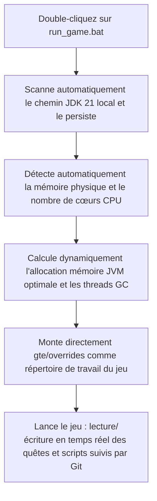

# Démarrage rapide sans lanceur et débogage à chaud local

GTE propose un système de débogage à chaud extrêmement convivial pour les concepteurs de packs, les rédacteurs de quêtes et les programmeurs de mods.

---

## ⚡ 1. Script de démarrage ultra-rapide sans lanceur (`run_game.bat` / `run_game.sh`)

Pour les auteurs de livres de quêtes (FTB Quests) et les concepteurs de recettes KubeJS, **sans ouvrir IntelliJ IDEA, ni installer de lanceur tiers**, double-cliquez simplement sur **`run_game.bat`** à la racine du projet pour entrer rapidement dans le jeu !



### Caractéristiques principales
1. **Détection entièrement automatique de JDK 21** : recherche automatiquement Java 21 dans `.jdks`, `Adoptium`, `Zulu`, `Program Files`, et mémorise automatiquement le chemin dans `.jdk_path`.
2. **Optimisation adaptative du matériel** : en fonction de la RAM totale de l'ordinateur, alloue automatiquement la taille du tas JVM selon un ratio optimal (50 % à 60 % de la mémoire physique disponible) et configure automatiquement les threads GC parallèles.
3. **Flux de travail sans déplacement** : modifiez les quêtes dans le jeu (`/ftbquests editing_mode true`) et enregistrez ; les modifications sont directement enregistrées en temps réel dans le dossier `config/ftbquests/` du dépôt Git. Ouvrez GitHub Desktop pour un commit en un clic !

---

## 🔗 2. Outil de mappage sans copie pour lanceurs externes (`link_to_launcher.bat`)

Si vous préférez utiliser un lanceur personnalisé avec vos skins et vos habitudes de touches (comme PCL2 / HMCL / Prism Launcher) :

1. Double-cliquez sur **`link_to_launcher.bat`** à la racine.
2. Suivez les instructions pour faire glisser le répertoire de jeu de votre lanceur (par exemple `D:\PCL2\.minecraft\versions\GTE-Dev\.minecraft\`) dans la console et appuyez sur Entrée.
3. Le script crée automatiquement des jonctions de répertoires Windows (Directory Junctions) :
   - `config` ➜ `gte/overrides/config`
   - `kubejs` ➜ `gte/overrides/kubejs`
   - `ftbquests` ➜ `gte/overrides/config/ftbquests`
   - `defaultconfigs` ➜ `gte/overrides/defaultconfigs`
4. Quelle que soit la modification des quêtes ou des recettes dans le lanceur, **les données physiques sont synchronisées en temps réel et enregistrées dans le dépôt Git principal** !

---

## ☕ 3. Environnement fantôme de compilation à chaud pour le code des mods (`gte-dev-runtime`)

Pour les programmeurs Java/Kotlin, `modules/gte-dev-runtime` est un module de débogage fantôme dédié :

### Principe de fonctionnement et considérations de conception
- **Positionnement** : sandbox de débogage à chaud purement local, **interdit à la publication, n'apparaîtra dans aucun artefact de joueur**.
- **Remappage dynamique ModDevGradle** : compile à chaud automatiquement les derniers codes sources de `gtm-reborn` et `gtecore` et les monte dans l'espace de noms de désobfuscation Mojang.
- **Méthode de lancement** :
  - Dans IDEA, sélectionnez la configuration d'exécution **`Run GTE Full Pack (Client - Hot Debug)`**.
  - Ou exécutez en ligne de commande :
    ```powershell
    .\gradlew.bat :modules:gte-dev-runtime:runClient
    ```