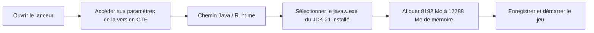

# Guide de téléchargement du pack et pack de joueur simplifié

GTE (GregTech Easy) propose trois formats de livraison prêts à l'emploi pour les joueurs et les administrateurs de serveurs de différents niveaux techniques :

1. **Pack de joueur complet sans compilation (`GTE-LazyPack-*.zip`)** : contient tous les mods précompilés, les configurations, les scripts de modification et la structure complète du répertoire `.minecraft`, **double-cliquez ou glissez-déposez dans le lanceur pour jouer**.
2. **Pack au format CurseForge (`GTE-CurseForge-*.zip`)** : format CurseForge standard, importable en un clic directement dans PCL2 / HMCL / CurseForge App / Prism Launcher.
3. **Pack serveur (`GTE-Server-*.zip`)** : contient une configuration serveur propre, les mods et les scripts de démarrage, pour ouvrir un serveur multijoueur.

---

## 🚀 Pack de joueur simplifié (recommandé)

### Caractéristiques et avantages
- **0 dépendance de compilation** : pas besoin d'installer l'environnement de compilation JDK, IntelliJ IDEA ou Git.
- **Pack complet** : les derniers JAR publiés de `gtecore`, `gtm-reborn`, `gt--` ainsi que les mods d'extension prérequis sont déjà inclus dans le répertoire `mods/`.
- **Glisser-déposer pour jouer** : prise en charge de l'importation en un clic par glisser-déposer dans PCL2 / HMCL.

### Étapes d'importation et de démarrage

=== "Méthode 1 : glisser-déposer dans le lanceur (recommandé)"

    1. Ouvrez **PCL2 (Plain Craft Launcher 2)** ou **HMCL (Hello Minecraft! Launcher)**.
    2. Glissez-déposez le fichier `GTE-LazyPack-<version>.zip` téléchargé directement dans la fenêtre principale du lanceur avec le **bouton gauche de la souris**.
    3. Le lanceur le reconnaîtra automatiquement et l'extraira dans la liste des versions du jeu.
    4. Accédez aux **paramètres de version** de cette version et définissez le runtime Java sur **Java 21**.
    5. Allouez **8 Go à 12 Go** de mémoire, puis cliquez pour démarrer le jeu !

=== "Méthode 2 : mode d'extraction manuelle"

    1. Extrayez l'archive dans un chemin sans caractères chinois ni espaces (par exemple `D:\Games\GTE\`).
    2. Après l'extraction, vous obtiendrez un répertoire `.minecraft` contenant `mods/`, `config/`, `kubejs/`.
    3. Dans le lanceur, ajoutez une version du jeu et sélectionnez le dossier `.minecraft` extrait comme répertoire racine du jeu.
    4. Assurez-vous de sélectionner le noyau **Java 21** et démarrez.

---

## ⚠️ Exigence d'environnement d'exécution Java 21 (extrêmement important)

> [!CAUTION]
> **Ce pack exige impérativement un environnement d'exécution Java 21 (JDK 21) !**
> N'utilisez surtout pas **Java 17** ou **Java 8**, sinon le jeu plantera immédiatement ou refusera de démarrer !

### Pourquoi Java 21 est-il obligatoire ?
- Les mods principaux de GTE (`gtecore`, `gtm-reborn`, `gt--`) utilisent pleinement les **fonctionnalités modernes du langage Java 21** (comme les Record Patterns, les Virtual Threads, le Switch amélioré).
- Les scripts de construction Gradle configurent globalement `JavaLanguageVersion.of(21)` pour forcer la vérification de la chaîne d'outils.

### Adresses de téléchargement recommandées pour JDK 21

| Distribution | Lien de téléchargement | Raison de la recommandation |
| :--- | :--- | :--- |
| **Azul Zulu 21 (LTS)** | [Cliquez pour aller sur le site d'Azul](https://www.azul.com/downloads/?version=java-21-lts) | Performances excellentes, optimisation idéale pour le multithreading à grande échelle de Minecraft |
| **Eclipse Temurin 21 (LTS)** | [Cliquez pour aller sur le site d'Adoptium](https://adoptium.net/temurin/releases/?version=21) | Recommandation officielle, haute compatibilité et stabilité |
| **Microsoft OpenJDK 21** | [Cliquez pour aller sur le site de Microsoft](https://learn.microsoft.com/zh-cn/java/openjdk/download) | Bonne adaptation native à la plateforme Windows |

### Configuration de Java 21 dans le lanceur

---

## 🎮 Raccourcis clavier et commandes courantes dans le jeu

| Commande / Raccourci | Description | Exigence de permission |
| :--- | :--- | :--- |
| `/ftbquests editing_mode true` | Activer le mode d'édition visuelle du livre de quêtes (mode auteur) | Permission OP |
| `/ftbquests reload` | Recharger à chaud les fichiers de configuration du livre de quêtes FTB Quests | Tout le monde |
| `/kubejs reload server_scripts` | Recharger à chaud les scripts de modification côté serveur et les recettes | Permission OP |
| `/kubejs reload client_scripts` | Recharger à chaud les scripts de modification côté client et la logique d'affichage | Aucune permission requise |
| `/dumpmultiblock` | Exporter en un clic le code de structure multi-bloc après avoir sélectionné une zone avec la hache en bois | Permission OP |
| <kbd>U</kbd> / <kbd>R</kbd> | Afficher l'utilisation (Usage) / la recette (Recipe) de l'élément sous le curseur | Raccourcis EMI / JEI |
| <kbd>F7</kbd> | Afficher le niveau de lumière environnant (croix rouge indiquant les zones d'apparition des monstres) | Raccourci client |