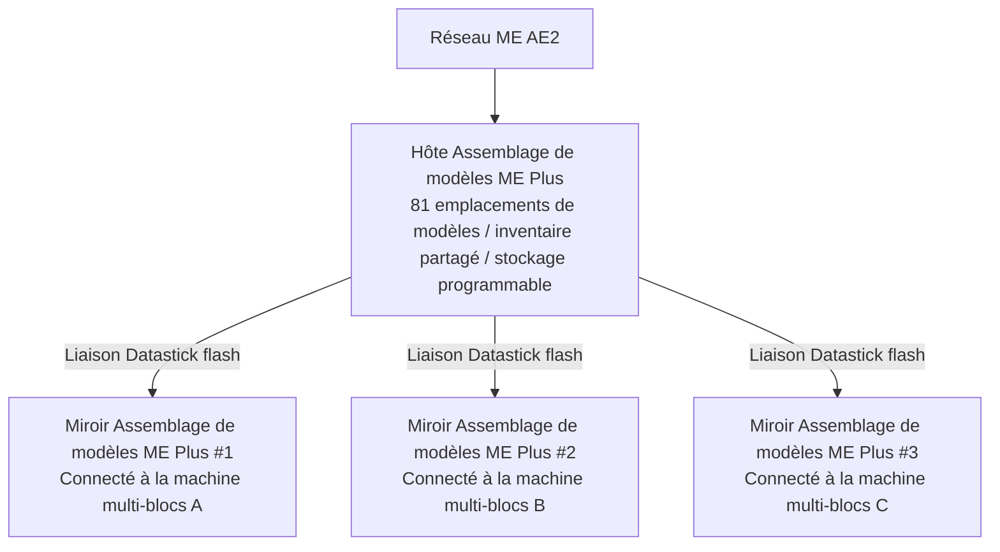

# Système d'intégration approfondie AE2 et d'assemblage de modèles Plus

GTECore établit un pont de données direct extrêmement puissant entre Applied Energistics 2 (AE2) et les structures multi-blocs de GregTech.

---

## 🧩 Assemblage de modèles ME Plus (`me_pattern_buffer_plus`)

Dans les mods technologiques traditionnels, connecter un fournisseur de modèles AE2 à une machine multi-blocs pose souvent des problèmes de **manque d'emplacements, d'impossibilité de mélanger fluides et objets en sortie, et de difficulté à partager les modèles entre plusieurs machines**.

GTECore a développé l'**Assemblage de modèles ME Plus** pour résoudre complètement ce problème :

### Caractéristiques principales
1. **Capacité de modèles massive** : Un seul hôte d'assemblage possède **81 emplacements de modèles** (équivalent à la somme de 9 fournisseurs de modèles AE2 standard).
2. **Capacité de compartiment universel** : Dispose simultanément des capacités `IMPORT_ITEMS`, `IMPORT_FLUIDS`, `EXPORT_ITEMS`, `EXPORT_FLUIDS`, permettant une interaction mixte fluides et objets dans le même compartiment.
3. **Support du stockage programmable** : Intègre le mécanisme de stockage programmable en interne, prenant en charge l'alimentation précise et la mise en cache pour les recettes complexes.

---

## 🪞 Miroir Assemblage de modèles ME Plus (`me_pattern_buffer_proxy_plus`)

Le **Miroir Assemblage de modèles ME Plus** est un composant structurel d'automatisation distribuée révolutionnaire :

### Principe de fonctionnement et partage entre machines
- Installez le miroir d'assemblage à l'emplacement de compartiment de n'importe quelle machine multi-blocs.
- Tenez un **Datastick (flash)** en main, faites un clic droit sur l'**Assemblage de modèles ME Plus** principal pour lire les coordonnées, puis faites un clic droit sur le **Miroir Assemblage de modèles ME Plus** pour le lier.
- **Tous les miroirs liés partageront en temps réel les 81 modèles placés dans l'assemblage principal** !
- Lorsque le réseau AE2 lance une tâche d'automatisation de synthèse, le réseau équilibre automatiquement la charge et répartit les tâches entre toutes les machines miroirs inactives pour un fonctionnement parallèle !

### Affichage d'état en survol Jade
En pointant sur l'assemblage de modèles ou le miroir, Jade affiche automatiquement :
- Assemblage principal : `Nombre de miroirs connectés : X`
- Composant miroir : `Lié à - X : ..., Y : ..., Z : ...`

---

## 💨 Compartiment vapeur ME (`me_steam_hatch`)

- **Fonction** : Connecte directement le réseau de fluides AE2 aux structures multi-blocs à vapeur.
- **Rôle** : Les structures multi-blocs à vapeur n'ont plus besoin de tuyaux et réservoirs à vapeur haute vitesse complexes externes ; elles peuvent extraire instantanément la vapeur du réseau ME avec un débit maximal pour l'alimentation, éliminant ainsi les goulots d'étranglement de transmission par tuyaux.