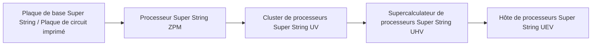
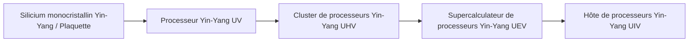

# Système de circuits avancés et de matériaux Super String et Yin-Yang

GTECore étend deux branches de circuits avancés couvrant tout le cycle de ZPM à MAX — **Système de circuits Super String** et **Système de circuits Yin-Yang Taiji**, accompagnés d'un centre de traitement intégré des minerais pour un cycle automatisé des matériaux.

---

## 🌌 Système de circuits Super String (Super String Circuitry)

Les circuits Super String obtiennent une puissance de calcul supraluminique à partir de cordes vibrantes de haute dimension, couvrant principalement le gradient de tension **ZPM ➜ UEV** :

### Matériaux Super String et substances de cordes
- **Corde d'origine (`item.gtecore.original_string`)** : Source vibrante de l'univers de haute dimension.
- **Cordes α / β / γ (`alpha_string`, `beta_string`, `gamma_string`)** : Polymères de super cordes à différents niveaux d'énergie et états de polarisation.
- **Mélangeur de super cordes (`super_string_mixer`)**、**Corde de création (`string_of_creation`)** et **Réseau d'oscillation de super cordes (`super_string_oscillator_array`)** : Utilisés pour la division, l'accord et la solidification avancée des substances de super cordes.

---

## ☯️ Système de circuits Yin-Yang Taiji (Yin-Yang Circuitry)

Le système de circuits Yin-Yang suit la philosophie cyclique de **« Yin engendre Yang, Yang engendre Yin, sans fin »**, couvrant **UV ➜ UIV** et au-delà :

### Symboles spéciaux des Huit Trigrammes et des Cinq Éléments
- **Cinq Éléments** : Élément Métal (`jinyuansu`), Élément Bois (`muyuansu`), Élément Eau (`shuiyuansu`), Élément Feu (`huo`), Élément Terre (`tuyuansu`).
- **Talismans des Cinq Éléments** : Talisman du Métal, Talisman du Bois, Talisman de l'Eau, Talisman du Feu, Talisman de la Terre.
- **Symboles des Huit Trigrammes et puces** : Pierres de symboles et puces centrales des huit trigrammes Qian, Kun, Zhen, Xun, Kan, Li, Gen, Dui.
- **Pépite des Trois Purs (`god_nugget`)** : Support de synthèse de premier ordre condensant l'énergie du ciel et de la terre.

---

## 💎 Modes de recette du centre de traitement intégré des minerais

**Centre de traitement intégré des minerais (`ore_process_center`)** dispose de 7 modes de circuits standardisés, commutables en réglant le numéro de circuit programmé dans la machine :

| Numéro de circuit | Processus | Types de minerais applicables et caractéristiques des produits | Multiplicateur de rendement |
| :---: | :--- | :--- | :---: |
| **Circuit 1** | Concassage ➜ Concassage ➜ Lavage | Production rapide de minerais métalliques de base (fer, cuivre, étain, etc.) | 5x produit principal + sous-produits |
| **Circuit 2** | Concassage ➜ Concassage ➜ Centrifugation | Minerais de métaux légers rares de haute valeur associés | 5x produit principal + sous-produits centrifugés purs |
| **Circuit 3** | Concassage ➜ Lavage ➜ Séparation thermique ➜ Concassage | Minerais réfractaires à haute température, minerais de métaux précieux (platine, or, argent, etc.) | 5-6x + poudre de métal pur |
| **Circuit 4** | Concassage ➜ Séparation thermique ➜ Concassage | Sulfures et minerais complexes fortement disséminés | 5x + sous-produits de séparation thermique spéciaux |
| **Circuit 5** | Concassage ➜ Lavage ➜ Concassage ➜ Lavage | Minerais de terres rares et minerais de sels solubles en plusieurs étapes | 6x + sous-produits de double lavage |
| **Circuit 6** | Concassage ➜ Lavage ➜ Concassage ➜ Centrifugation | Minerais lourds radioactifs (uranium, thorium, plutonium) et terres rares | 6x + métaux lourds centrifugés fins |
| **Circuit 8** | Concassage ➜ Lavage ➜ Concassage ➜ Séparation électromagnétique | Minéraux ferromagnétiques et paramagnétiques (magnétite, chrome, titane, etc.) | 6-8x + poudre pure électromagnétique |