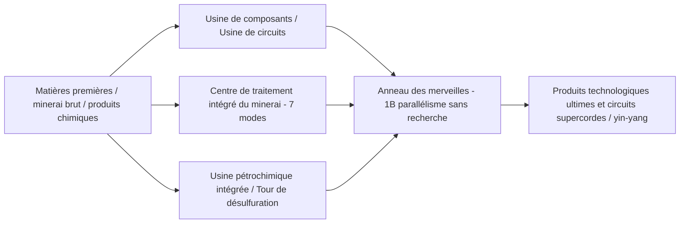

# GTECore 图鉴 des machines multi-blocs

GTECore  propose une vaste gamme de machines multi-blocs combinant **capacités de parallélisme ultra-élevées** et **logique de production agrégée**, conçues pour résoudre les problèmes de chaînes de production complexes en milieu et fin de parcours technologique.

---

## 🏭  Grands multi-blocs de l'ère de la vapeur

Pour remédier aux problèmes de faible productivité et d'encombrement des machines individuelles à l'ère de la vapeur, GTECore introduit une série de grands multi-blocs à vapeur, tous supportant le parallélisme inter-recettes et un débit de vapeur élevé :

| Nom de la machine (ID de bloc) | Fonction principale et type de recette | Caractéristiques et avantages |
| :--- | :--- | :--- |
| **Grand four à alliages à vapeur** (`gtceu:big_alloy`) | Fusion d'alliages (`alloy_smelter`) | Production d'alliages à haut rendement en début de jeu, supporte la vapeur haute pression |
| **Grand compresseur à vapeur** (`gtceu:big_compressor`) | Compression (`compressor`) | Pressage en masse de plaques et blocs métalliques denses |
| **Grand marteau-pilon à vapeur** (`gtceu:big_forge_hammer`) | Martelage / concassage en poudre / plaques (`forge_hammer`) | Automatisation rapide du concassage des plaques et du minerai brut |
| **Grand extracteur à vapeur** (`gtceu:big_steam_extractor`) | Extraction de caoutchouc / fluides (`extractor`) | Extraction à grande échelle de gomme et de fluides industriels |
| **Broyeur à vapeur simple** (`gtceu:steam_grinder_easy`) | Broyage de minerai (`macerator`) | Traitement multiple des minerais en début de jeu |
| **Four de fusion à vapeur simple** (`gtceu:steam_oven_easy`) | Fusion par pyrolyse (`pyrochlore_oven`) | Production industrielle en masse de coke et de charbon de bois |
| **Usine de traitement des minerais à vapeur** (`gtecore:steam_op`) | Concassage et raffinage complets du minerai | **Parallélisme de 1 milliard (1B)** , toutes les recettes exécutées en **1 tick** ! Supporte n'importe quel compartiment d'entrée/sortie |

---

## ⚡  Multi-blocs industriels électriques super

À l'ère de l'électricité, GTECore propose des centres de traitement intégrés et avancés :

### 1. Usines de production principales

- **§6Usine de composants (`gtceu:component_factory`)** :
  - **Rôle** : Production en une étape de moteurs, pompes, pistons, bras mécaniques, courroies transporteuses, diodes électroluminescentes et autres composants de base courants.
  - **Caractéristiques** : Élimine les sous-étapes intermédiaires fastidieuses, produit rapidement des pièces industrielles standard du niveau de tension spécifié.
- **§6Usine de circuits (`gtceu:circuit_factory`)** :
  - **Rôle** : Intègre la fabrication de substrats de circuits intégrés, la gravure de puces et l'encapsulation.
  - **Caractéristiques** : Supporte le parallélisme inter-recettes, accélère globalement la production de circuits de ULV à MAX sur toute la gamme de tensions.
- **§6Anneau des merveilles (`gtceu:miracle_ring`)** :
  - **Rôle** : Installation d'assemblage final des merveilles industrielles.
  - **Caractéristiques** : Possède un **parallélisme de 1 milliard (1B)** et un **overclocking Subtick 1t**, **aucune recherche / étude de ligne d'assemblage requise** pour exécuter directement les recettes de ligne d'assemblage !
- **Terminateur chimique (`gtecore:chemistry_terminator`)** :
  - **Rôle** : « Bouleverse l'existence de la chimie et de la physique, représente la fin de la chimie ».
  - **Caractéristiques** : Agrège en une seule étape les chaînes de réactions chimiques complexes de plusieurs dizaines d'étapes, synthétise rapidement les polymères ultimes et les milieux acides.
- **Usine de traitement universelle dix-en-un (`gtecore:ten_in_one`)** :
  - **Rôle** : Boîte intégrée universelle fusionnant 10 processus de base : centrifugation, électrolyse, lixiviation chimique, polymérisation, réaction à haute pression, etc.

### 2. Système de raffinage du minerai et des fluides

- **§6Centre de traitement intégré du minerai (`gtecore:ore_process_center`)** :
  - Supporte **7 modes de circuit programmables**, permettant un raffinage du minerai de 5 à 8 fois selon différents produits (concassage, lavage, séparation thermique, centrifugation, séparation électromagnétique entièrement intégrés), avec overclocking Subtick 1t.
- **Usine pétrochimique intégrée (`gtecore:integrated_petrochemical_plant`)** :
  - Intègre toute la chaîne de distillation du pétrole brut, craquage catalytique, reformage et désulfuration, produisant en une seule machine tous les hydrocarbures légers gazeux et les hydrocarbures aromatiques.
- **Tour de désulfuration (`gtceu:desulfurization`)** :
  - Purifie rapidement divers fiouls lourds soufrés, récupère du soufre en poudre de haute pureté comme sous-produit.
- **Foreuse de fluides simple / avancée (`gtecore:easy_fluid_drilling_rig` / `not_hard_fluid_drilling_rig`)** :
  - Extrait automatiquement les veines de fluides du substratum rocheux, inépuisables, sans nécessiter d'exploration complexe de pipelines.

### 3. Traitement haut de gamme et câbles supraconducteurs

- **§6Usine de fils (`gtecore:wiremill_factory`)** : Produit en une seule étape tous les fils métalliques simples, doubles, quadruples, octuples, seize brins et câbles supraconducteurs.
- **§6Centre de cristaux (`gtecore:crystal_center`)** : Culture automatisée à grande échelle de colonnes de silicium monocristallin, émeraudes, saphirs, cristaux de sextil chargés.
- **§6Assembleur de câbles quantiques (`gtecore:quantum_cable_assembler`)** : Spécialisé dans la fabrication à haute vitesse de fibres optiques quantiques et de câbles de transmission d'énergie hyperdimensionnels.
- **§3Machine de gravure Lame d'étoile (`gtecore:starblade_etching_machine`)** : Utilise des faisceaux d'énergie élevée dans la gamme EUV / rayons X pour graver des puces nanométriques à l'échelle galactique.

---

## 🔋  Systèmes d'énergie et de générateurs

| Nom de la machine | Sortie d'énergie / niveau | Mécanisme et caractéristiques principaux |
| :--- | :--- | :--- |
| **§6Moteur à carburant universel** (`gtceu:general_fuel_engine`) | Adaptatif dynamique (MAX maximum) | **Supporte tous les types de carburant du monde** (diesel, biomasse, gaz naturel, carburant de fusée, etc.), possède un **parallélisme de 2 milliards (2B)** , libère une énergie colossale en un instant ! |
| **Grand générateur universel** (`gtecore:large_general_generator`) | Tensions multiples sélectionnables | Compatible avec les rotors de générateurs à gaz, vapeur et plasma conventionnels |
| **Super réacteur à fusion** (`gtecore:super_fusion_reactor`) | Sortie de plasma de fusion | Élimine complètement le long temps de chauffe des fusions ordinaires, **supporte parfaitement l'overclocking Subtick 1T**, produit instantanément des produits de fusion à haute température |
| **Super bloc-batterie à tension maximale** (`gtecore:max_super_battery_buffer_1x`) | **MAX (2 147 483 647 V)** | Contient une énorme réserve d'EU, supporte une interface de charge sans fil interdimensionnelle sans perte |