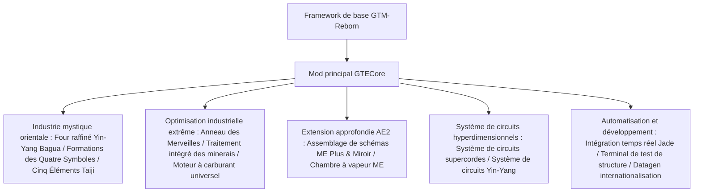

# Aperçu du mod principal GTECore

**GTECore** est le mod principal Java personnalisé du projet GregTech Easy. Il dépend directement du code source de `gtm-reborn` et étend les structures industrielles multi-blocs à grande échelle, les technologies de formations avancées, les interactions profondes avec AE2 ainsi que le système de fabrication de circuits suprêmes.

---

## 🏛️ Architecture du mod et positionnement de conception

---

## 📦 Onglets d'inventaire en mode créatif et classification

GTECore enregistre des onglets de mode créatif indépendants dans le jeu :

1. **Machines GregTech Easy (`itemGroup.gtecore.gtecore_machines`)** :
   - Contient tous les blocs principaux multi-blocs originaux de GTE (Haut fourneau Yin-Yang Bagua, Anneau des Merveilles, Centre de traitement des minerais, Terminateur chimique, etc.).
   - Contient les batteries super tampons multi-niveaux (Max Super Battery Buffer), les chambres à vapeur ME, les assemblages de schémas ME Plus et Miroir.
2. **Objets GregTech Easy (`itemGroup.gtecore.gtecore_items`)** :
   - Contient les objets des séries de circuits supercordes et Yin-Yang (processeurs, clusters, supercalculateurs, hôtes).
   - Contient les talismans des Cinq Éléments, les puces Bagua, les particules des Trois Purs, le terminal de test de structure et autres objets spéciaux.

---

## ⚙️ Configuration globale du mod (`GTEConfig`)

GTECore fournit de nombreuses options de configuration en jeu et dans les fichiers (situées dans `config/gtecore-common.toml` ou via le menu de configuration en jeu) :

| Option de configuration | Valeur par défaut | Description détaillée |
| :--- | :--- | :--- |
| `superPeace` (Mode super paix) | `false` | Une fois activé, désactive complètement l'apparition de créatures hostiles nuisibles, offrant un environnement absolument pur pour la construction technologique |
| `durationMultiplier` (Multiplicateur de durée des recettes) | `1.0` | Ajuste globalement le multiplicateur de temps des recettes personnalisées de GTECore |

---

## 🔍 Intégration native Jade / TOP

GTECore intègre le plugin **`GTEJadePlugin`** :
- **État de l'assemblage de schémas ME Plus** : affiche en temps réel le nombre de schémas liés à l'assemblage actuel, ainsi que les modes de sortie des fluides et des objets.
- **Informations de liaison de l'assemblage de schémas ME Miroir Plus** : affiche directement en survol les coordonnées `(X, Y, Z)` de l'assemblage principal lié et l'état de connectivité du réseau.
- **Indicateur d'activation des formations** : affiche en temps réel sur le Four raffiné Yin-Yang Bagua l'état de préparation des formations des Quatre Symboles : Dragon Vert, Tigre Blanc, Oiseau Vermillon et Tortue Noire.

---

## 🛠️ Terminal de test de structure (`Structure Testing Terminal`)

GTECore fournit un outil portable dédié — le **terminal de test de structure** (`item.gtecore.check_structure_terminal`) :
- **Clic droit sur le contrôleur multi-blocs** : scanne en temps réel l'intégrité de la structure.
- **Messages de diagnostic d'erreur** : si la structure n'est pas formée, le terminal indique précisément dans le chat et l'infobulle les **coordonnées des blocs erronés et les emplacements qui ne devraient pas être occupés**, accélérant considérablement la construction et le débogage des grandes structures multi-blocs.