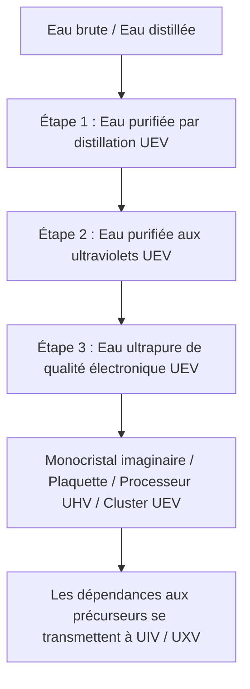

# Purification de l'eau en trois étapes et circuit d'eau industriel

Dans GTECore, **l'ensemble du système de purification de l'eau en trois étapes relève du palier UEV**. Ces étapes correspondent à des traitements successifs et à des qualités d'eau, pas à des époques électriques distinctes. La centrale, les trois unités de purification et leurs trappes de contrôle utilisent des composants, des circuits et une tension d'assemblage UEV. Les trois traitements et la régénération EDI fonctionnent en UEV.

La chaîne comprend **une centrale et trois unités de purification**. Les unités n'ont pas de trappes d'énergie : reliez-les à la centrale avec une clé de données pour recevoir leur alimentation et une limite de recettes parallèles.

## 💧 Caractéristiques des trois qualités d'eau

| Fluide enregistré | Nom du matériau | Palier technologique |
| :--- | :--- | :---: |
| `distilled_purified_water` | Eau purifiée par distillation | UEV |
| `uv_purified_water` | Eau purifiée aux ultraviolets | UEV |
| `ultrapure_water` | Eau ultrapure de qualité électronique | UEV |

Les descriptions de la qualité des eaux industrielles fournissent un contexte ; le fonctionnement réel en jeu dépend des recettes, de la stabilité thermique, de la dose UV et de la charge EDI.

## 🏭 Quatre machines multiblocs

| Machine | Identifiant de registre | Palier technologique |
| :--- | :--- | :---: |
| Centrale de purification de l'eau | `central_water_purification_plant` | UEV |
| Unité de clarification et de purification de niveau 1 | `t1_clarifier_purification_unit` | UEV |
| Unité de purification par oxydation UV de niveau 2 | `t2_uv_oxidation_purification_unit` | UEV |
| Unité de purification ultrapure par EDI de niveau 3 | `t3_edi_ultrapure_purification_unit` | UEV |

L'ancienne `ultrapure_water_refinery` reste enregistrée pour assurer la compatibilité, mais elle est désactivée. Elle ne peut plus exécuter toute la chaîne de purification ; passez à la centrale et aux trois unités.

### 1. Centrale de purification de l'eau

La centrale n'exécute pas de recettes de purification. Elle mémorise les connexions, distribue l'énergie aux unités reliées dont la structure est complète, affiche la puissance réellement fournie en EU/s et transmet la limite de recettes parallèles configurée. Une unité ne peut pas fonctionner sans une centrale reliée dont la structure est complète.

### 2. Niveau 1 : clarification et traitement thermique (UEV)

La première étape sépare les impuretés de l'eau entrante. Les valeurs nominales des recettes sont les suivantes :

- Eau 1000 mB + Floculant composite 50 mB + 1 Microsphère de carbone modifiée → Eau purifiée par distillation 900 mB / 60 ticks, avec des chances de produire des poudres de sel et de terres rares.
- Eau distillée 1000 mB + Floculant composite 25 mB + 1 Microsphère de carbone modifiée → Eau purifiée par distillation 1000 mB / 30 ticks, avec une chance de produire de la poudre de sel.

La quantité d'eau réellement produite dépend aussi de la stabilité thermique. Cette étape constitue l'entrée de la chaîne de purification UEV.

### 3. Niveau 2 : oxydation par ultraviolet profond (UEV)

Le rayonnement UV et les oxydants décomposent les impuretés organiques. Les valeurs nominales des recettes sont les suivantes :

- Eau purifiée par distillation 800 mB + Ozone 50 mB → Eau purifiée aux ultraviolets 800 mB + Oxygène 25 mB / 40 ticks.
- Eau purifiée par distillation 800 mB + Peroxyde d'hydrogène 50 mB → Eau purifiée aux ultraviolets 800 mB + Oxygène 25 mB / 20 ticks.

Les deux procédés doivent également atteindre la dose UV requise avant de se terminer.

### 4. Niveau 3 : électrodéionisation et purification finale (UEV)

L'étape EDI élimine les ions résiduels. En jeu, elle nécessite un réactif et de la résine, avec une recette de régénération distincte pour supprimer la charge ionique accumulée :

- Eau purifiée aux ultraviolets 800 mB + Réactif acido-basique de qualité électronique 20 mB + 1 Bille de résine à lit mélangé → Eau ultrapure de qualité électronique 800 mB / 30 ticks.
- Régénération EDI : Eau purifiée aux ultraviolets 100 mB + Réactif acido-basique de qualité électronique 1 mB / 2 ticks. Elle supprime la charge ionique sans produire d'eau.

## 🔌 Relier et exploiter la chaîne

1. Faites un clic droit sur la centrale en vous accroupissant, avec une clé de données GT, pour copier ses coordonnées.
2. Faites un clic droit sur une unité de purification avec cette clé pour la relier. L'ordre inverse fonctionne aussi : copiez les coordonnées de l'unité, puis faites un clic droit sur la centrale.
3. Alimentez la centrale par des trappes d'énergie (1–4 ; l'entrée laser est prise en charge). La centrale transmet l'énergie aux unités reliées.
4. Réglez la limite de recettes parallèles dans l'interface de la centrale, entre 1 et 65536.
5. Vérifiez dans l'interface de chaque unité les coordonnées de la centrale reliée, la limite de recettes parallèles et le tampon énergétique interne.

Chaque unité consomme la puissance de la recette multipliée par le nombre réel de recettes exécutées en parallèle. Les trois unités ont le même plafond de puissance : `tension UEV × 256 A`. Les étapes 1, 2 et 3 désignent des traitements, pas des tensions de fonctionnement ou des paliers de déblocage distincts. Le parallélisme réel dépend également des ingrédients disponibles et de la capacité de sortie : augmenter uniquement la limite centrale ne garantit donc pas un meilleur débit.

## 🔄 Production imaginaire et ordre de démarrage

Les recettes suivantes de l'Arbre de l'imaginaire consomment directement de l'`ultrapure_water` de troisième étape. Les quantités sont indiquées par lot :

| Produit | Production par lot | Eau de qualité électronique |
| :--- | ---: | ---: |
| Monocristal imaginaire | 4 | 4000 mB |
| Plaquette imaginaire ordinaire | 16 | 1000 mB |
| Processeur imaginaire UHV | 4 | 1000 mB |
| Cluster de processeurs imaginaires UEV | 2 | 2000 mB |

Le supercalculateur imaginaire UIV et l'hôte imaginaire UXV ne consomment directement aucune eau supplémentaire. Ils héritent de cette dépendance par les clusters et ordinateurs nécessaires à leur fabrication. Le palier de circuit d'un produit et la tension de sa recette ne changent pas le déblocage du système de purification au palier UEV.

L'ordre de démarrage est **composants UHV + production Yin-Yang → huit composants UEV → équipements de purification UEV → eau de troisième étape de qualité électronique → principaux produits imaginaires**. Le modpack ajoute les recettes des huit composants UEV. Les recettes Yin-Yang et celles de ces composants ne nécessitent pas directement d'eau de qualité électronique, ce qui évite une dépendance circulaire où les équipements de purification auraient besoin de leur propre production pour être construits.

Les matériaux de construction imaginaires, la voie vers le premier arbre et la production de monocristaux et de plaquettes ordinaires forment une chaîne complète ; voir [Matériaux imaginaires et premier arbre](circuits-and-materials.md). Le Noyau du Tao du soleil rouge consomme 4000 mB d'eau de qualité électronique par lot de 32 milieux de croissance. Les matrices de feuilles restent des blocs de structure, tandis que la production de monocristaux consomme continuellement du milieu de croissance.

Le **Centre imaginaire de lithographie par immersion** consomme de l'eau de troisième étape de qualité électronique pour traiter les plaquettes imaginaires ordinaires avec ses recettes dédiées. Les plaquettes CPU, les puces brutes, les puces gravées, les puces de circuit et les puces CPU disposent désormais de chaînes de production complètes, toutes en UEV. Leur consommation directe d'eau par lot est respectivement de **2000, 1000, 500, 1000 et 500 mB**. L'exposition et la gravure utilisent une lentille de verre Yin-Yang réutilisable, qui n'est pas consommée. Consultez le [Centre imaginaire de lithographie par immersion](circuits-and-materials.md) pour les deux branches et les quantités complètes d'ingrédients. Son contrôleur peut être construit avec des circuits Yin-Yang UIV et des plaquettes imaginaires ordinaires, sans nécessiter les puces qu'il produit lui-même.

### Fabrique de circuits imaginaires

La [Fabrique de circuits imaginaires](circuits-and-materials.md) démarre avec des puces CPU et des puces de circuit provenant du centre de lithographie, des circuits UIV de la génération précédente et des composants UEV. Elle n'a pas besoin de ses propres plaques ou SoC pour être construite. Les trois procédés utilisent UEV :

| Produit du procédé | Production par lot | Consommation directe d'eau de qualité électronique | Durée de base |
| :--- | ---: | ---: | ---: |
| Plaque de base de circuit de l'Arbre imaginaire | 4 | 2000 mB | 30 s |
| Plaque de circuit imprimé de l'Arbre imaginaire | 1 | 1000 mB | 20 s |
| SoC de l'Arbre imaginaire | 2 | 2000 mB | 30 s |

La chaîne de recettes relie désormais les plaques de base, les plaques de circuit imprimé, les SoC et les quatre paliers de circuits finis. L'Arbre de l'imaginaire produit toujours les quatre circuits finis à une **tension de fabrication UEV**, à raison de **4 / 2 / 1 / 1** par lot. Leurs **étiquettes de circuit UHV / UEV / UIV / UXV** restent inchangées. UIV et UXV héritent de la consommation d'eau par leurs produits intermédiaires.

Le recyclage de l'eau vers une qualité inférieure dans la Machine de gravure à lame stellaire et l'Usine de circuits, les gains supplémentaires de traitement des minerais et un circuit récupérant 90% de l'eau restent des propositions non implémentées, et non des fonctionnalités disponibles.
