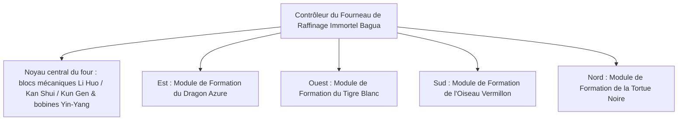

# Système de Fourneau de Raffinage Immortel Yin-Yang et de Formation des Quatre Symboles

GTECore a créé de manière originale un **« Système de Taiji, Bagua et des Quatre Symboles »** combinant la philosophie taoïste orientale et l'ingénierie industrielle moderne. Ce système constitue le cœur central de la métallurgie, de la synthèse de matériaux supraconducteurs et du saut technologique de la voie immortelle en milieu et fin de jeu.

---

## 🌌 Fourneau de Raffinage Immortel Yin-Yang Bagua (`yin_yang_eight_trigmas_blast_furnace`)

**Le Fourneau de Raffinage Immortel Bagua Ziwei** est l'une des structures multi-blocs les plus vastes et les plus précises de la scène des mods technologiques (occupant plus de 55×55 blocs) :



### 🧭 Règle d'orientation Feng Shui (mécanisme clé)
> [!IMPORTANT]
> **Loi de l'orientation Feng Shui** : En raison des contraintes du Feng Shui et du champ magnétique, **le contrôleur principal du four de raffinage doit être placé face au sud** pour s'harmoniser avec le souffle Yin-Yang du ciel et de la terre et se former et fonctionner correctement !

### Capacités de base du four
- **Bibliothèque de recettes prise en charge** : Compatible nativement avec les recettes de haut fourneau standard (`blast_recipes`), les recettes de four (`furnace_recipes`), les recettes de fusion d'alliages (`alloy_smelter_recipes`), les recettes de haut fourneau géant d'alliage GCYM (`alloy_blast_recipes`) ainsi que les recettes exclusives **Yin-Yang Bagua (`yin_yang_eight_trigmas_blast`)**.
- **Caractéristique de surcadençage** : Prend parfaitement en charge le **surcadençage instantané 1T Subtick** et le **mode de traitement par lots (Batch Mode)**.

---

## 🐉 Sous-modules de Formation des Quatre Symboles et détection dynamique des conditions

Autour du four de raffinage, on peut étendre respectivement les quatre ailes de formation : **Dragon Azure à l'Est, Tigre Blanc à l'Ouest, Oiseau Vermillon au Sud, Tortue Noire au Nord** :

| Module de formation | Orientation de la formation | Bloc de formation | Condition de recette (`RecipeCondition`) | Bonus et effets une fois activés |
| :--- | :--- | :--- | :--- | :--- |
| **Formation du Dragon Azure** (`Qing Long`) | **Est (East)** | `qinglong_module` | `QING_LONG_CONDITION` | Active la tendance du bois générant le feu, réduit considérablement la consommation d'énergie pour la fusion à ultra-haute température, débloque des recettes de catalyse avancées de régénération continue |
| **Formation du Tigre Blanc** (`Bai Hu`) | **Ouest (West)** | `baihu_module` | `BAI_HU_CONDITION` | Le métal maléfique domine la destruction, débloque des recettes de métal divin à haute dureté, de fission d'éléments à noyau super-dense et de transmutation de métaux quantiques |
| **Formation de l'Oiseau Vermillon** (`Zhu Que`) | **Sud (South)** | `zhuque_module` | `ZHU_QUE_CONDITION` | Feu de l'éclat du sud, fournit une température de four maximale sans limite, débloque la fusion plasma stellaire et les recettes de raffinage de pilules divines |
| **Formation de la Tortue Noire** (`Xuan Wu`) | **Nord (North)** | `xuanwu_module` | `XUAN_WU_CONDITION` | L'eau de Kan garde, refroidit extrêmement rapidement les produits à ultra-haute température, débloque des recettes de solidification instantanée et de stabilisation de l'antimatière |

### Détection dynamique et retour d'état
- Le contrôleur, à chaque analyse de la structure et correspondance des recettes, appelle automatiquement `checkModule()` pour calculer si les blocs de formation aux coordonnées décalées des quatre directions sont prêts.
- En utilisant **Jade** pour viser le contrôleur, on peut visualiser directement l'état d'activation des quatre formations (vert pour activé, rouge pour non prêt).

---

## 🔮 Noyaux dérivés de la Voie et Matrice des Étoiles

Sur la base du four de raffinage Bagua, GTECore étend davantage une série de multi-blocs de la Voie Céleste Stellaire :

```
Groupe industriel avancé GTE
├── Matrice de Séparation des Cinq Éléments Taiji (Tai Chi Five Elements Separation Array)
├── Pivot Stellaire Kun Gen (Kun Gen Star Hub)
├── Moteur Qian Qiong (Qian Qiong Engine)
├── Noyau de la Voie du Soleil Rouge (Red Sun Tao Core)
└── Matrice de Fusion de l'Étoile Cendrée (Ashing Star Fusion Array)
```

1. **Matrice de Séparation des Cinq Éléments Taiji (`taichi_five_elements_separation_array`)** :
   - Sépare et analyse tout minerai et substance chimique, réel ou fantastique, en éléments fondamentaux purs des **Cinq Éléments : Métal, Bois, Eau, Feu, Terre**.
2. **Pivot Stellaire Kun Gen (`kun_gen_star_hub`)** :
   - Connecte les ondes gravitationnelles de la terre et des étoiles, utilisé pour concentrer les gravitons microscopiques et construire des micro-trous noirs.
3. **Moteur Qian Qiong (`qian_qiong_engine`)** :
   - Moteur d'extraction d'énergie du vide, extrait une énergie du vide immense et illimitée des fluctuations quantiques du néant.
4. **Noyau de la Voie du Soleil Rouge (`red_sun_tao_core`)** :
   - Noyau stellaire artificiel ultra-miniature, simulant les conditions physiques extrêmes de la couronne solaire à des billions de degrés.
5. **Matrice de Fusion de l'Étoile Cendrée (`ashing_star_fusion_array`)** :
   - Matrice de fusion d'annihilation des vestiges de supernova, utilisée pour reconstruire l'équilibre de la matière noire et de l'antimatière.