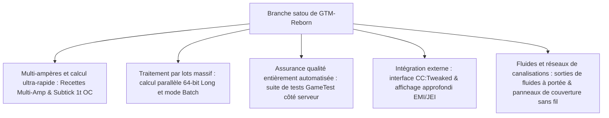

# GregTech Modern Reborn (GTM Reborn)

`modules/gtm-reborn` est une branche indépendante de GregTech Modern profondément personnalisée par GTE-Multi (nom de branche `satou`).

---

## 🚀 Caractéristiques clés de la branche `satou`

Par rapport à la version originale en amont, GTM-Reborn a réalisé plusieurs évolutions technologiques révolutionnaires et améliorations de l'expérience industrielle sur Minecraft 1.20.1 moderne :



### 1. Parallélisme 64 bits et mode de traitement par lots (Batch Mode)
- **Dépassement de la limite des entiers 32 bits** : le calcul parallèle utilise entièrement le type de données `long`, résolvant complètement les problèmes de débordement ou de troncature numérique dans les très grandes installations industrielles à très haut parallélisme.
- **Mode de traitement par lots intelligent** : lorsque les matières premières sont extrêmement abondantes, la machine peut regrouper des centaines, voire des milliers de micro-recettes en un seul cycle, réduisant considérablement la charge de ticks du serveur.

### 2. Overclocking instantané 1T Subtick (OC_PERFECT_SUBTICK)
- Optimise le pipeline d'exécution de la logique de recette des machines, permettant à certaines machines avancées d'effectuer plusieurs itérations de recettes en un seul tick, libérant ainsi les limites pures de la production industrielle.

### 3. Prise en charge des entrées et recettes multi-ampères (Multi-Amp)
- Les recettes de machines prennent en charge la consommation/la sortie de plusieurs ampères (Amperes) par recette, et l'interface EMI/JEI affiche de manière intuitive les valeurs multi-ampères et les indications de spécifications de câbles.

### 4. Sorties de fluides à portée (Ranged Fluid Outputs)
- Permet aux colonnes de distillation avancées et aux réacteurs chimiques de produire des fluides avec des plages de variation en fonction des conditions de température et de pression.

### 5. Intégration moderne des périphériques CC:Tweaked (ComputerCraft)
- Toutes les machines standard exposent une interface périphérique à ComputerCraft :
  - Interroger en temps réel la progression des recettes, le temps restant, la consommation EU/t actuelle.
  - Activer, mettre en pause ou changer le mode de fonctionnement des machines dynamiquement via des scripts Lua.

---

## 🧪 Tests automatisés et validation GameTest

GTM-Reborn comprend une suite complète de tests automatisés GameTest natifs de Minecraft (située dans `src/test`) :

```powershell
# Exécuter les tests automatisés GameTest côté serveur
$env:JAVA_HOME='C:\Users\Ex_Je\.jdks\ms-21.0.11'
.\gradlew.bat :modules:gtm-reborn:runGameTestServer
```

### Couverture des tests
- **Système de couverture** : teste le débit et la logique anti-fuite des plaques de pompe à fluide, des plaques de transfert d'objets et des plaques de conduction d'énergie.
- **Logique de recette des machines** : teste le multi-ampères, le traitement par lots, le parallélisme inter-recettes et le calcul d'overclocking.
- **Formation et rotation des multiblocs** : teste la validation structurelle de divers boîtiers et compartiments sous différentes orientations.

---

## 🌿 Normes de flux de travail Git pour les sous-modules

`modules/gtm-reborn` correspond au dépôt Git indépendant `takanashisatou/GregTech-Modern-Reborn`, avec la branche de développement par défaut `satou` :

```bash
# Développer et committer indépendamment dans le sous-module
cd modules/gtm-reborn
git checkout satou
git add .
git commit -m "feat: optimize multiblock recipe logic"
git push origin satou

# Revenir au projet principal et mettre à jour le pointeur du sous-module
cd ../..
git add modules/gtm-reborn
git commit -m "chore: bump gtm-reborn submodule pointer"
```