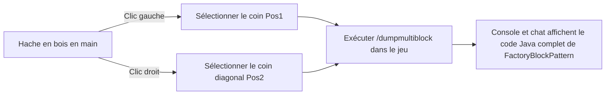

# KubeJS Boîte à outils et exportateur de multiblocs (`/dumpmultiblock`)

GTE intègre dans les scripts serveur KubeJS des outils de développement dédiés à la construction automatisée et à l'extraction de structures multiblocs, libérant ainsi entièrement le processus de conception de structures multiblocs.

---

## 🪓 Exportateur visuel de multiblocs (`/dumpmultiblock`)

Lors du développement de multiblocs personnalisés (que ce soit en code Java ou en scripts KubeJS), écrire manuellement des `FactoryBlockPattern.aisle(...)` composés de dizaines de couches de caractères est extrêmement chronophage et très sujet aux erreurs.

GTE intègre l'**exportateur de sélection à la hache en bois `/dumpmultiblock`** (`server_scripts/easymultiblock.js`) :



### Étapes d'utilisation

1. Passez en mode créatif dans le jeu et tenez une **hache en bois (`minecraft:wooden_axe`)**.
2. Construisez directement dans le monde la structure physique complète du multibloc selon vos plans (incluant la coque, les compartiments, les bobines, le contrôleur principal).
3. Utilisez la hache en bois avec un **clic gauche** sur un bloc d'angle inférieur de la structure (le chat affiche `Pos1 défini : x, y, z`).
4. Utilisez la hache en bois avec un **clic droit** sur le bloc d'angle supérieur diagonal de la structure (le chat affiche `Pos2 défini : x, y, z`).
5. Saisissez la commande dans le chat :
   ```mcfunction
   /dumpmultiblock
   ```
6. Le script analyse automatiquement tous les types de blocs dans la boîte englobante 3D, attribue une correspondance de caractères (`.` pour l'air, `A-Z/a-z/0-9` pour les blocs spécifiques), et génère directement le code de structure dans les journaux d'arrière-plan et côté client :

```java
// Modèle FactoryBlockPattern exporté automatiquement
.pattern(definition -> FactoryBlockPattern.start()
    .aisle("BBB", "BBB", "BBB")
    .aisle("BBB", "BAB", "BBB")
    .aisle("BBB", "B#B", "BBB")
    .where('A', Predicates.blocks("minecraft:air"))
    .where('#', Predicates.controller(Predicates.blocks(definition.getBlock())))
    .where('B', Predicates.blocks("gtceu:steam_machine_casing").or(Predicates.autoAbilities(definition.getRecipeTypes())))
    .build()
)
```

---

## 🌌 Configuration des veines de fluides et de gaz dimensionnels

GTE étend la collecte de fluides et de gaz à travers toutes les dimensions via KubeJS :

### 1. Extraction de gaz à l'échelle dimensionnelle (`dimension_gas.js`)
En utilisant la grande chambre de collecte de gaz (`gas_collector`) avec différents numéros de circuit, il est possible d'extraire l'atmosphère spécifique de chaque dimension :
- **Air du monde normal** : `circuit(4)` ➜ sortie `gtceu:air 10000`
- **Air infernal du Nether** : `circuit(5)` ➜ sortie `gtceu:nether_air 10000`
- **Air du vide de l'End** : `circuit(6)` ➜ sortie `gtceu:ender_air 10000`

### 2. Convertisseur de circuits universels (`universal_circuit.js`)
Pour résoudre la complexité des recettes empilées entre les différents niveaux de circuits et les mods, GTE introduit le système de **circuit universel (`universal_circuit`)** :
- Permet dans la machine d'emballage (`packer`) de convertir sans perte tout circuit de même niveau de tension (de ULV à MAX) en un objet de circuit universel unique à raison de **1 EU / 1 tick**.