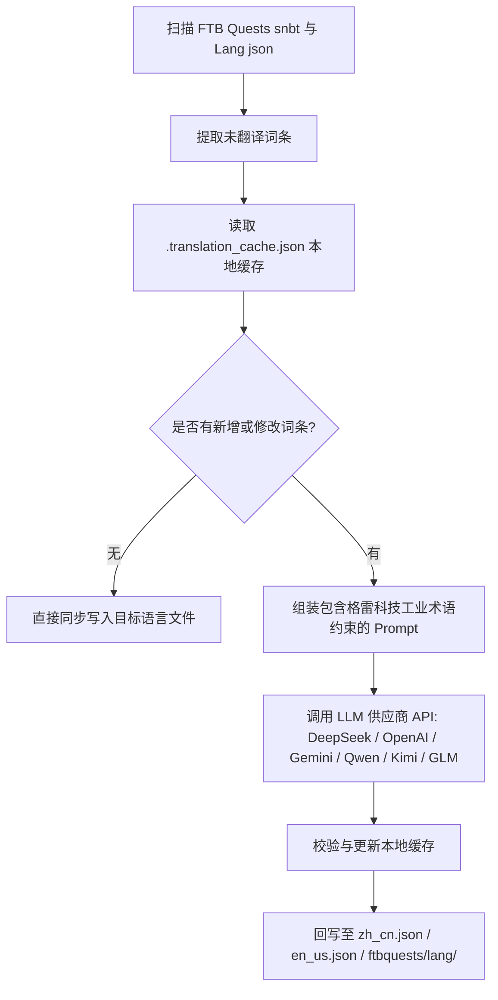

# AI 国際化翻訳エンジン (`opencode_translate.py`)

GTE エンジニアリングは、現代の大規模言語モデル（LLM）に基づくクロスモッド全自動国際化翻訳システムを設計・実装しました（`scripts/opencode_translate.py` にあります）。

---

## 🤖 翻訳エンジンアーキテクチャ

従来のコミュニティによる中国語翻訳は、複雑な JSON と SNBT テキストを手動で保守する必要があり、更新が遅れ、誤りや漏れが発生しやすくなっています。

GTE の AI 翻訳エンジンは、標準化された OpenAI 互換 API を介して、FTB Quests クエストブックとコア Mod 言語ファイルの**自動増分抽出、用語整合、および並行翻訳**を実現します：



---

## 🔑 対応 LLM プロバイダと環境変数

| プロバイダ名 | API Key 環境変数 | Base URL 環境変数 | デフォルトモデル |
| :--- | :--- | :--- | :--- |
| **DeepSeek** | `DEEPSEEK_API_KEY` | `DEEPSEEK_BASE_URL` | `deepseek-chat` |
| **OpenAI** | `OPENAI_API_KEY` | `OPENAI_BASE_URL` | `gpt-4o-mini` |
| **Google Gemini** | `GEMINI_API_KEY` | `GEMINI_BASE_URL` | `gemini-3.5-flash` |
| **通義千問 (DashScope)** | `DASHSCOPE_API_KEY` | `DASHSCOPE_BASE_URL` | `qwen-plus` |
| **月の暗面 (Moonshot)** | `MOONSHOT_API_KEY` | `MOONSHOT_BASE_URL` | `moonshot-v1-8k` |
| **智譜清言 (Zhipu GLM)** | `ZHIPU_API_KEY` | `ZHIPU_BASE_URL` | `glm-4-flash` |
| **OpenCode プラットフォーム** | `OPENCODE_API_KEY` | `OPENCODE_BASE_URL` | `deepseek-v4-flash` |
| **汎用アグリゲーションプロキシ** | `LLM_API_KEY` | `LLM_BASE_URL` | `LLM_MODEL` (カスタム) |

---

## 🎯 産業グレードの Prompt 制約原則

API を呼び出して翻訳する際、システムには厳格な Minecraft および GregTech 用語規則が組み込まれています：

1. **フォーマットコードを絶対に保持**：Minecraft ネイティブの色フォーマットコード（`§a`, `§c`, `§6` など）とプレースホルダー（`%s`, `%d`, `{0}`）を完全に保持します。
2. **科学技術用語の統一**：科学技術の固有名詞の翻訳を厳密に固定します（例：`UHV`, `EU/t`, `Amps`, `Voltage`, `Overclock`, `Subtick` など）。
3. **ハッシュ増分キャッシュ**：翻訳済みのすべてのエントリは `.translation_cache.json` に自動的に永続化され、新規または変更されたテキストのみがネットワークリクエストを発行するため、Token コストと CI 時間を大幅に節約します。

---

## 💻 ローカル実行コマンド

ローカル開発環境でワンクリックにより全量翻訳を実行します：

```powershell
# 设置任意一个有效 API Key 后执行
$env:DEEPSEEK_API_KEY="sk-..."
python scripts/opencode_translate.py
```