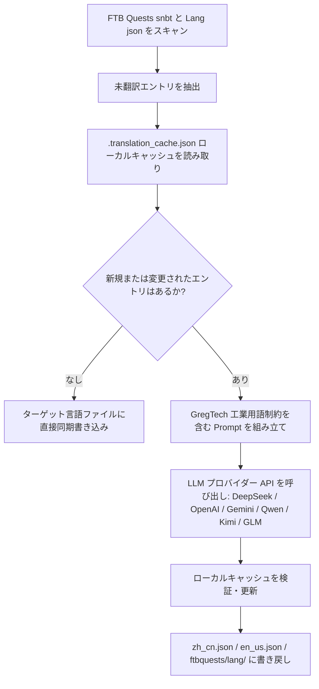

# AI 国際化翻訳エンジン (`opencode_translate.py`)

GTE は、現代の大規模言語モデル（LLM）に基づくクロスモッド全自動国際化翻訳システム（`scripts/opencode_translate.py` に配置）を設計・実装しました。

---

## 🤖 翻訳エンジンのアーキテクチャ

従来のコミュニティ翻訳は、複雑な JSON および SNBT テキストの手動メンテナンスに依存しており、更新が遅れ、エラーや欠落が発生しやすいものでした。

GTE の AI 翻訳エンジンは、標準化された OpenAI 互換 API を通じて、FTB Quests クエストブックとコア Mod 言語ファイルの**自動化された増分抽出、用語整合、および並行翻訳**を実現します：



---

## 🔑 サポートされている LLM プロバイダーと環境変数

このスクリプトは、環境変数を通じて異なる AI モデルプロバイダーをシームレスに切り替えることをサポートしています：

| プロバイダー名 | API Key 環境変数 | Base URL 環境変数 | デフォルトモデル |
| :--- | :--- | :--- | :--- |
| **DeepSeek** | `DEEPSEEK_API_KEY` | `DEEPSEEK_BASE_URL` | `deepseek-chat` |
| **OpenAI** | `OPENAI_API_KEY` | `OPENAI_BASE_URL` | `gpt-4o-mini` |
| **Google Gemini** | `GEMINI_API_KEY` | `GEMINI_BASE_URL` | `gemini-3.5-flash` |
| **通義千問 (DashScope)** | `DASHSCOPE_API_KEY` | `DASHSCOPE_BASE_URL` | `qwen-plus` |
| **月之暗面 (Moonshot)** | `MOONSHOT_API_KEY` | `MOONSHOT_BASE_URL` | `moonshot-v1-8k` |
| **智譜清言 (Zhipu GLM)** | `ZHIPU_API_KEY` | `ZHIPU_BASE_URL` | `glm-4-flash` |
| **OpenCode プラットフォーム** | `OPENCODE_API_KEY` | `OPENCODE_BASE_URL` | `deepseek-v4-flash` |
| **汎用集約プロキシ** | `LLM_API_KEY` | `LLM_BASE_URL` | `LLM_MODEL` (カスタム) |

---

## 🎯 工業グレードの Prompt 制約原則

API を呼び出して翻訳する際、システムには厳格な Minecraft および GregTech 用語ルールが組み込まれています：
1. **フォーマットコードの完全保持**：Minecraft ネイティブの色フォーマットコード（`§a`, `§c`, `§6` など）とプレースホルダー（`%s`, `%d`, `{0}`）を完全に保持します。
2. **科学技術用語の標準化**：技術的な固有名詞の翻訳を厳密に固定します（`UHV`, `EU/t`, `Amps`, `Voltage`, `Overclock`, `Subtick` など）。
3. **ハッシュ増分キャッシュ**：翻訳済みの全エントリは自動的に `.translation_cache.json` に永続化され、新規または変更されたテキストのみがネットワークリクエストを開始するため、トークン消費と CI 時間を大幅に節約します。

---

## 💻 ローカル実行コマンド

ローカル開発環境でワンクリックで全量翻訳をトリガーします：

```powershell
# 有効な API Key を設定してから実行
$env:DEEPSEEK_API_KEY="sk-..."
python scripts/opencode_translate.py
```