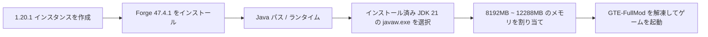

# Modパックのダウンロードと完全Modクライアントパックガイド

GTE (GregTech Easy) は、技術レベルの異なるプレイヤーとサーバー管理者向けに、3つの配布形式を提供しています：

1. **CurseForge 標準パック (`GTE-CurseForge-*.zip`)**：ランチャー標準のインポート形式です。`manifest.json` を同梱し、Mod は `overrides/mods/` に置かれ、ランチャーが Forge を自動でインストールします。**ほとんどのプレイヤーにはこちらを推奨します。**
2. **完全Modクライアントパック (`GTE-FullMod-*.zip`)**：最上位にゲームコンテンツのみを含むフラットな zip で、自分でインスタンスを構成できるプレイヤー向けです。
3. **サーバーパック (`GTE-Server-*.zip`)**：Forge 専用サーバーパックで、`mods/` は zip の最上位に配置されています。サーバーを立ててマルチプレイするためのものです。

---

## 📦 完全Modクライアントパック

### パックの構成

```text
README_安装必看.txt
mods/            (17個の jar)
config/
defaultconfigs/
kubejs/
```

入れ子になった `.minecraft/` ディレクトリはなく、ランチャーも `run_game.bat` も同梱していません。Minecraft 本体と Forge はお使いのランチャーが用意するため、本パックは**すでにランチャーでインスタンスを作れることが前提**です。

### 必須の動作環境

| 項目 | バージョン | 備考 |
| :--- | :--- | :--- |
| **Minecraft** | `1.20.1` | 他のバージョンは不可 |
| **Forge** | `47.4.1` | このバージョンぴったりでなければなりません |
| **Java** | `21` | Java 17 や Java 8 は使用しないでください |

> [!CAUTION]
> **Forge は 47.4.1 でなければなりません。「47.4.1 以上のどれでもよい」ではありません。**
> - Mod `gtmthings` は Forge `[47.4.1,)` を要求するため、これより低いバージョンでは読み込まれません；
> - 一方 Forge 47.4.10 は ASM 9.8 + coremods 5.2.4 を同梱しており、`appliedenergistics2` 15.4.9 の mixin が壊れてゲームがタイトル画面まで到達しません。
>
> 現時点で使用できるのは 47.4.1 のみです。

### インストール手順

=== "方法1：自分でインスタンスを構成する（本パックの使い方）"

    1. ランチャー（PCL2 / HMCL / Prism / MultiMC / 公式ランチャーいずれでも可）で Minecraft **1.20.1** のインスタンスを作成し、**Forge 47.4.1** をインストールします。
    2. 一度起動してタイトル画面に到達することを確認します（ランチャーと Java の問題を切り分ける工程です）。
    3. そのインスタンスのゲームディレクトリ（`.minecraft` フォルダ。ランチャーには通常「フォルダを開く」ボタンがあります）を開きます。
    4. `GTE-FullMod-<版本号>.zip` の中身を**すべて解凍して入れ**、既存の同名フォルダとマージします。
    5. インスタンス設定で Java を **Java 21** に指定し、メモリを **8G ~ 12G** 割り当てます。
    6. ゲームを起動します。初回は設定生成のため、普段より時間がかかります。

=== "方法2：ランチャーへのワンクリックインポート（推奨）"

    `GTE-CurseForge-<版本号>.zip` を使用し、CurseForge App / PCL2 / HMCL / Prism Launcher / MultiMC で**統合パックのインポート**を選択してください。このパックは `manifest.json` を同梱しているため、ランチャーが Forge を自動でインストールし、手動設定は不要です。

=== "方法3：サーバーを立てる"

    `GTE-Server-<版本号>.zip` を使用してください。`mods/` は zip の最上位にあります。サーバーのルートディレクトリに解凍したあと `java -jar forge-*-installer.jar --installServer` を実行し、`@libraries/net/minecraftforge/forge/1.20.1-47.4.1/unix_args.txt nogui` で起動します。

> [!WARNING]
> ファイル名が `-slim.jar` または `-dev-slim.jar` で終わる jar は Maven 利用者向けの成果物で、jar-in-jar 依存を意図的に一切同梱していません。**絶対に** `mods/` に入れないでください。入れると Forge が `ldlib` を内包しない `gtceu` ビルドを選び、`Missing or unsupported mandatory dependencies: Mod ID: 'ldlib' ... [MISSING]` で中断します。配布している3つのパックにはいずれも含まれていません。

---

## ⚠️ Java 21 実行環境の要件（非常に重要）

> [!CAUTION]
> **このModパックは実行環境として Java 21 (JDK 21) を必須とします！**
> **Java 17** や **Java 8** は使用しないでください。ゲームがクラッシュするか、起動を拒否します！

### なぜ Java 21 でなければならないのか？
- GTE のコアMod（`gtecore`、`gtm-reborn`、`gt--`）は、**Java 21 の近代的な言語機能**（Record Patterns、Virtual Threads、拡張されたSwitchマッチングなど）を全面的に採用しています。
- Gradle ビルドスクリプトは、`JavaLanguageVersion.of(21)` をグローバルに設定し、ツールチェーンを強制チェックしています。

### 推奨 JDK 21 ダウンロード先

| ディストリビューション | ダウンロードリンク | 推奨理由 |
| :--- | :--- | :--- |
| **Azul Zulu 21 (LTS)** | [Azul公式サイトへ](https://www.azul.com/downloads/?version=java-21-lts) | 性能が優れており、Minecraftの大規模マルチスレッド最適化に最適 |
| **Eclipse Temurin 21 (LTS)** | [Adoptium公式サイトへ](https://adoptium.net/temurin/releases/?version=21) | 公式推奨、高い互換性と安定性 |
| **Microsoft OpenJDK 21** | [Microsoft公式サイトへ](https://learn.microsoft.com/zh-cn/java/openjdk/download) | Windowsプラットフォームへのネイティブ対応が良好 |

### ランチャーで Java 21 を設定する



---

## 🎮 ゲーム内ショートカットキーとよく使うコマンド

| コマンド / ショートカットキー | 機能説明 | 権限要件 |
| :--- | :--- | :--- |
| `/ftbquests editing_mode true` | クエストブックのビジュアル編集モードを有効化（作者モード） | OP権限 |
| `/ftbquests reload` | FTB Quests クエストブックの設定ファイルをホットリロード | 全員 |
| `/kubejs reload server_scripts` | サーバー側の改造スクリプトとレシピをホットリロード | OP権限 |
| `/kubejs reload client_scripts` | クライアント側の改造スクリプトと表示ロジックをホットリロード | 権限不要 |
| `/dumpmultiblock` | 木の斧で領域を選択後、ワンクリックでマルチブロック構造コードをエクスポート | OP権限 |
| <kbd>U</kbd> / <kbd>R</kbd> | カーソル位置のアイテムの用途 (Usage) / レシピ (Recipe) を表示 | EMI / JEI ショートカットキー |
| <kbd>F7</kbd> | 周囲の明るさレベルを表示（赤い×はモブ湧き領域を示す） | クライアント側ショートカットキー |
