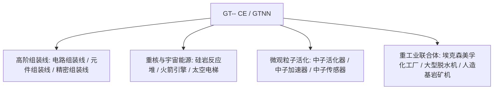

# GT-- Community Edition (GTNN)

`modules/gt--`（パッケージ名 `dev.arbor.gtnn`）は、**Kotlin + Java** のハイブリッドアーキテクチャに基づいて構築された GT-- Community Edition 公式コミュニティ版 MOD です（開発ブランチは `kotlin`）。

---

## 🏗️ アーキテクチャと技術スタック

- **開発言語**: Kotlin 2.0.21 + Java 21。
- **位置付け**: クラシックな GT 5.09 と現代の拡張でプレイヤーに人気の巨大組立ライン、重核反応炉、脱水機システム、宇宙探索産業を導入します。



---

## 🏭 中核マルチブロック機械と施設

### 1. 組立ラインアレイ

- **回路組立ライン (`circuit_assembly_line`)**：中高級チップと複合回路の効率的な量産に特化し、多段階の精密筐体をサポートします。
- **部品組立ライン (`component_assembly_line`)**：電圧グレード（LV から MAX）に応じた対応する階級の筐体を使用し、コアモーターとセンサーを大量に組み立てます。
- **精密組立ライン (`precision_assembly_line`)**：最高精度のナノリソグラフィマスクとスーパーコンピューティングバスを生産します。

### 2. 粒子加速と中性子活性化システム

- **中性子活性化装置 (`neutron_activator`)** と **中性子加速器 (`neutron_accelerator`)**：
  - 高エネルギー衝突型加速器と高速中性子捕獲反応をシミュレートし、通常の安定同位体を放射性重核材料または超重超伝導元素に活性化します。
- **中性子センサー (`neutron_sensor`)**：反応キャビティ内の中性子運動エネルギーフラックスをリアルタイムで検出し、レッドストーンまたはコンピューター信号のフィードバックを提供します。

### 3. 重核エネルギーと宇宙産業

- **大型ナクアダ反応炉 (`large_naquadah_reactor`)**：ナクアダ合金と濃縮燃料を動力とし、安定した高密度の EU エネルギー出力を提供します。
- **ロケットエンジン (`rocket_engine`)**：高級ロケット燃料を消費し、高負荷機器にパルス動力を提供します。
- **宇宙エレベーター (`space_elevator`)**：低軌道を貫通し、宇宙空間での鉱物採集と微小重力工業製造を実現します。

### 4. 化学工業と鉱業の複合施設

- **エクソンモービル化学プラント (`exxonmobil_chemical_plant`)**：超大型石油深加工複合装置で、単体で分解、改質、芳香族化、重合の全工程を完了します。
- **大型脱水機 (`large_dehydrator`)**：流体や化学鉱物中の結晶水と遊離水分を効率的に除去します。
- **人造岩盤鉱石採掘機 (`homemade_bedrock_ore_machine`)**：岩盤層に人造ドリルビットを配置し、深層の無限鉱脈を絶え間なく抽出します。

---

## 🌿 サブモジュール Git ワークフロー規範

`modules/gt--` は独立した Git リポジトリ `takanashisatou/GT---Community-Edition` に対応し、開発ブランチは `kotlin` です：

```bash
# 独立在子模块中开发与提交
cd modules/gt--
git checkout kotlin
git add .
git commit -m "feat: add precision assembly line recipes"
git push origin kotlin

# 回到主工程更新 submodule 指针
cd ../..
git add modules/gt--
git commit -m "chore: bump gt-- submodule pointer"
```