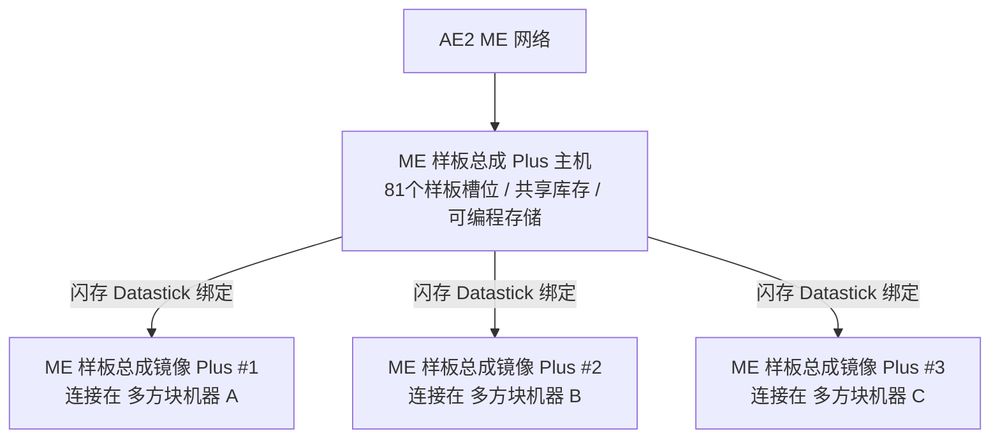

# AE2 深度統合とパターンバッファ Plus システム

GTECore は、AE2 (Applied Energistics 2) と GregTech マルチブロック構造の間に、極めて強力な直接データ連携の橋渡しを提供します。

---

## 🧩 ME パターンバッファ Plus (`me_pattern_buffer_plus`)

従来のテック系 MOD では、AE2 パターンプロバイダーをマルチブロック機械に接続する際、**スロット不足、流体とアイテムの混合出力ができない、パターンを複数機械で共有しにくい**という課題に直面することがよくあります。

GTECore が開発した **ME パターンバッファ Plus** は、この問題を根本的に解決します：

### 主な特徴
1. **大容量パターンスロット**: 単一のバッファ本体は **81 個のパターンスロット** を備えています（標準の AE2 パターンプロバイダー 9 台分に相当）。
2. **万能ハッチ能力**: `IMPORT_ITEMS`、`IMPORT_FLUIDS`、`EXPORT_ITEMS`、`EXPORT_FLUIDS` のすべての能力を備え、流体とアイテムを同じハッチ内で混合してやり取りできます。
3. **プログラマブルストレージ対応**: 内部に Programmable Storage メカニズムを統合し、複雑なレシピの正確な投入とキャッシュをサポートします。

---

## 🪞 ME パターンバッファミラー Plus (`me_pattern_buffer_proxy_plus`)

**パターンバッファミラー Plus** は、革新的な分散型自動化構造部品です。

### 動作原理とマシン間共有
- パターンバッファミラーを任意のマルチブロック機械のハッチ位置に設置します。
- **フラッシュメモリ (Datastick)** を手に持ち、メインの **ME パターンバッファ Plus** を右クリックして座標を読み取り、その後 **パターンバッファミラー Plus** を右クリックしてバインドします。
- **バインドされたすべてのミラーは、メインバッファ内に配置された全 81 個のパターンをリアルタイムで共有します**！
- AE2 ネットワークが自動クラフトタスクを開始すると、ネットワークは自動的に負荷分散を行い、アイドル状態のすべてのミラー機械に並行して作業を割り当てます！

### Jade のホバー状態表示
パターンバッファまたはミラーにカーソルを合わせると、Jade が自動的に表示します：
- メインバッファ：`已连接镜像数量: X`
- ミラー部品：`已绑定至 - X: ..., Y: ..., Z: ...`

---

## 💨 ME 蒸気ハッチ (`me_steam_hatch`)

- **機能**: AE2 流体ネットワークと蒸気マルチブロック構造を直接接続します。
- **効果**: 蒸気マルチブロック構造は、複雑な高速蒸気パイプやタンクを外部に設置する必要がなく、ME ネットワークから最高スループットで即座に蒸気を引き出して供給でき、パイプ輸送のボトルネックを排除します。