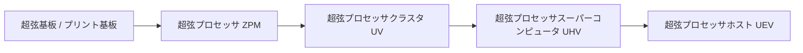
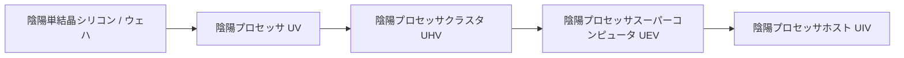

# 超弦と陰陽高次回路および材料システム

GTECoreは、ZPMからMAXまでの全周期にわたる2つの高次回路ブランチ、**超弦回路システム**と**陰陽太極回路システム**を拡張し、鉱石総合処理センターと連携して自動化された材料の大循環を実現します。

---

## 🌌 超弦回路システム (Super String Circuitry)

超弦回路は高次元の振動弦から超光速の計算能力を取得し、主に **ZPM ➜ UEV** の電圧勾配をカバーします：

### 超弦材料と弦系物質
- **起源の弦 (`item.gtecore.original_string`)**：高次元宇宙の振動の本源。
- **α弦 / β弦 / γ弦 (`alpha_string`, `beta_string`, `gamma_string`)**：異なるエネルギーレベルと偏光状態の超弦ポリマー。
- **超弦混合機 (`super_string_mixer`)**、**創世の弦 (`string_of_creation`)** と **超弦振動アレイ (`super_string_oscillator_array`)**：超弦物質の分裂、調律、高次固化に使用。

---

## ☯️ 陰陽太極回路システム (Yin-Yang Circuitry)

陰陽回路システムは **「陰が陽を生み、陽が陰を生み、生生不息」** の循環生克哲学に従い、**UV ➜ UIV** およびそれ以上の限界をカバーします：

### 八卦と五行専用符篆
- **五行元素**：金元素 (`jinyuansu`)、木元素 (`muyuansu`)、水元素 (`shuiyuansu`)、火元素 (`huo`)、土元素 (`tuyuansu`)。
- **五行符篆**：金の符篆、木の符篆、水の符篆、火の符篆、土の符篆。
- **八卦象とチップ**：乾、坤、震、巽、坎、離、艮、兑の八大卦象符石とコアチップ。
- **三清の粒 (`god_nugget`)**：天地玄黄の気を凝縮した最高級の合成媒体。

---

## 💎 鉱石総合処理センターのレシピモード

**鉱石総合処理センター (`ore_process_center`)** には7つの標準化された回路モードがプリセットされており、機械内でプログラミング回路番号を設定することで切り替えられます：

| 回路番号 | プロセスルート | 適用鉱物タイプと産物の特徴 | 産出倍率 |
| :---: | :--- | :--- | :---: |
| **回路 1** | 粉砕 ➜ 粉砕 ➜ 洗鉱 | 基礎金属鉱石（鉄、銅、錫など）の高速量産 | 5倍の主産物 + 副産物 |
| **回路 2** | 粉砕 ➜ 粉砕 ➜ 遠心分離 | 随伴する高価値の希少軽金属鉱石 | 5倍の主産物 + 遠心分離精製副産物 |
| **回路 3** | 粉砕 ➜ 洗鉱 ➜ 熱分離 ➜ 粉砕 | 高温耐火鉱石、貴金属鉱（白金系、金銀など） | 5〜6倍 + 純粋な金属粉 |
| **回路 4** | 粉砕 ➜ 熱分離 ➜ 粉砕 | 硫化物と重度の複雑な鉱石 | 5倍 + 特殊な熱分離副産物 |
| **回路 5** | 粉砕 ➜ 洗鉱 ➜ 粉砕 ➜ 洗鉱 | 希土類鉱石と多段階の可溶性塩鉱 | 6倍 + 二重洗鉱副産物 |
| **回路 6** | 粉砕 ➜ 洗鉱 ➜ 粉砕 ➜ 遠心分離 | 放射性重鉱（ウラン、トリウム、プルトニウム系）と希土類 | 6倍 + 精密遠心分離重金属 |
| **回路 8** | 粉砕 ➜ 洗鉱 ➜ 粉砕 ➜ 電磁選鉱 | 強磁性と常磁性鉱物（磁鉄鉱、クロム、チタンなど） | 6〜8倍 + 電磁純粋粉 |