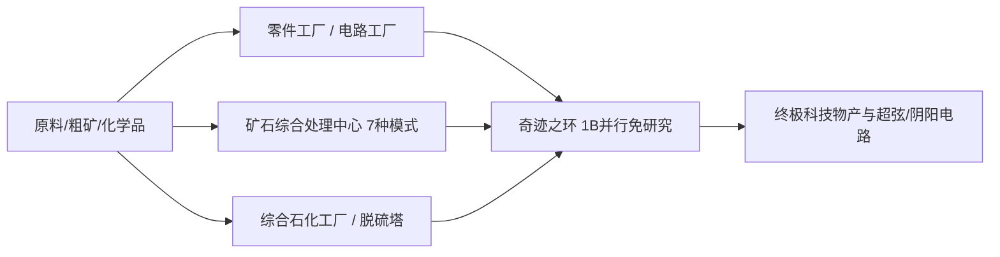

# GTECore マルチブロック機械図鑑

GTECore は、テクノロジーライン中後期の煩雑なパイプライン積み重ねに対し、**超並列能力**と**集約生産ロジック**を兼ね備えた多数のマルチブロック機械を設計しました。

---

## 🏭 蒸気時代の大型マルチブロック

蒸気時代の単機生産能力の低さと設置面積の冗長性の問題を解決するため、GTECore は一連の大型蒸気マルチブロックを導入しました。すべてがレシピ横断並列と大容量蒸気スループットをサポートします：

| 機械名 (Block ID) | 中核機能とレシピタイプ | 特性と利点 |
| :--- | :--- | :--- |
| **大型蒸気合金炉** (`gtceu:big_alloy`) | 合金精錬 (`alloy_smelter`) | 初期の高倍率合金生産、高圧蒸気に対応 |
| **大型蒸気圧縮機** (`gtceu:big_compressor`) | 圧縮処理 (`compressor`) | 緻密な金属板とブロックを一括プレス |
| **大型蒸気鍛造ハンマー** (`gtceu:big_forge_hammer`) | 鍛造ハンマーによる粉砕/板 (`forge_hammer`) | 板材の自動化と粗鉱の高速破砕 |
| **大型蒸気抽出機** (`gtceu:big_steam_extractor`) | ゴム/流体抽出 (`extractor`) | 樹脂と工業流体を大規模に抽出 |
| **簡易蒸気粉砕機** (`gtceu:steam_grinder_easy`) | 鉱石粉砕 (`macerator`) | 初期の鉱物多倍処理 |
| **簡易蒸気焙焼炉** (`gtceu:steam_oven_easy`) | 熱分解焙焼 (`pyrochlore_oven`) | コークスと木炭の工業的大量生産 |
| **蒸気鉱物処理プラント** (`gtecore:steam_op`) | 総合的な鉱石粉砕と精錬 | **10億 (1B) 並列**、全レシピが **1 tick** で完了！任意の入出力バスに対応 |

---

## ⚡ 超電気産業マルチブロック

電力時代に入ると、GTECore はオールインワンと高次加工センターを提供します：

### 1. 中核生産工場

- **§6部品工場 (`gtceu:component_factory`)**：
  - **位置付け**：モーター、ポンプ、ピストン、ロボットアーム、コンベアベルト、発光ダイオードなど、各種常用基礎部品を一気に生産。
  - **特性**：煩雑な中間サブ工程をスキップし、指定電圧グレードの標準工業部品を高速生産。
- **§6回路工場 (`gtceu:circuit_factory`)**：
  - **位置付け**：集積回路基板、チップエッチング、集積パッケージングを一体化。
  - **特性**：レシピ横断並列バスに対応し、ULV から MAX までの全電圧グレードの回路基板生産を全面的に加速。
- **§6ミラクルリング (`gtceu:miracle_ring`)**：
  - **位置付け**：産業の奇跡、究極の組立施設。
  - **特性**：**10億 (1B) 並列** と **1t Subtick オーバークロック** を備え、**いかなる研究/組立ライン研究も不要**で組立ラインレシピを直接実行可能！
- **化学ターミネーター (`gtecore:chemistry_terminator`)**：
  - **位置付け**：「化学と物理の存在を覆し、化学の終焉を意味する」。
  - **特性**：複雑な十数段階の長鎖化学反応をワンクリックで集約し、各種究極ポリマーと酸系媒体を超高速合成。
- **十合一汎用処理工場 (`gtecore:ten_in_one`)**：
  - **位置付け**：遠心分離、電解、化学浸出、重合、高圧反応など10大基本工程を融合した万能統合ボックス。

### 2. 鉱石と流体の精製システム

- **§6鉱石総合処理センター (`gtecore:ore_process_center`)**：
  - **7種類のプログラミング回路モード**に対応し、異なる生成物指向の鉱物5〜8倍精錬（粉砕、洗鉱、熱分解、遠心分離、電磁選鉱を完全統合）を実現。1t Subtick オーバークロックに対応。
- **総合石油化学プラント (`gtecore:integrated_petrochemical_plant`)**：
  - 原油分留、接触分解、改質、脱硫の全チェーンを統合し、単機で全ての炭化水素系軽質ガスと芳香族炭化水素を生産。
- **脱硫機 (`gtceu:desulfurization`)**：
  - 各種の重質含硫黄燃料油を迅速に浄化し、高純度硫黄粉末の副産物を回収。
- **簡易/上級流体掘削リグ (`gtecore:easy_fluid_drilling_rig` / `not_hard_fluid_drilling_rig`)**：
  - 岩盤流体鉱脈を自動で汲み上げ、枯渇せず、複雑なパイプライン探査も不要。

### 3. ハイエンドおよび超伝導ケーブル加工

- **§6ワイヤー工場 (`gtecore:wiremill_factory`)**：すべての金属の単撚り、二重撚り、四重撚り、八重撚り、十六重撚りワイヤーおよび超伝導ケーブルをワンクリック生産。
- **§6結晶核中枢 (`gtecore:crystal_center`)**：単結晶シリコン柱、エメラルド、サファイア、チャージ済みサイクステル結晶を大規模に自動育成。
- **§6量子ケーブルエンジン (`gtecore:quantum_cable_assembler`)**：量子光ファイバーと超次元エネルギー伝送ケーブルの高速製造に特化。
- **§3スターブレードエッチング装置 (`gtecore:starblade_etching_machine`)**：高エネルギービームを使用して極紫外/X線帯域で銀河系規模のマイクロ・ナノチップをエッチング。

---

## 🔋 エネルギーと発電機システム

| 機械名 | エネルギー出力/グレード | 中核メカニズムと特性 |
| :--- | :--- | :--- |
| **§6汎用燃料エンジン** (`gtceu:general_fuel_engine`) | 動的適応 (最高 MAX) | **世界中のあらゆる種類の燃料**（ディーゼル、バイオマス、天然ガス、ロケット燃料など）に対応、**20億 (2B) 並列** を備え、瞬時に天文学的なエネルギーを放出！ |
| **大型汎用発電機** (`gtecore:large_general_generator`) | 多段電圧選択可能 | 通常のガス、蒸気、プラズマ発電機ローターに対応 |
| **スーパー核融合炉** (`gtecore:super_fusion_reactor`) | 核融合プラズマ出力 | 通常の核融合の長い昇温待ちを完全に排除、**1T Subtick オーバークロックを完全サポート**、高温核融合生成物を瞬時に出力 |
| **上限圧スーパーバッテリーボックス** (`gtecore:max_super_battery_buffer_1x`) | **MAX (2,147,483,647 V)** | 超大量の EU キャッシュを収容、ゼロ損失の次元間ワイヤレス充電インターフェースに対応 |