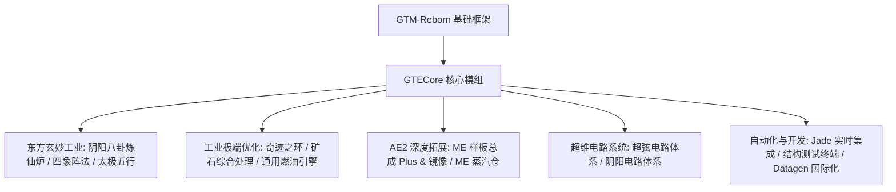

# GTECore コアMOD概要

**GTECore** は GregTech Easy プロジェクトのカスタム Java コアMODです。`gtm-reborn` のソースコードに直接依存し、大規模マルチブロック産業構造、高次元の陣法技術、AE2 の深層連携、そしてスーパー回路製造システムを拡張します。

---

## 🏛️ MODアーキテクチャと設計方針

---

## 📦 クリエイティブモードのアイテム欄と分類

GTECore はゲーム内に独立したクリエイティブモードのタブを登録します：

1. **GregTech Easy マシン (`itemGroup.gtecore.gtecore_machines`)**：
   - GTE オリジナルのマルチブロックメインブロック（陰陽八卦高炉、奇跡の環、鉱石処理センター、ケミカルターミネーターなど）を含みます。
   - 多段階スーパーバッテリーボックス（Max Super Battery Buffer）、ME 蒸気ハッチ、ME パターンアセンブリ Plus とミラーを含みます。
2. **GregTech Easy アイテム (`itemGroup.gtecore.gtecore_items`)**：
   - 超弦と陰陽回路シリーズのアイテム（プロセッサ、クラスタ、スーパーコンピュータ、ホスト）を含みます。
   - 五行元素のタリスマン、八卦チップ、三清の粒、構造テスト端末などの専用アイテムを含みます。

---

## ⚙️ MOD全体設定 (`GTEConfig`)

GTECore は、ゲーム内およびファイル設定の豊富なオプションを提供します（`config/gtecore-common.toml` またはゲーム内設定メニューにあります）：

| 設定項目 | デフォルト値 | 詳細説明 |
| :--- | :--- | :--- |
| `superPeace` (超平和モード) | `false` | 有効にすると、悪性の敵対Mobのスポーンを全面的に無効化し、テクノロジー建築に絶対的なクリーンな環境を提供します。 |
| `durationMultiplier` (レシピ時間倍率) | `1.0` | GTECore のカスタムレシピの所要時間倍率を全体的に調整します。 |

---

## 🔍 Jade / TOP ネイティブ統合

GTECore には **`GTEJadePlugin`** プラグインのサポートが組み込まれています：
- **ME パターンアセンブリ Plus の状態**：現在のアセンブリにバインドされているパターン数、流体とアイテムの出力モードをリアルタイムに表示します。
- **ME パターンアセンブリミラー Plus のバインド情報**：ホバーすると、バインドされているメインアセンブリの座標 `(X, Y, Z)` とネットワーク接続状態を直接表示します。
- **陣法活性化インジケーター**：陰陽八卦煉仙炉上に、青龍・白虎・朱雀・玄武の四象陣法の準備状態をリアルタイムに表示します。

---

## 🛠️ 構造テスト端末 (`Structure Testing Terminal`)

GTECore は専用の手持ちツール —— **構造テスト端末** (`item.gtecore.check_structure_terminal`) を提供します：
- **マルチブロックコントローラーを右クリック**：構造の完全性をリアルタイムにスキャンします。
- **エラー診断ヒント**：構造が未完成の場合、端末はチャット欄とホバーヒントで**エラーブロックの座標と配置すべきでない位置**を正確に指摘し、大型マルチブロックの建造とトラブルシューティングを大幅に加速します。