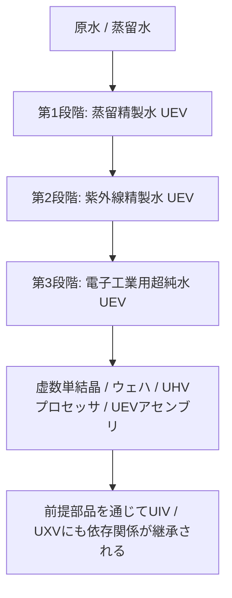

# 3段階の水精製システムと工業用水の循環

GTECoreの**3段階の水精製システムは、全体がUEVに属します**。各段階は連続する処理工程と水質を表しており、異なる電圧時代を表すものではありません。中央プラント、3基すべての精製ユニット、および各制御ハッチには、UEVの部品・回路・組立電圧を使用します。3段階すべての処理とEDI再生はUEVで動作します。

このラインは**中央プラント1基と精製ユニット3基**で構成されます。ユニットにはエネルギーハッチがありません。データスティックで中央プラントに接続し、電力と並列数の上限を受け取ります。

## 💧 3段階の精製水の仕様

| 登録流体 | 材料名 | 技術段階 |
| :--- | :--- | :---: |
| `distilled_purified_water` | 蒸留精製水 | UEV |
| `uv_purified_water` | 紫外線精製水 | UEV |
| `ultrapure_water` | 電子工業用超純水 | UEV |

工業的な水質の説明は背景情報です。ゲーム内での実際の挙動は、レシピ、熱安定性、紫外線照射量、EDI負荷によって決まります。

## 🏭 4種類のマルチブロック機械

| 機械 | 登録ID | 技術段階 |
| :--- | :--- | :---: |
| 中央水精製プラント | `central_water_purification_plant` | UEV |
| 第1段階クラリファイア精製ユニット | `t1_clarifier_purification_unit` | UEV |
| 第2段階紫外線酸化精製ユニット | `t2_uv_oxidation_purification_unit` | UEV |
| 第3段階EDI超純水精製ユニット | `t3_edi_ultrapure_purification_unit` | UEV |

旧式の`ultrapure_water_refinery`は互換性のため登録が残っていますが、無効化されています。精製工程全体を実行することはできません。中央プラントと3基のユニットに移行してください。

### 1. 中央水精製プラント

プラント自体は精製レシピを処理しません。接続情報を保存し、接続済みで構造が完成したユニットに電力を配分し、実際の出力電力をEU/sで表示し、設定された並列数の上限を通知します。ユニットが動作するには、構造が完成した中央プラントへの接続が必要です。

### 2. 第1段階: 清澄化と熱処理（UEV）

最初の段階では、流入する水から不純物を分離します。標準レシピは次のとおりです。

- 水1000 mB + 複合凝集剤50 mB + 改質カーボン微小球1個 → 蒸留精製水900 mB / 60 ticks。確率で塩の粉と希土類の粉も生成します。
- 蒸留水1000 mB + 複合凝集剤25 mB + 改質カーボン微小球1個 → 蒸留精製水1000 mB / 30 ticks。確率で塩の粉も生成します。

実際の水の生成量は熱安定性にも左右されます。この工程がUEV精製ラインの入口です。

### 3. 第2段階: 深紫外線酸化（UEV）

紫外線照射と酸化剤で有機不純物を分解します。標準レシピは次のとおりです。

- 蒸留精製水800 mB + オゾン50 mB → 紫外線精製水800 mB + 酸素25 mB / 40 ticks。
- 蒸留精製水800 mB + 過酸化水素50 mB → 紫外線精製水800 mB + 酸素25 mB / 20 ticks。

どちらの経路も、完了するには紫外線照射量の条件を満たす必要があります。

### 4. 第3段階: 電気脱イオンと最終精製（UEV）

EDI工程は残留イオンを除去します。ゲーム内では試薬と樹脂を使用し、蓄積したイオン負荷は別の再生レシピで解消します。

- 紫外線精製水800 mB + 電子工業用酸塩基試薬20 mB + 混床樹脂ビーズ1個 → 電子工業用超純水800 mB / 30 ticks。
- EDI再生: 紫外線精製水100 mB + 電子工業用酸塩基試薬1 mB / 2 ticks。イオン負荷を解消し、水は生成しません。

## 🔌 ラインの接続と運転

1. GTデータスティックを持って中央プラントをスニーク右クリックし、座標をコピーします。
2. そのスティックで精製ユニットを右クリックすると接続されます。逆の順序でも可能です。ユニットの座標をコピーしてからプラントを右クリックしてください。
3. エネルギーハッチ（1–4基、レーザー入力にも対応）を通じて中央プラントに給電します。プラントは接続されたユニットへ電力を送ります。
4. プラントのGUIで並列数の上限を1から65536の範囲で設定します。
5. 各ユニットのGUIで、接続先プラントの座標、並列数の上限、内部エネルギーバッファを確認します。

各ユニットは、レシピの消費電力に実際の並列数を掛けた電力を消費します。3基すべてのユニットの電力上限は同じ`UEV電圧 × 256 A`です。第1・第2・第3段階は処理工程を表し、動作電圧や解禁段階の違いを表すものではありません。実際の並列数は材料の供給量や出力容量にも左右されるため、中央プラントの上限を上げるだけで処理量が増えるとは限りません。

## 🔄 虚数製品の生産と立ち上げ順序

次の虚数の樹のレシピは、第3段階の`ultrapure_water`を直接消費します。数量はレシピ1バッチあたりです。

| 製品 | 1バッチの生成数 | 電子工業用水 |
| :--- | ---: | ---: |
| 虚数単結晶 | 4 | 4000 mB |
| 通常の虚数ウェハ | 16 | 1000 mB |
| UHV虚数プロセッサ | 4 | 1000 mB |
| UEV虚数プロセッサアセンブリ | 2 | 2000 mB |

UIV虚数スーパーコンピュータとUXV虚数メインフレームは、追加の水を直接消費しません。前提となるアセンブリとコンピュータを通じて、水への依存関係を引き継ぎます。出力回路の等級やレシピ電圧が変わっても、精製システムの解禁条件がUEVであることは変わりません。

立ち上げ順序は、**UHV部品 + 陰陽系の生産 → 8種類のUEV部品 → UEV精製設備 → 第3段階の電子工業用水 → 主要な虚数製品**です。このModパックには8種類のUEV部品のレシピが追加されています。陰陽系とこれらの部品のレシピは電子工業用水を直接必要としないため、精製設備を作るためにその設備の生成物が必要になる依存関係の循環を回避できます。

虚数の建築材料、最初の樹の製作経路、単結晶と通常ウェハの生産はつながっています。[虚数材料と最初の樹](circuits-and-materials.md)を参照してください。赤日道核は、成長培地32個を作る1バッチにつき電子工業用水4000 mBを消費します。葉のマトリックスは構造用ブロックとして残り、単結晶の生産では成長培地を繰り返し消費します。

**虚数液浸リソグラフィセンター**は、第3段階の電子工業用水を消費し、専用レシピで通常の虚数ウェハを加工します。CPUウェハ、未加工チップ、刻印済みチップ、回路チップ、CPUチップには、すべてUEVで動作する一連の生産経路が用意されています。1バッチあたりの直接的な水消費量は、順に**2000、1000、500、1000、500 mB**です。露光と刻印には、消費されず繰り返し使える陰陽ガラスレンズを使用します。2つの分岐と材料の全必要量は、[虚数液浸リソグラフィセンター](circuits-and-materials.md)を参照してください。制御ブロックは陰陽UIV回路と通常の虚数ウェハで製作でき、この機械自身が生産するチップは必要ありません。

### 虚数回路製造機

[虚数回路製造機](circuits-and-materials.md)は、リソグラフィセンターのCPUチップと回路チップ、前世代のUIV回路、UEV部品から生産を開始できます。立ち上げに自身が生産する基板やSoCは必要ありません。3つの工程はすべてUEVで動作します。

| 工程の生成物 | 1バッチの生成数 | 電子工業用水の直接消費量 | 基本所要時間 |
| :--- | ---: | ---: | ---: |
| 虚数の樹の回路基板 | 4 | 2000 mB | 30 s |
| 虚数の樹のプリント基板 | 1 | 1000 mB | 20 s |
| 虚数の樹のSoC | 2 | 2000 mB | 30 s |

レシピチェーンは、基板、プリント基板、SoC、4等級すべての完成回路までつながっています。虚数の樹は引き続き**UEVの製造電圧**で4種類の完成回路を生産し、1バッチの生成数は**4 / 2 / 1 / 1**です。各回路の**UHV / UEV / UIV / UXV回路タグ**は変わりません。UIVとUXVは前提製品を通じて水消費を引き継ぎます。

星刃エッチング機と回路工場での水質を落とした水の再利用、鉱石処理の追加収量、90%回収ループは、いずれも未実装の提案であり、利用できる機能ではありません。
