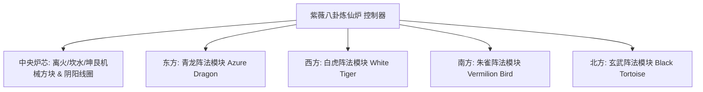

# 陰陽八卦煉仙炉と四象陣法システム

GTECore は、東洋の道家哲学と現代重工業工学を組み合わせた **「太極八卦と四象陣法体系」** を独自に創り出しました。この体系は、ゲーム中盤から終盤にかけての冶金、超伝導物質合成、仙道テクノロジーへの躍進の中核ハブとなります。

---

## 🌌 陰陽八卦煉仙炉 (`yin_yang_eight_trigmas_blast_furnace`)

**紫薇八卦煉仙炉** は、現在のテックMOD界で最も大規模で、最も精密な機構を持つマルチブロック構造の一つです（55×55ブロック以上を占有）：



### 🧭 風水の向きの法則（重要メカニズム）
> [!IMPORTANT]
> **風水方位の法則**：風水と磁場の制約により、**煉仙炉のメインコントローラーは正面を南に向けて設置しなければなりません**。そうすることで、天地の陰陽の気と通じ、正常に形成・稼働できます！

### 炉体の基本能力

- **対応レシピライブラリ**：通常の高炉レシピ (`blast_recipes`)、溶解炉レシピ (`furnace_recipes`)、合金炉レシピ (`alloy_smelter_recipes`)、GCYM 巨大合金高炉レシピ (`alloy_blast_recipes`)、そして専用の **陰陽八卦レシピ (`yin_yang_eight_trigmas_blast`)** をネイティブにサポートします。
- **オーバークロック特性**：**1T Subtick 瞬時オーバークロック** と **バッチモード (Batch Mode)** を完全サポートします。

---

## 🐉 四象陣法サブモジュールと動的条件検出

煉仙炉の周囲には、**東の青龍、西の白虎、南の朱雀、北の玄武** という四大陣法の翼をそれぞれ延伸・構築できます：

| 陣法モジュール | 陣法の方角 | 陣法ブロック | レシピ条件 (`RecipeCondition`) | 発動後の強化効果と作用 |
| :--- | :--- | :--- | :--- | :--- |
| **青龍陣法** (`Qing Long`) | **東方 (East)** | `qinglong_module` | `QING_LONG_CONDITION` | 木が火を生む勢いを活性化し、超高温精錬のエネルギー消費を大幅に削減、生生不息の高次触媒レシピを解放します。 |
| **白虎陣法** (`Bai Hu`) | **西方 (West)** | `baihu_module` | `BAI_HU_CONDITION` | 金の煞気が主に伐ち、高硬度の神金、超密度重核元素の核分裂、量子金属変成レシピを解放します。 |
| **朱雀陣法** (`Zhu Que`) | **南方 (South)** | `zhuque_module` | `ZHU_QUE_CONDITION` | 南明の離火、上限なしの極限炉温を提供し、恒星級プラズマ溶鋳と神丹錬成レシピを解放します。 |
| **玄武陣法** (`Xuan Wu`) | **北方 (North)** | `xuanwu_module` | `XUAN_WU_CONDITION` | 坎水が鎮守し、超高温生成物を極速冷却、瞬時固化と反物質安定化レシピを解放します。 |

### 動的検出と状態フィードバック

- コントローラーは構造スキャンとレシピマッチングのたびに、`checkModule()` を自動的に呼び出し、四方のオフセット座標上の陣法ブロックが準備完了かどうかを計算します。
- **Jade** を使ってコントローラーに照準を合わせると、現在の四つの陣法のアクティブ状態を直感的に確認できます（緑はアクティブ、赤は未準備）。

---

## 🔮 派生道道核心と群星マトリクス

八卦煉仙炉を基盤として、GTECore はさらに一連の星天道法マルチブロックを展開します：

```
GTE 高阶阵列工业群
├── 太极五行剥离阵列 (Tai Chi Five Elements Separation Array)
├── 坤艮星枢 (Kun Gen Star Hub)
├── 谦穹引擎 (Qian Qiong Engine)
├── 赤阳道核 (Red Sun Tao Core)
└── 烬星聚变阵 (Ashing Star Fusion Array)
```

1. **太極五行剥離アレイ (`taichi_five_elements_separation_array`)**：
   - 現実と幻想の中のあらゆる鉱物や化学物質を剥離・解析し、純粋な **金、木、水、火、土** の五行本源元素に還元します。
2. **坤艮星枢 (`kun_gen_star_hub`)**：
   - 大地と星辰の重力波を連結し、微視的グラビトンを集束させ、ミニチュアブラックホールを構築するために使用します。
3. **謙穹エンジン (`qian_qiong_engine`)**：
   - 虚空からエネルギーを取り出すエンジンで、虚無の量子ゆらぎから広大無辺の虚空エネルギーを抽出します。
4. **赤陽道核 (`red_sun_tao_core`)**：
   - 人工超微小恒星コアで、恒星のコロナ層の数兆度という極端な物理条件を再現します。
5. **烬星融合アレイ (`ashing_star_fusion_array`)**：
   - 超新星残骸の対消滅融合マトリクスで、暗黒物質と反物質の平衡状態を再構築するために使用します。