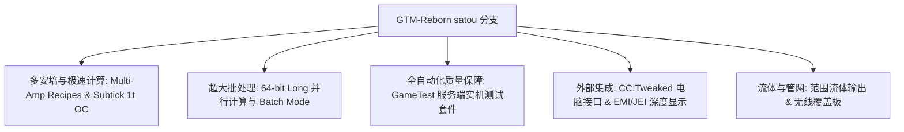

# GregTech Modern Reborn (GTM Reborn)

`modules/gtm-reborn` は GTE-Multi が深くカスタマイズした GregTech Modern の独立ブランチです（ブランチ名は `satou`）。

---

## 🚀 `satou` ブランチの核心的拡張機能

上流オリジナルと比較して、GTM-Reborn は現代の高バージョン Minecraft 1.20.1 上で、複数の革命的な技術進化と産業体験のアップグレードを実現しました：



### 1. 64ビット長整数並列処理とバッチモード (Batch Mode)
- **32ビット整数の上限を突破**：並列計算は全面的に `long` データ型を採用し、超大型工業群が極めて高い並列処理を行う際の数値オーバーフローや計算切り捨ての問題を完全に解決します。
- **スマートバッチモード**：原料が非常に豊富な場合、機械は何百何千もの微小なレシピを単一サイクルにまとめて実行でき、サーバーの Tick 負荷を大幅に低減します。

### 2. 1T Subtick 瞬時オーバークロック (OC_PERFECT_SUBTICK)
- 機械の Recipe Logic 実行パイプラインを最適化し、指定された上位機械が 1 Tick 内で複数回のレシピ反復を完了できるようにし、純粋な工業生産の限界を解放します。

### 3. マルチアンペア入力とレシピ対応 (Multi-Amp)
- 機械レシピは単一レシピで複数アンペア（Amperes）の電流を消費/出力でき、EMI/JEI インターフェースでマルチアンペア値と導線仕様のヒントを直感的に表示できます。

### 4. 範囲流体出力 (Ranged Fluid Outputs)
- 上位の蒸留塔と化学反応器が、異なる温度と圧力の運転条件に応じて範囲変動のある流体生成物を出力できるようにします。

### 5. CC:Tweaked (ComputerCraft) 現代周辺機器統合
- すべての標準機械は ComputerCraft に周辺機器インターフェースを開放します：
  - レシピの進行状況、残り時間、現在の EU/t 消費をリアルタイムに照会できます。
  - Lua スクリプトを通じて機械を動的に起動・一時停止したり、動作モードを切り替えたりできます。

---

## 🧪 自動テストと GameTest 検証

GTM-Reborn には、完全な Minecraft ネイティブ GameTest 自動テストスイートが含まれています（`src/test` にあります）：

```powershell
# 运行 GameTest 自动化服务端测试
$env:JAVA_HOME='C:\Users\Ex_Je\.jdks\ms-21.0.11'
.\gradlew.bat :modules:gtm-reborn:runGameTestServer
```

### テスト適用範囲
- **Cover システム**：流体ポンププレート、アイテム搬送プレート、エネルギー導流プレートのスループットと漏れ防止ロジックをテストします。
- **機械 Recipe Logic**：マルチアンペア、バッチ処理、レシピ間並列処理、オーバークロック計算をテストします。
- **マルチブロック構造の形成と回転**：各種筐体、ハッチが異なる向きでの構造検証をテストします。

---

## 🌿 サブモジュール Git ワークフロー規範

`modules/gtm-reborn` は独立した Git リポジトリ `takanashisatou/GregTech-Modern-Reborn` に対応し、デフォルトの開発ブランチは `satou` です：

```bash
# 独立在子模块中开发与提交
cd modules/gtm-reborn
git checkout satou
git add .
git commit -m "feat: optimize multiblock recipe logic"
git push origin satou

# 回到主工程更新 submodule 指针
cd ../..
git add modules/gtm-reborn
git commit -m "chore: bump gtm-reborn submodule pointer"
```