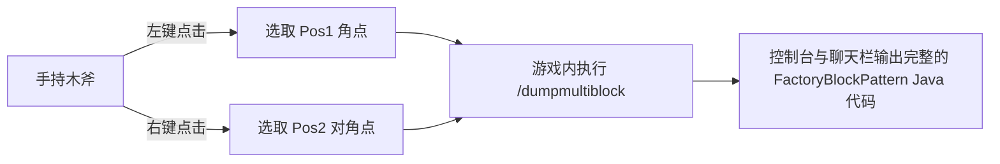

# KubeJS ツールセットとマルチブロック書き出しツール (`/dumpmultiblock`)

GTE は KubeJS サーバースクリプトに、開発者専用のマルチブロック自動構築・構造抽出ツールを組み込んでおり、マルチブロック構造設計のプロセスを完全に解放します。

---

## 🪓 マルチブロック可視化書き出しツール (`/dumpmultiblock`)

カスタムマルチブロック（Java コードでも KubeJS スクリプトでも）を開発する際、数十層の文字からなる `FactoryBlockPattern.aisle(...)` を手動で記述するのは、非常に時間がかかり、エラーも発生しやすいです。

GTE には **`/dumpmultiblock` 木の斧範囲選択書き出しツール** (`server_scripts/easymultiblock.js`) が組み込まれています：



### 使用手順

1. ゲームのクリエイティブモードに入り、**木の斧 (`minecraft:wooden_axe`)** を手に持ちます。
2. 構想に従って、ワールド内に完全なマルチブロック物理構造（筐体、ハッチ、コイル、メインコントローラーを含む）を直接構築します。
3. 木の斧で構造の底面の角ブロックを **左クリック** します（チャット欄に `已设置 Pos1: x, y, z` と表示されます）。
4. 木の斧で構造の対角線上の頂点ブロックを **右クリック** します（チャット欄に `已设置 Pos2: x, y, z` と表示されます）。
5. チャットボックスにコマンドを入力します：
   ```mcfunction
   /dumpmultiblock
   ```
6. スクリプトは3次元バウンディングボックス内のすべてのブロックタイプを自動的にスキャンし、文字マッピングを割り当て（`.` は空気、`A-Z/a-z/0-9` は具体的なブロック）、バックグラウンドログとクライアントに構造コードを直接生成します：

```java
// 自动导出的 FactoryBlockPattern 模板
.pattern(definition -> FactoryBlockPattern.start()
    .aisle("BBB", "BBB", "BBB")
    .aisle("BBB", "BAB", "BBB")
    .aisle("BBB", "B#B", "BBB")
    .where('A', Predicates.blocks("minecraft:air"))
    .where('#', Predicates.controller(Predicates.blocks(definition.getBlock())))
    .where('B', Predicates.blocks("gtceu:steam_machine_casing").or(Predicates.autoAbilities(definition.getRecipeTypes())))
    .build()
)
```

---

## 🌌 ディメンションの気体と流体鉱脈の設定

GTE は KubeJS を通じて、全ディメンションの流体・気体収集を拡張しました：

### 1. 全ディメンション気体抽出 (`dimension_gas.js`)
大型ガスコレクター (`gas_collector`) と異なる回路番号を組み合わせることで、任意のディメンションでそのディメンション固有の大気を抽出できます：
- **主世界の空気**：`circuit(4)` ➜ 出力 `gtceu:air 10000`
- **ネザーの地獄の気**：`circuit(5)` ➜ 出力 `gtceu:nether_air 10000`
- **エンドの虚空の気**：`circuit(6)` ➜ 出力 `gtceu:ender_air 10000`

### 2. 万能回路変換器 (`universal_circuit.js`)
クロスモッドと各グレードの回路基板の複雑なレシピの積み重ねを解決するため、GTE は **ユニバーサル回路 (`universal_circuit`)** システムを導入しました：
- パッカー (`packer`) 内で、同じ電圧レベルの任意の回路（ULV から MAX まで）を **1 EU / 1 tick** で、統一されたユニバーサル回路アイテムにロスなく変換できます。