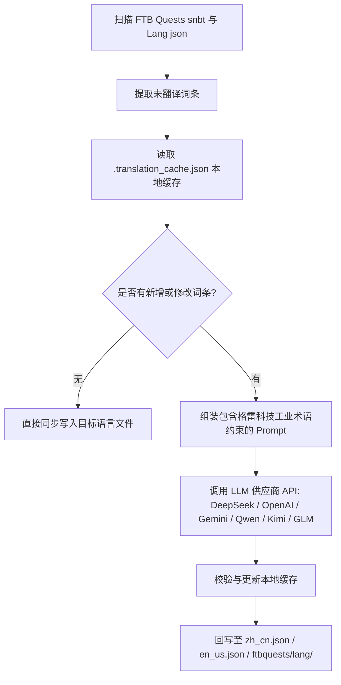

# AI 국제화 번역 엔진 (`opencode_translate.py`)

GTE 엔지니어링은 현대 대규모 언어 모델(LLM) 기반의 모드 간 완전 자동 국제화 번역 시스템을 설계하고 구현했습니다 (`scripts/opencode_translate.py`에 위치).

---

## 🤖 번역 엔진 아키텍처

전통적인 커뮤니티 한글화는 복잡한 JSON 및 SNBT 텍스트를 수동으로 유지 관리해야 했으며, 업데이트가 지연되고 오류가 발생하기 쉬웠습니다.

GTE의 AI 번역 엔진은 표준화된 OpenAI 호환 API를 통해 FTB Quests 퀘스트 북과 핵심 Mod 언어 파일의 **자동화된 증분 추출, 용어 정렬 및 동시 번역**을 구현했습니다:



---

## 🔑 지원되는 LLM 공급업체 및 환경 변수

스크립트는 환경 변수를 통해 다양한 AI 모델 제공업체를 원활하게 전환할 수 있습니다:

| 공급업체 이름 | API Key 환경 변수 | Base URL 환경 변수 | 기본 모델 |
| :--- | :--- | :--- | :--- |
| **DeepSeek** | `DEEPSEEK_API_KEY` | `DEEPSEEK_BASE_URL` | `deepseek-chat` |
| **OpenAI** | `OPENAI_API_KEY` | `OPENAI_BASE_URL` | `gpt-4o-mini` |
| **Google Gemini** | `GEMINI_API_KEY` | `GEMINI_BASE_URL` | `gemini-3.5-flash` |
| **통이첸원 (DashScope)** | `DASHSCOPE_API_KEY` | `DASHSCOPE_BASE_URL` | `qwen-plus` |
| **월지암면 (Moonshot)** | `MOONSHOT_API_KEY` | `MOONSHOT_BASE_URL` | `moonshot-v1-8k` |
| **지푸칭옌 (Zhipu GLM)** | `ZHIPU_API_KEY` | `ZHIPU_BASE_URL` | `glm-4-flash` |
| **OpenCode 플랫폼** | `OPENCODE_API_KEY` | `OPENCODE_BASE_URL` | `deepseek-v4-flash` |
| **범용 집계 프록시** | `LLM_API_KEY` | `LLM_BASE_URL` | `LLM_MODEL` (사용자 정의) |

---

## 🎯 산업급 Prompt 제약 원칙

API를 호출하여 번역할 때 시스템에는 엄격한 Minecraft 및 GregTech 용어 규칙이 내장되어 있습니다:
1. **형식 기호 절대 보존**: Minecraft 기본 색상 형식 코드(예: `§a`, `§c`, `§6`)와 자리 표시자(`%s`, `%d`, `{0}`)를 완전히 보존합니다.
2. **과학 기술 용어 규범 통일**: 과학 기술 고유 명사 번역을 엄격히 고정합니다(예: `UHV`, `EU/t`, `Amps`, `Voltage`, `Overclock`, `Subtick` 등).
3. **해시 증분 캐시**: 모든 번역된 항목은 `.translation_cache.json`에 자동으로 영구 기록되며, 새로 추가되거나 변경된 텍스트만 네트워크 요청을 발생시켜 Token 비용과 CI 시간을 크게 절약합니다.

---

## 💻 로컬 실행 명령

로컬 개발 환경에서 원클릭으로 전체 번역을 실행합니다:

```powershell
# 设置任意一个有效 API Key 后执行
$env:DEEPSEEK_API_KEY="sk-..."
python scripts/opencode_translate.py
```