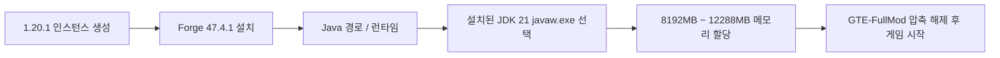

# 통합팩 다운로드 및 전체 모드 클라이언트 팩 가이드

GTE(GregTech Easy)는 다양한 기술 수준의 플레이어와 서버 관리자를 위해 세 가지 배포 형태를 제공합니다:

1. **CurseForge 표준 팩 (`GTE-CurseForge-*.zip`)**: 런처 표준 가져오기 형식입니다. `manifest.json`이 포함되어 있고 모드는 `overrides/mods/`에 위치하며, 런처가 Forge를 자동으로 설치합니다. **대부분의 플레이어에게 권장되는 방식입니다.**
2. **전체 모드 클라이언트 팩 (`GTE-FullMod-*.zip`)**: 최상위에 게임 콘텐츠만 담긴 평면 zip으로, 인스턴스를 직접 구성하는 플레이어를 위한 팩입니다.
3. **서버 팩 (`GTE-Server-*.zip`)**: Forge 전용 서버 팩으로 `mods/`가 zip 최상위에 있으며, 서버를 열고 멀티플레이를 즐기기 위한 팩입니다.

---

## 📦 전체 모드 클라이언트 팩

### 팩 구조

```text
README_安装必看.txt
mods/            (jar 17개)
config/
defaultconfigs/
kubejs/
```

중첩된 `.minecraft/` 디렉터리가 없고, 런처도 `run_game.bat`도 포함되지 않습니다. Minecraft 본체와 Forge는 런처가 설치하므로, 이 팩은 **런처에서 인스턴스를 만들 수 있다는 것을 전제**로 합니다.

### 필수 실행 환경

| 항목 | 버전 | 설명 |
| :--- | :--- | :--- |
| **Minecraft** | `1.20.1` | 다른 버전은 허용되지 않습니다 |
| **Forge** | `47.4.1` | 정확히 이 버전이어야 합니다 |
| **Java** | `21` | Java 17 또는 Java 8은 절대 사용하지 마세요 |

> [!CAUTION]
> **Forge는 반드시 47.4.1이어야 하며, "47.4.1 이상 아무 버전"이 아닙니다.**
> - 모드 `gtmthings`는 Forge `[47.4.1,)`을 요구하므로 그보다 낮은 버전은 로드되지 않습니다.
> - 반면 Forge 47.4.10은 ASM 9.8 + coremods 5.2.4를 포함하여 `appliedenergistics2` 15.4.9의 mixin이 깨지고, 게임이 메인 메뉴까지 도달하지 못합니다.
>
> 현재 사용 가능한 버전은 47.4.1뿐입니다.

### 설치 단계

=== "방법 1: 인스턴스 직접 구성 (이 팩의 사용법)"

    1. 런처(PCL2 / HMCL / Prism / MultiMC / 공식 런처 모두 가능)에서 Minecraft **1.20.1** 인스턴스를 만들고 **Forge 47.4.1**을 설치합니다.
    2. 한 번 실행하여 메인 메뉴까지 진입되는지 확인합니다(런처와 Java 문제를 배제하는 단계입니다).
    3. 해당 인스턴스의 게임 디렉터리(`.minecraft` 폴더, 런처에 보통 "폴더 열기" 버튼이 있습니다)를 엽니다.
    4. `GTE-FullMod-<版本号>.zip`의 내용을 **모두 압축 해제하여** 넣고, 이미 있는 같은 이름의 폴더와 병합합니다.
    5. 인스턴스 설정에서 Java를 **Java 21**로 지정하고 **8G ~ 12G** 메모리를 할당합니다.
    6. 게임을 시작합니다. 첫 실행 시 설정이 생성되므로 평소보다 조금 느립니다.

=== "방법 2: 런처 원클릭 가져오기 (권장)"

    `GTE-CurseForge-<版本号>.zip`을 사용하여 CurseForge App / PCL2 / HMCL / Prism Launcher / MultiMC에서 **모드팩 가져오기**를 선택하세요. 이 팩에는 `manifest.json`이 포함되어 런처가 Forge를 자동으로 설치하므로 수동 설정이 필요하지 않습니다.

=== "방법 3: 서버 열기"

    `GTE-Server-<版本号>.zip`을 사용하세요. `mods/`가 zip 최상위에 있습니다. 서버 루트 디렉터리에 압축을 풀고 `java -jar forge-*-installer.jar --installServer`를 실행한 뒤, `@libraries/net/minecraftforge/forge/1.20.1-47.4.1/unix_args.txt nogui`로 시작합니다.

> [!WARNING]
> 파일 이름이 `-slim.jar` 또는 `-dev-slim.jar`로 끝나는 jar는 Maven 사용자를 위한 산출물로, jar-in-jar 의존성을 의도적으로 포함하지 않습니다. **절대** `mods/`에 넣지 마세요. 그러면 Forge가 `ldlib`가 내장되지 않은 `gtceu` 빌드를 선택하여 `Missing or unsupported mandatory dependencies: Mod ID: 'ldlib' ... [MISSING]`로 중단됩니다. 배포되는 세 가지 팩에는 이런 파일이 포함되어 있지 않습니다.

---

## ⚠️ Java 21 실행 환경 요구 사항 (매우 중요)

> [!CAUTION]
> **이 통합팩은 실행 환경으로 Java 21 (JDK 21)을 필수로 요구합니다!**
> **Java 17** 또는 **Java 8**을 절대 사용하지 마세요. 그렇지 않으면 게임이 즉시 충돌하거나 시작을 거부합니다!

### 왜 Java 21을 사용해야 하나요?
- GTE의 핵심 모드(`gtecore`, `gtm-reborn`, `gt--`)는 **Java 21의 현대적인 언어 기능**(예: Record Patterns, Virtual Threads, 향상된 Switch 매칭)을 전면적으로 채택했습니다.
- Gradle 빌드 스크립트는 전역적으로 `JavaLanguageVersion.of(21)`을 구성하여 툴체인 검사를 강제합니다.

### 권장 JDK 21 다운로드 주소

| 배포판 | 다운로드 링크 | 추천 이유 |
| :--- | :--- | :--- |
| **Azul Zulu 21 (LTS)** | [Azul 공식 사이트로 이동](https://www.azul.com/downloads/?version=java-21-lts) | 성능이 뛰어나며 Minecraft 대규모 멀티스레드 최적화에 탁월합니다. |
| **Eclipse Temurin 21 (LTS)** | [Adoptium 공식 사이트로 이동](https://adoptium.net/temurin/releases/?version=21) | 공식 권장, 높은 호환성과 안정성 |
| **Microsoft OpenJDK 21** | [Microsoft 공식 사이트로 이동](https://learn.microsoft.com/zh-cn/java/openjdk/download) | Windows 플랫폼 네이티브 호환성이 우수합니다. |

### 런처에서 Java 21 구성



---

## 🎮 게임 내 단축키 및 자주 사용하는 명령어

| 명령어 / 단축키 | 기능 설명 | 권한 요구 사항 |
| :--- | :--- | :--- |
| `/ftbquests editing_mode true` | 퀘스트 북 시각적 편집 모드(작성자 모드) 활성화 | OP 권한 |
| `/ftbquests reload` | FTB Quests 퀘스트 북 설정 파일을 핫 리로드 | 모든 사용자 |
| `/kubejs reload server_scripts` | 서버 측 트윅 스크립트와 레시피를 핫 리로드 | OP 권한 |
| `/kubejs reload client_scripts` | 클라이언트 측 트윅 스크립트와 표시 로직을 핫 리로드 | 권한 불필요 |
| `/dumpmultiblock` | 목도끼로 영역을 선택한 후 원클릭으로 멀티블록 구조 코드를 내보냅니다 | OP 권한 |
| <kbd>U</kbd> / <kbd>R</kbd> | 커서가 있는 아이템의 용도(Usage) / 레시피(Recipe) 보기 | EMI / JEI 단축키 |
| <kbd>F7</kbd> | 주변 조명 레벨 보기 (빨간 X는 몬스터 생성 구역을 나타냄) | 클라이언트 단축키 |
