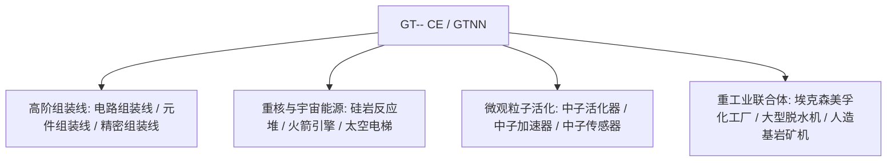

# GT-- Community Edition (GTNN)

`modules/gt--` (패키지명 `dev.arbor.gtnn`)는 **Kotlin + Java** 혼합 아키텍처로 구축된 GT-- Community Edition 공식 커뮤니티 에디션 모드입니다 (개발 브랜치는 `kotlin`).

---

## 🏗️ 아키텍처 및 기술 스택

- **개발 언어**: Kotlin 2.0.21 + Java 21.
- **지향점**: 클래식 GT 5.09 및 현대 확장팩에서 플레이어들에게 사랑받는 거대 조립 라인, 중핵 반응로, 탈수기 시스템, 우주 탐사 산업을 도입합니다.



---

## 🏭 핵심 멀티블록 기계 및 시설

### 1. 조립 라인 어레이

- **회로 조립 라인 (`circuit_assembly_line`)**：중고급 칩과 복합 회로를 효율적으로 대량 생산하는 데 특화되어 있으며, 다단계 정밀 케이싱을 지원합니다.
- **부품 조립 라인 (`component_assembly_line`)**：전압 등급(LV~MAX)에 따라 해당 등급의 케이싱을 사용하여 핵심 모터와 센서를 대량 조립합니다.
- **정밀 조립 라인 (`precision_assembly_line`)**：최고 정밀도의 나노 리소그래피 마스크와 슈퍼컴퓨팅 버스를 생산합니다.

### 2. 입자 가속 및 중성자 활성화 시스템

- **중성자 활성화기 (`neutron_activator`)** 및 **중성자 가속기 (`neutron_accelerator`)**：
  - 고에너지 충돌기와 고속 중성자 포획 반응을 시뮬레이션하여 일반적인 안정 동위원소를 방사성 중핵 물질 또는 초중 초전도 원소로 활성화합니다.
- **중성자 센서 (`neutron_sensor`)**：반응 챔버 내 중성자 운동 에너지 플럭스를 실시간으로 감지하여 레드스톤 또는 컴퓨터 신호 피드백을 제공합니다.

### 3. 중핵 에너지 및 우주 항공 산업

- **대형 나쿠아다 반응로 (`large_naquadah_reactor`)**：나쿠아다 합금과 농축 연료를 동력으로 사용하여 안정적이고 고밀도의 EU 에너지 출력을 제공합니다.
- **로켓 엔진 (`rocket_engine`)**：고급 로켓 연료를 소비하여 고하중 장비에 펄스 동력을 제공합니다.
- **우주 엘리베이터 (`space_elevator`)**：지구 저궤도를 관통하여 우주 기반 광물 채집과 미세중력 산업 제조를 실현합니다.

### 4. 화학 및 광업 복합 시설

- **엑슨모빌 화학 공장 (`exxonmobil_chemical_plant`)**：초대형 석유 심층 가공 복합 설비로, 단일 기계에서 분해, 개질, 방향족화, 중합의 전체 공정을 완료합니다.
- **대형 탈수기 (`large_dehydrator`)**：유체 또는 화학 광물에서 결정수와 유리수를 효율적으로 제거합니다.
- **인공 기반암 광석 기계 (`homemade_bedrock_ore_machine`)**：기반암 층에 인공 드릴을 배치하여 깊은 곳의 무한 광맥을 끊임없이 추출합니다.

---

## 🌿 서브모듈 Git 워크플로 규칙

`modules/gt--`는 독립 Git 저장소 `takanashisatou/GT---Community-Edition`에 해당하며, 개발 브랜치는 `kotlin`입니다:

```bash
# 独立在子模块中开发与提交
cd modules/gt--
git checkout kotlin
git add .
git commit -m "feat: add precision assembly line recipes"
git push origin kotlin

# 回到主工程更新 submodule 指针
cd ../..
git add modules/gt--
git commit -m "chore: bump gt-- submodule pointer"
```