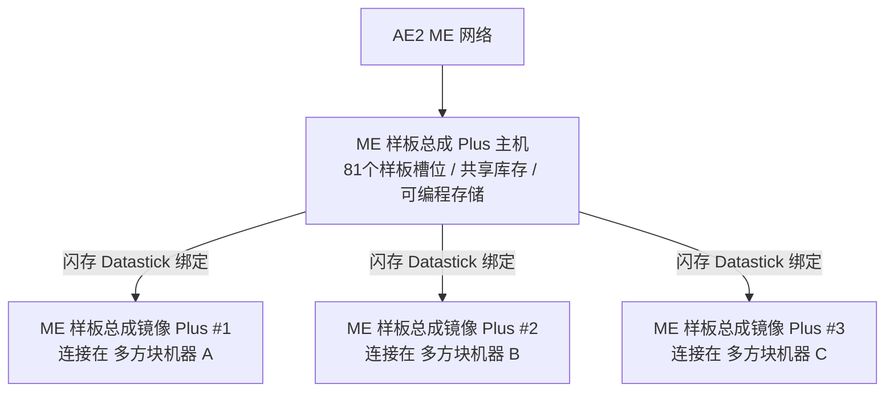

# AE2 딥 인티그레이션 및 패턴 어셈블리 Plus 시스템

GTECore는 Applied Energistics 2(AE2)와 GregTech 멀티블록 구조 사이에 매우 강력한 직접 데이터 상호 연결 다리를 놓습니다.

---

## 🧩 ME 패턴 어셈블리 Plus (`me_pattern_buffer_plus`)

기존 테크 모드에서 AE2 패턴 공급기를 멀티블록 기계에 연결할 때 일반적으로 **슬롯 부족, 유체와 아이템 혼합 출력 불가, 패턴 다중 기계 공유의 어려움** 같은 문제가 있습니다.

GTECore가 개발한 **ME 패턴 어셈블리 Plus**가 이 문제를 완전히 해결합니다:

### 핵심 기능
1. **대용량 패턴 슬롯**: 단일 어셈블리 호스트에는 **81개의 패턴 슬롯**이 있습니다 (표준 AE2 패턴 공급기 9개의 총합에 해당).
2. **올인원 하치 기능**: `IMPORT_ITEMS`, `IMPORT_FLUIDS`, `EXPORT_ITEMS`, `EXPORT_FLUIDS` 능력을 동시에 갖추어 유체와 아이템을 같은 하치에서 혼합 상호작용할 수 있습니다.
3. **프로그래머블 스토리지 지원**: 내부에 Programmable Storage 메커니즘이 통합되어 복잡한 레시피의 정밀 투입과 캐싱을 지원합니다.

---

## 🪞 ME 패턴 어셈블리 미러 Plus (`me_pattern_buffer_proxy_plus`)

**패턴 어셈블리 미러 Plus**는 혁신적인 분산 자동화 구조 부품입니다:

### 작동 원리 및 기계 간 공유
- 미러 어셈블리를 임의의 멀티블록 기계의 하치 슬롯에 설치합니다.
- **플래시 메모리(Datastick)** 를 손에 들고 메인 **ME 패턴 어셈블리 Plus**를 우클릭하여 좌표를 읽은 다음, **패턴 어셈블리 미러 Plus**를 우클릭하여 바인딩합니다.
- **바인딩된 모든 미러는 메인 어셈블리에 배치된 81개의 모든 패턴을 실시간으로 공유합니다!**
- AE2 네트워크가 자동 조합 작업을 시작하면, 네트워크는 자동으로 부하를 분산하여 모든 유휴 미러 기계에 할당하고 병렬로 가동합니다!

### Jade 호버 상태 표시
패턴 어셈블리 또는 미러를 바라보면 Jade가 자동으로 표시합니다:
- 메인 어셈블리: `已连接镜像数量: X`
- 미러 파트: `已绑定至 - X: ..., Y: ..., Z: ...`

---

## 💨 ME 증기 하치 (`me_steam_hatch`)

- **기능**: AE2 유체 네트워크와 증기 멀티블록 구조를 직접 연결합니다.
- **역할**: 증기 멀티블록 구조는 복잡한 고속 증기 파이프와 저장 탱크를 외부에 설치할 필요 없이, ME 네트워크에서 최고 처리량으로 즉시 증기를 추출하여 에너지를 공급하므로 파이프 전송 병목 현상을 없앱니다.