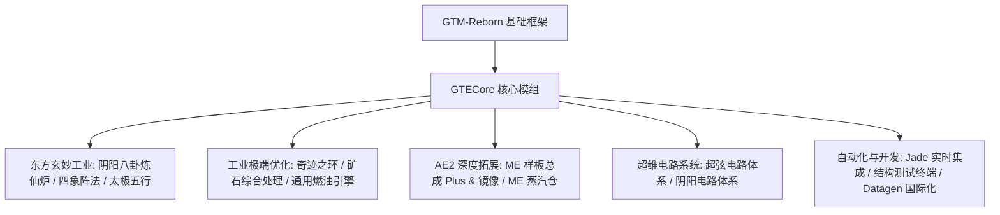

# GTECore 핵심 모드 개요

**GTECore**는 GregTech Easy 프로젝트의 맞춤형 Java 핵심 모드입니다. `gtm-reborn` 소스 코드에 직접 의존하며, 대규모 멀티블록 산업 구조, 고급 진법 기술, AE2 심층 상호작용 및 초급 회로 제조 시스템을 확장합니다.

---

## 🏛️ 모드 아키텍처 및 설계 방향

---

## 📦 크리에이티브 모드 아이템 탭 및 분류

GTECore는 게임 내에 독립적인 크리에이티브 모드 탭을 등록합니다:

1. **그레그테크 Easy 기계 (`itemGroup.gtecore.gtecore_machines`)**:
   - GTE 고유의 모든 멀티블록 컨트롤러 블록(음양 팔괘 고로, 기적의 고리, 광석 처리 센터, 화학 터미네이터 등)을 포함합니다.
   - 다단계 슈퍼 배터리 버퍼(Max Super Battery Buffer), ME 증기 해치, ME 패턴 어셈블리 Plus 및 미러를 포함합니다.
2. **그레그테크 Easy 아이템 (`itemGroup.gtecore.gtecore_items`)**:
   - 초끈 및 음양 회로 시리즈 아이템(프로세서, 클러스터, 슈퍼컴퓨터, 메인프레임)을 포함합니다.
   - 오행 원소 부적, 팔괘 칩, 삼청의 입자, 구조 테스트 터미널 등의 전용 도구를 포함합니다.

---

## ⚙️ 모드 전역 설정 (`GTEConfig`)

GTECore는 게임 내 및 파일 구성 옵션을 제공합니다 (`config/gtecore-common.toml` 또는 게임 내 설정 메뉴에 위치):

| 설정 항목 | 기본값 | 상세 설명 |
| :--- | :--- | :--- |
| `superPeace` (슈퍼 평화 모드) | `false` | 활성화하면 악성 적대적 몹 생성을 완전히 비활성화하여 기술 건설을 위한 절대적으로 깨끗한 환경을 제공합니다. |
| `durationMultiplier` (레시피 시간 배율) | `1.0` | GTECore 사용자 정의 레시피의 소요 시간 배율을 전역적으로 조정합니다. |

---

## 🔍 Jade / TOP 네이티브 통합

GTECore에는 **`GTEJadePlugin`** 플러그인 지원이 내장되어 있습니다:
- **ME 패턴 어셈블리 Plus 상태**: 현재 어셈블리에 바인딩된 패턴 수, 유체 및 아이템 출력 모드를 실시간으로 표시합니다.
- **ME 패턴 어셈블리 미러 Plus 바인딩 정보**: 호버 시 바인딩된 기본 어셈블리의 좌표 `(X, Y, Z)` 및 네트워크 연결 상태를 직접 표시합니다.
- **진법 활성화 표시**: 음양 팔괘 연선로에서 청룡, 백호, 주작, 현무 사상 진법의 준비 상태를 실시간으로 표시합니다.

---

## 🛠️ 구조 테스트 터미널 (`Structure Testing Terminal`)

GTECore는 전용 휴대 도구인 **구조 테스트 터미널** (`item.gtecore.check_structure_terminal`)을 제공합니다:
- **멀티블록 컨트롤러를 우클릭**: 구조 완전성을 실시간으로 스캔합니다.
- **오류 진단 알림**: 구조가 형성되지 않은 경우, 터미널은 채팅창과 호버 툴팁에서 **오류 블록 좌표 및 배치하지 말아야 할 위치**를 정확히 지적하여 대형 멀티블록 건설과 오류 수정을 크게 가속화합니다.