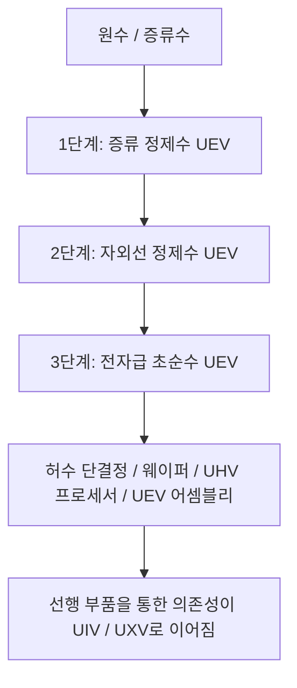

# 3단계 정수 시스템과 산업용수 순환

GTECore의 **3단계 정수 시스템 전체는 UEV에 속합니다**. 각 단계는 연속적인 처리 공정과 수질을 나타내며, 서로 다른 전압 시대를 뜻하지 않습니다. 중앙 플랜트, 정수 유닛 3기, 제어 해치는 모두 UEV 부품과 회로를 사용하고 UEV 전압에서 조립합니다. 세 처리 단계와 EDI 재생은 모두 UEV에서 작동합니다.

이 라인은 **중앙 플랜트 1기와 정수 유닛 3기**로 구성됩니다. 유닛에는 에너지 해치가 없습니다. 데이터 스틱으로 중앙 플랜트에 연결하여 전력과 병렬 처리 한도를 전달받습니다.

## 💧 3단계 정수 유체 사양

| 등록 유체 | 재료 이름 | 기술 단계 |
| :--- | :--- | :---: |
| `distilled_purified_water` | 증류 정제수 | UEV |
| `uv_purified_water` | 자외선 정제수 | UEV |
| `ultrapure_water` | 전자급 초순수 | UEV |

산업용 수질 설명은 배경 정보입니다. 실제 게임 내 동작은 레시피, 열 안정성, 자외선 조사량, EDI 부하에 따라 결정됩니다.

## 🏭 멀티블록 기계 4종

| 기계 | 등록 ID | 기술 단계 |
| :--- | :--- | :---: |
| 중앙 정수 플랜트 | `central_water_purification_plant` | UEV |
| 1단계 청징 정수 유닛 | `t1_clarifier_purification_unit` | UEV |
| 2단계 자외선 산화 정수 유닛 | `t2_uv_oxidation_purification_unit` | UEV |
| 3단계 EDI 초순수 정수 유닛 | `t3_edi_ultrapure_purification_unit` | UEV |

기존 `ultrapure_water_refinery`는 호환성을 위해 등록은 유지되지만 비활성화되어 있습니다. 전체 정수 공정을 실행할 수 없으므로 중앙 플랜트와 유닛 3기로 전환하세요.

### 1. 중앙 정수 플랜트

플랜트 자체는 정수 레시피를 처리하지 않습니다. 연결 정보를 저장하고, 연결된 유닛 중 구조가 완성된 유닛에 전력을 분배하며, 실제 출력 전력을 EU/s로 표시하고, 설정된 병렬 처리 한도를 전달합니다. 유닛이 작동하려면 구조가 완성된 중앙 플랜트에 연결되어 있어야 합니다.

### 2. 1단계: 청징 및 열처리 (UEV)

첫 단계에서는 유입되는 물의 불순물을 분리합니다. 기본 레시피는 다음과 같습니다.

- 물 1000 mB + 복합 응집제 50 mB + 개질 탄소 미소구체 1개 → 증류 정제수 900 mB / 60 ticks. 소금 가루와 희토류 가루가 확률적으로 함께 생성됩니다.
- 증류수 1000 mB + 복합 응집제 25 mB + 개질 탄소 미소구체 1개 → 증류 정제수 1000 mB / 30 ticks. 소금 가루가 확률적으로 함께 생성됩니다.

실제 물 생산량은 열 안정성에도 영향을 받습니다. 이 공정이 UEV 정수 라인의 시작점입니다.

### 3. 2단계: 심자외선 산화 (UEV)

자외선 조사와 산화제로 유기 불순물을 분해합니다. 기본 레시피는 다음과 같습니다.

- 증류 정제수 800 mB + 오존 50 mB → 자외선 정제수 800 mB + 산소 25 mB / 40 ticks.
- 증류 정제수 800 mB + 과산화수소 50 mB → 자외선 정제수 800 mB + 산소 25 mB / 20 ticks.

두 경로 모두 자외선 조사량 요구 조건도 충족해야 완료됩니다.

### 4. 3단계: 전기 탈이온 및 최종 정제 (UEV)

EDI 단계는 잔류 이온을 제거합니다. 게임 내에서는 시약과 수지를 사용하며, 축적된 이온 부하는 별도의 재생 레시피로 해소합니다.

- 자외선 정제수 800 mB + 전자급 산염기 시약 20 mB + 혼상 수지 비드 1개 → 전자급 초순수 800 mB / 30 ticks.
- EDI 재생: 자외선 정제수 100 mB + 전자급 산염기 시약 1 mB / 2 ticks. 이온 부하를 해소하며 물은 생산하지 않습니다.

## 🔌 라인 연결 및 운전

1. GT 데이터 스틱을 들고 중앙 플랜트를 웅크린 상태로 우클릭하여 좌표를 복사합니다.
2. 해당 스틱으로 정수 유닛을 우클릭하면 연결됩니다. 반대 순서도 가능합니다. 유닛의 좌표를 복사한 다음 플랜트를 우클릭하세요.
3. 에너지 해치(1–4개, 레이저 입력 지원)를 통해 중앙 플랜트에 전력을 공급합니다. 플랜트는 연결된 유닛에 전력을 전달합니다.
4. 플랜트 GUI에서 병렬 처리 한도를 1부터 65536까지 설정합니다.
5. 각 유닛의 GUI에서 연결된 플랜트의 좌표, 병렬 처리 한도, 내부 에너지 버퍼를 확인합니다.

각 유닛은 레시피 소비 전력에 실제 병렬 처리 수를 곱한 만큼 전력을 소비합니다. 유닛 3기의 전력 상한은 모두 `UEV 전압 × 256 A`로 동일합니다. 1, 2, 3단계는 처리 공정을 나타내며, 작동 전압이나 해금 단계가 다르다는 뜻이 아닙니다. 실제 병렬 처리 수는 사용 가능한 재료와 출력 용량에도 영향을 받으므로 중앙 한도를 높이는 것만으로 처리량이 보장되지는 않습니다.

## 🔄 허수 제품 생산과 가동 준비 순서

다음 허수의 나무 레시피는 3단계 `ultrapure_water`를 직접 소비합니다. 수량은 레시피 1회 처리 기준입니다.

| 제품 | 1회 생산량 | 전자급 용수 |
| :--- | ---: | ---: |
| 허수 단결정 | 4 | 4000 mB |
| 일반 허수 웨이퍼 | 16 | 1000 mB |
| UHV 허수 프로세서 | 4 | 1000 mB |
| UEV 허수 프로세서 어셈블리 | 2 | 2000 mB |

UIV 허수 슈퍼컴퓨터와 UXV 허수 메인프레임은 추가적인 물을 직접 소비하지 않습니다. 선행 어셈블리와 컴퓨터를 통해 물에 대한 의존성을 이어받습니다. 산출물의 회로 등급이나 레시피 전압은 정수 시스템의 UEV 해금 조건을 바꾸지 않습니다.

가동 준비 순서는 **UHV 부품 + 음양 계열 생산 → UEV 부품 8종 → UEV 정수 설비 → 3단계 전자급 용수 → 주요 허수 제품**입니다. 모드팩에는 UEV 부품 8종의 레시피가 추가되어 있습니다. 음양 레시피와 이 부품 레시피들은 전자급 용수를 직접 요구하지 않으므로, 정수 설비를 제작하는 데 그 설비 자체의 산출물이 필요한 순환 의존성이 생기지 않습니다.

허수 건축 재료, 첫 나무 제작 경로, 단결정 및 일반 웨이퍼 생산은 서로 연결됩니다. [허수 재료와 첫 나무](circuits-and-materials.md)를 참조하세요. 적일 도핵은 성장 배지 32개를 생산할 때마다 전자급 용수 4000 mB를 소비합니다. 잎 매트릭스는 구조용 블록으로 유지되며, 단결정 생산은 성장 배지를 반복해서 소비합니다.

**허수 액침 리소그래피 센터**는 3단계 전자급 용수를 소비하여 전용 레시피로 일반 허수 웨이퍼를 가공합니다. CPU 웨이퍼, 미가공 칩, 각인된 칩, 회로 칩, CPU 칩에는 이제 모두 UEV로 작동하는 연결된 생산 경로가 있습니다. 1회 처리 시 직접 소비하는 물의 양은 순서대로 **2000, 1000, 500, 1000, 500 mB**입니다. 노광과 각인에는 소모되지 않고 재사용할 수 있는 음양 유리 렌즈를 사용합니다. 두 분기와 전체 재료 수량은 [허수 액침 리소그래피 센터](circuits-and-materials.md)를 참조하세요. 제어기는 음양 UIV 회로와 일반 허수 웨이퍼로 제작할 수 있으며, 이 기계가 생산하는 칩을 요구하지 않습니다.

### 허수 회로 제조기

[허수 회로 제조기](circuits-and-materials.md)는 리소그래피 센터의 CPU 칩과 회로 칩, 이전 세대 UIV 회로, UEV 부품을 사용해 생산을 시작합니다. 초기 가동에 자체 생산한 기판이나 SoC는 필요하지 않습니다. 세 공정은 모두 UEV를 사용합니다.

| 공정 산출물 | 1회 생산량 | 전자급 용수 직접 소비량 | 기본 소요 시간 |
| :--- | ---: | ---: | ---: |
| 허수의 나무 회로 기판 | 4 | 2000 mB | 30 s |
| 허수의 나무 인쇄 회로 기판 | 1 | 1000 mB | 20 s |
| 허수의 나무 SoC | 2 | 2000 mB | 30 s |

레시피 체인은 이제 기판, 인쇄 기판, SoC, 네 등급의 완성 회로 전체로 이어집니다. 허수의 나무는 여전히 **UEV 제조 전압**에서 네 종류의 완성 회로를 생산하며, 1회 생산량은 **4 / 2 / 1 / 1**입니다. 각 회로의 **UHV / UEV / UIV / UXV 회로 태그**는 변경되지 않습니다. UIV와 UXV는 선행 제품을 통해 물 소비를 이어받습니다.

별칼날 식각기와 회로 공장의 수질을 낮춘 물 재활용, 광석 처리 추가 산출량, 90% 회수 순환은 아직 구현되지 않은 제안이며, 사용할 수 있는 기능이 아닙니다.
