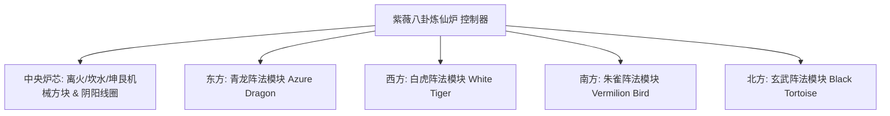

# 음양팔괘 연선로와 사상진법 시스템

GTECore는 동양 도가 철학과 현대 중공업 공학을 결합한 **“태극팔괘와 사상진법 체계”**를 독자적으로 창안했습니다. 이 체계는 게임 중후반의 야금, 초전도 물질 합성, 선도(仙道) 기술 도약의 핵심 허브를 구성합니다.

---

## 🌌 음양팔괘 연선로 (`yin_yang_eight_trigmas_blast_furnace`)

**자미팔괘 연선로**는 현재 기술 모드계에서 규모가 가장 웅장하고 메커니즘이 가장 정밀한 멀티블록 구조 중 하나입니다 (점유 면적 55×55 블록 이상):



### 🧭 풍수 방향 법칙 (핵심 메커니즘)
> [!IMPORTANT]
> **풍수 방위의 법칙**: 풍수와 자기장 제약으로 인해 **연선로 주 제어기는 정면을 남쪽으로 향하게 배치해야** 천지의 음양 기운과 통하고 정상적으로 형성되어 작동할 수 있습니다!

### 노체 기본 능력
- **레시피 라이브러리 지원**: 일반 고로 레시피 (`blast_recipes`), 용해로 레시피 (`furnace_recipes`), 합금로 레시피 (`alloy_smelter_recipes`), GCYM 거대 합금 고로 레시피 (`alloy_blast_recipes`), 그리고 전용 **음양팔괘 레시피 (`yin_yang_eight_trigmas_blast`)**를 기본적으로 호환합니다.
- **오버클럭 특성**: **1T Subtick 순간 오버클럭** 및 **배치 모드 (Batch Mode)**를 완벽하게 지원합니다.

---

## 🐉 사상진법 서브모듈 및 동적 조건 감지

연선로 주변에는 각각 **동쪽 청룡, 서쪽 백호, 남쪽 주작, 북쪽 현무**의 네 대 진법 날개를 확장하여 구축할 수 있습니다:

| 진법 모듈 | 진법 방위 | 진법 블록 | 레시피 조건 (`RecipeCondition`) | 활성화 시 이점 및 효과 |
| :--- | :--- | :--- | :--- | :--- |
| **청룡 진법** (`Qing Long`) | **동쪽 (East)** | `qinglong_module` | `QING_LONG_CONDITION` | 목생화(木生火)의 기세를 활성화하여 초고온 야금 에너지 소모를 대폭 낮추고, 끊임없이 생성되는 고급 촉매 레시피를 해금합니다. |
| **백호 진법** (`Bai Hu`) | **서쪽 (West)** | `baihu_module` | `BAI_HU_CONDITION` | 금살(金煞)이 주관하는 정벌로, 고경도 신금, 초밀집 중핵 원소 분해, 양자 금속 변성 레시피를 해금합니다. |
| **주작 진법** (`Zhu Que`) | **남쪽 (South)** | `zhuque_module` | `ZHU_QUE_CONDITION` | 남명리화(南明離火)로 무제한 극한 노온을 제공하고, 항성급 플라즈마 용주와 신단 제련 레시피를 해금합니다. |
| **현무 진법** (`Xuan Wu`) | **북쪽 (North)** | `xuanwu_module` | `XUAN_WU_CONDITION` | 감수(坎水)가 진수하여 초고온 산출물을 극속 냉각하고, 순간 고형화와 반물질 안정화 레시피를 해금합니다. |

### 동적 감지 및 상태 피드백
- 컨트롤러는 구조 스캔 및 레시피 매칭 시마다 `checkModule()`을 자동으로 호출하여 사방 오프셋 좌표의 진법 블록이 준비되었는지 계산합니다.
- **Jade**를 사용하여 컨트롤러를 바라보면 현재 네 진법의 활성화 상태를 직관적으로 확인할 수 있습니다 (초록색은 활성화, 빨간색은 미준비).

---

## 🔮 파생 도도(道道) 코어와 군성 매트릭스

팔괘 연선로를 기반으로 GTECore는 일련의 성천도법(星天道法) 멀티블록을 추가로 확장했습니다:

```
GTE 高阶阵列工业群
├── 太极五行剥离阵列 (Tai Chi Five Elements Separation Array)
├── 坤艮星枢 (Kun Gen Star Hub)
├── 谦穹引擎 (Qian Qiong Engine)
├── 赤阳道核 (Red Sun Tao Core)
└── 烬星聚变阵 (Ashing Star Fusion Array)
```

1. **태극오행 박리 배열 (`taichi_five_elements_separation_array`)**:
   - 현실과 환상 속의 모든 광물과 화학 물질을 분리·분해하여 순수한 **금(金), 목(木), 수(水), 화(火), 토(土)** 오행 본원 원소로 만듭니다.
2. **곤간성추 (`kun_gen_star_hub`)**:
   - 대지와 별의 중력파를 연결하여 미시적 중력자를 모으고 초소형 블랙홀을 구축하는 데 사용합니다.
3. **겸궁 엔진 (`qian_qiong_engine`)**:
   - 허공에서 에너지를 취하는 엔진으로, 무(無)의 양자 요동에서 광활무변한 허공 에너지를 추출합니다.
4. **적양도핵 (`red_sun_tao_core`)**:
   - 인공 초미세 항성 코어로, 항성 코로나(일면)의 수조 도(度) 극한 물리 조건을 모사합니다.
5. **진성(燼星) 핵융합 배열 (`ashing_star_fusion_array`)**:
   - 초신성 잔해의 소멸 핵융합 매트릭스로, 암흑 물질과 반물질의 평형 상태를 재구성하는 데 사용합니다.