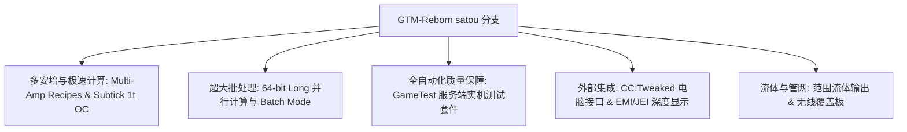

# GregTech Modern Reborn (GTM Reborn)

`modules/gtm-reborn`은 GTE-Multi가 깊게 커스터마이즈한 GregTech Modern 독립 브랜치입니다 (브랜치 이름: `satou`).

---

## 🚀 `satou` 브랜치 핵심 강화 기능

업스트림 원본과 비교하여, GTM-Reborn은 최신 높은 버전의 Minecraft 1.20.1에서 여러 혁신적인 기술 발전과 산업 경험 업그레이드를 구현했습니다:



### 1. 64비트 정수 병렬 처리 및 배치 모드 (Batch Mode)
- **32비트 정수 상한 돌파**: 병렬 계산에 전면적으로 `long` 데이터 타입을 사용하여, 초대형 산업 클러스터의 매우 높은 병렬 처리에서 발생하는 숫자 오버플로우나 계산 잘림 문제를 완전히 해결합니다.
- **지능형 배치 모드**: 원자재가 매우 풍부할 때, 기계는 수백 수천 번의 미세 레시피를 단일 주기로 묶어 실행하여 서버 Tick 부하를 크게 줄입니다.

### 2. 1T Subtick 순간 오버클럭 (OC_PERFECT_SUBTICK)
- 기계의 Recipe Logic 실행 파이프라인을 최적화하여, 지정된 고급 기계가 1 Tick 내에 여러 번의 레시피 반복을 완료할 수 있게 하여 순수한 산업 생산의 한계를 발휘합니다.

### 3. 멀티암페어 입력 및 레시피 지원 (Multi-Amp)
- 기계 레시피는 단일 레시피에서 다중 암페어(Amperes) 전류를 소비/출력할 수 있도록 지원하며, EMI/JEI 인터페이스에서 멀티암페어 수치와 전선 규격 힌트를 직관적으로 렌더링합니다.

### 4. 범위 유체 출력 (Ranged Fluid Outputs)
- 고급 증류탑과 화학 반응기가 온도와 압력 조건에 따라 범위가 변동하는 유체 산출물을 출력할 수 있게 합니다.

### 5. CC:Tweaked (ComputerCraft) 최신 주변기기 통합
- 모든 표준 기계는 ComputerCraft에 주변기기 인터페이스를 개방합니다:
  - 레시피 진행도, 남은 시간, 현재 EU/t 소비량을 실시간으로 조회합니다.
  - Lua 스크립트를 통해 기계를 동적으로 시작, 일시정지하거나 작업 모드를 전환할 수 있습니다.

---

## 🧪 자동화 테스트 및 GameTest 검증

GTM-Reborn은 완전한 Minecraft 네이티브 GameTest 자동화 테스트 스위트를 포함합니다 (`src/test`에 위치):

```powershell
# 运行 GameTest 自动化服务端测试
$env:JAVA_HOME='C:\Users\Ex_Je\.jdks\ms-21.0.11'
.\gradlew.bat :modules:gtm-reborn:runGameTestServer
```

### 테스트 적용 범위
- **Cover 시스템**: 유체 펌프 보드, 아이템 전송 보드, 에너지 전도 보드의 처리량과 누출 방지 로직을 테스트합니다.
- **기계 Recipe Logic**: 멀티암페어, 배치 처리, 레시피 간 병렬 처리 및 오버클럭 계산을 테스트합니다.
- **멀티블록 구조 형성과 회전**: 각종 케이싱과 버스/햇치가 서로 다른 방향에서의 구조 검증을 테스트합니다.

---

## 🌿 서브모듈 Git 워크플로 규칙

`modules/gtm-reborn`은 독립 Git 저장소 `takanashisatou/GregTech-Modern-Reborn`에 해당하며, 기본 개발 브랜치는 `satou`입니다:

```bash
# 独立在子模块中开发与提交
cd modules/gtm-reborn
git checkout satou
git add .
git commit -m "feat: optimize multiblock recipe logic"
git push origin satou

# 回到主工程更新 submodule 指针
cd ../..
git add modules/gtm-reborn
git commit -m "chore: bump gtm-reborn submodule pointer"
```