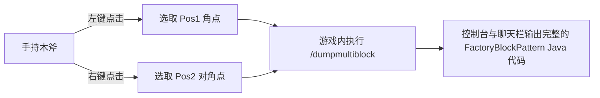

# KubeJS 도구 모음 및 멀티블록 내보내기 (`/dumpmultiblock`)

GTE는 KubeJS 서버 스크립트에 개발자 전용 멀티블록 자동화 구축 및 구조 추출 도구를 내장하여 멀티블록 구조 설계 프로세스를 완전히 해방합니다.

---

## 🪓 멀티블록 시각적 내보내기 (`/dumpmultiblock`)

사용자 정의 멀티블록(Java 코드든 KubeJS 스크립트든)을 개발할 때 수십 개의 레이어 문자로 구성된 `FactoryBlockPattern.aisle(...)`를 수동으로 작성하는 것은 매우 시간이 많이 걸리고 오류가 발생하기 쉽습니다.

GTE에는 **`/dumpmultiblock` 나무 도끼 영역 선택 내보내기** (`server_scripts/easymultiblock.js`)가 내장되어 있습니다:



### 사용 단계

1. 게임에서 크리에이티브 모드로 전환하고 **나무 도끼 (`minecraft:wooden_axe`)**를 손에 듭니다.
2. 구상대로 세계에 완전한 멀티블록 물리 구조(기계 케이싱, 버스, 코일, 메인 컨트롤러 포함)를 직접 설치합니다.
3. 나무 도끼로 구조물의 한쪽 밑면 모서리 블록을 **왼쪽 클릭**합니다 (채팅창에 `已设置 Pos1: x, y, z` 안내가 표시됩니다).
4. 나무 도끼로 구조물의 대각선 꼭대기 모서리 블록을 **오른쪽 클릭**합니다 (채팅창에 `已设置 Pos2: x, y, z` 안내가 표시됩니다).
5. 채팅창에 다음 명령어를 입력합니다:
   ```mcfunction
   /dumpmultiblock
   ```
6. 스크립트는 3D 경계 상자 내의 모든 블록 유형을 자동으로 스캔하고 문자 매핑(`.`은 공기, `A-Z/a-z/0-9`는 특정 블록)을 할당한 다음 백엔드 로그와 클라이언트에 구조 코드를 직접 생성합니다:

```java
// 自动导出的 FactoryBlockPattern 模板
.pattern(definition -> FactoryBlockPattern.start()
    .aisle("BBB", "BBB", "BBB")
    .aisle("BBB", "BAB", "BBB")
    .aisle("BBB", "B#B", "BBB")
    .where('A', Predicates.blocks("minecraft:air"))
    .where('#', Predicates.controller(Predicates.blocks(definition.getBlock())))
    .where('B', Predicates.blocks("gtceu:steam_machine_casing").or(Predicates.autoAbilities(definition.getRecipeTypes())))
    .build()
)
```

---

## 🌌 차원 가스 및 유체 광맥 설정

GTE는 KubeJS를 통해 전 차원의 유체 및 가스 수집을 확장했습니다:

### 1. 전 차원 가스 추출 (`dimension_gas.js`)
대형 가스 수집기(`gas_collector`)와 서로 다른 회로 번호를 사용하여 모든 차원에서 해당 차원 고유의 대기를 추출할 수 있습니다:
- **오버월드 공기**: `circuit(4)` ➜ 출력 `gtceu:air 10000`
- **네더 지옥 공기**: `circuit(5)` ➜ 출력 `gtceu:nether_air 10000`
- **엔드 보이드 공기**: `circuit(6)` ➜ 출력 `gtceu:ender_air 10000`

### 2. 유니버설 회로 변환기 (`universal_circuit.js`)
모드 간 및 각 등급 회로 기판의 복잡한 레시피 중첩을 해결하기 위해 GTE는 **유니버설 회로(`universal_circuit`)** 시스템을 도입했습니다:
- 포장기(`packer`)에서 동일한 전압 등급의 모든 회로(ULV~MAX)를 **1 EU / 1 tick**으로 손실 없이 통일된 유니버설 회로 아이템으로 변환할 수 있습니다.