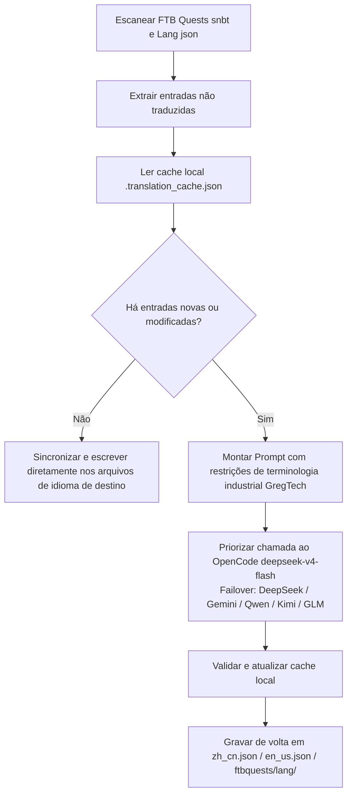

# Motor de Tradução Internacional por IA (`opencode_translate.py`)

O projeto GTE implementa um sistema de tradução internacional multilíngue de nível industrial, dirigido por um script unificado, cobrindo três áreas principais: ativos de mods, livros de missões FTB e documentação Markdown.

---

## 🔒 As Cinco Regras de Ferro da Tradução

A tradução deste projeto segue as seguintes **5 regras de ferro que não podem ser violadas**:

1. **Script Único**: Toda a tradução é exclusivamente conduzida por `scripts/opencode_translate.py`, integrado ao modelo `deepseek-v4-flash` do OpenCode Zen. É proibido introduzir um segundo script de tradução ou montar chamadas de API manualmente.
2. **Execução na Nuvem**: Todas as traduções completas devem ser executadas no GitHub Actions CI (`translate.yml` / `docs-deploy.yml` / `sync-build.yml`). É estritamente proibido executar em grande escala manualmente em ambiente local.
3. **Localização Única**: Todo o site é implantado uniformemente em `https://takanashisatou.github.io/GregtechEasy/` (branch `gh-pages`). Não se cria um segundo site de documentação nem se faz implantações duplicadas.
4. **Regras de Inglês**:
   - Sistema de documentação (`docs/en/`): O inglês deve ser totalmente traduzido por IA a partir de `docs/zh/`, sendo proibida a sobrescrita manual;
   - Projeto do mod: Apenas o `en_us.json` do `gtecore` é mantido manualmente. O script possui lógica de proteção integrada, nunca sobrescrevendo com tradução automática.
5. **Localização Profunda**: O menu de navegação (`nav_translations`), textos de diagramas Mermaid, comentários de código e rótulos de tabelas devem ser 100% localizados para o idioma correspondente.

---

## 🤖 Arquitetura do Motor de Tradução

A tradução comunitária tradicional depende de manutenção manual de arquivos JSON e SNBT complexos, com atualizações atrasadas e alta propensão a erros e omissões.

O motor de tradução por IA do GTE, através de uma API padronizada compatível com OpenAI, implementa **extração incremental automatizada, alinhamento de terminologia e tradução concorrente** para os livros de missões FTB Quests e arquivos de idioma do mod principal:

---

## 🔑 Provedores de LLM Suportados e Variáveis de Ambiente

O script seleciona automaticamente a primeira chave de API disponível, sem necessidade de especificar manualmente o provedor:

| Prioridade | Nome do Provedor | Variável de Ambiente da API Key | Variável de Ambiente da Base URL | Modelo Padrão |
| :---: | :--- | :--- | :--- | :--- |
| **1 (Preferencial)** | **OpenCode Zen** | `OPENCODE_API_KEY` | `OPENCODE_BASE_URL` | **`deepseek-v4-flash`** |
| 2 | DeepSeek | `DEEPSEEK_API_KEY` | `DEEPSEEK_BASE_URL` | `deepseek-chat` |
| 3 | Google Gemini | `GEMINI_API_KEY` | `GEMINI_BASE_URL` | `gemini-3.6-flash` |
| 4 | Tongyi Qianwen (DashScope) | `DASHSCOPE_API_KEY` | `DASHSCOPE_BASE_URL` | `qwen-plus` |
| 5 | Moonshot AI | `MOONSHOT_API_KEY` | `MOONSHOT_BASE_URL` | `moonshot-v1-8k` |
| 6 | Zhipu GLM | `ZHIPU_API_KEY` | `ZHIPU_BASE_URL` | `glm-4-flash` |
| 7 | OpenAI | `OPENAI_API_KEY` | `OPENAI_BASE_URL` | `gpt-4o-mini` |
| 8 | Proxy Agregador Genérico | `LLM_API_KEY` | `LLM_BASE_URL` | `LLM_MODEL` (personalizado) |

> **Nota**: Basta configurar `OPENCODE_API_KEY` nos Secrets do GitHub para que o CI funcione completamente. Os demais são Failovers de reserva.

---

## 🎯 Princípios de Restrição do Prompt de Nível Industrial

Ao chamar a API para tradução, o sistema possui regras estritas de terminologia do Minecraft e GregTech:

1. **Preservação Absoluta de Formatadores**: Preservar integralmente os códigos de formatação de cor nativos do Minecraft (como `§a`, `§c`, `§6`) e placeholders (`%s`, `%d`, `{0}`).
2. **Padronização de Termos Técnicos**: Tradução estritamente fixada para nomes técnicos especializados (como `UHV`, `EU/t`, `Amps`, `Voltage`, `Overclock`, `Subtick`, etc.).
3. **Cache Incremental por Hash**: Todas as entradas já traduzidas são persistidas automaticamente em `.translation_cache.json`. Apenas textos novos ou alterados geram requisições de rede, economizando significativamente tokens e tempo de CI.
4. **Localização de Textos em Diagramas Mermaid**: Rótulos de nós de fluxogramas (como `A[Rótulo]`) são traduzidos para o idioma de destino, enquanto palavras-chave de sintaxe como `graph TD`, `-->`, `subgraph` permanecem inalteradas.
5. **Comentários de Código e Rótulos de Tabelas**: Comentários dentro de blocos de código (`//` / `#`) e cabeçalhos de colunas de tabelas são totalmente localizados.

---

## 🏗️ Arquivos Protegidos (Não Traduzíveis Automaticamente)

| Caminho | Motivo da Proteção | Mecanismo de Proteção |
| :--- | :--- | :--- |
| `modules/gtecore/src/main/resources/assets/gtecore/lang/en_us.json` | A tradução em inglês do gtecore é mantida manualmente pelo autor | O script detecta a flag `is_gtecore` e ignora a sobrescrita para o idioma `en_us` |

---

## 💻 Formas de Acionamento do CI (Execução na Nuvem, Regra de Ferro 2)

| Cenário | Workflow | Forma de Acionamento |
| :--- | :--- | :--- |
| Após push de código, build completo + tradução automática | `sync-build.yml` | Acionado automaticamente por Push para `main`/`master` |
| Após alteração de documentação, tradução + implantação automática | `docs-deploy.yml` | Acionado quando há alterações em `docs/` ou `mkdocs.yml` |
| Tradução manual completa de ativos do mod | `translate.yml` | Acionado manualmente na página de Actions, com opção de Provedor e idioma |
| Tradução manual completa de documentação | `translate.yml` | Marcar a opção de entrada `translate_docs` |

> [!CAUTION]
> É proibido executar manualmente `python scripts/opencode_translate.py` localmente para traduções completas em grande escala. A execução local é permitida apenas para depuração de arquivos individuais ou verificação de conectividade da chave de API.