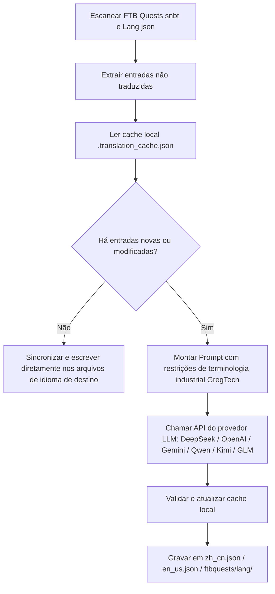

# Motor de Tradução Internacional por IA (`opencode_translate.py`)

A GTE projetou e implementou um sistema de tradução internacional totalmente automático entre mods, baseado em Modelos de Linguagem Modernos (LLM), localizado em `scripts/opencode_translate.py`.

---

## 🤖 Arquitetura do Motor de Tradução

A tradução comunitária tradicional depende de manutenção manual de arquivos JSON e SNBT complexos, resultando em atualizações atrasadas e alta propensão a erros e omissões.

O motor de tradução por IA da GTE utiliza uma API padronizada compatível com OpenAI, permitindo a **extração incremental automatizada, alinhamento de termos e tradução concorrente** dos livros de missões do FTB Quests e dos arquivos de idioma dos mods principais:



---

## 🔑 Provedores de LLM Suportados e Variáveis de Ambiente

O script suporta alternância perfeita entre diferentes provedores de modelos de IA por meio de variáveis de ambiente:

| Nome do Provedor | Variável de Ambiente da API Key | Variável de Ambiente da Base URL | Modelo Padrão |
| :--- | :--- | :--- | :--- |
| **DeepSeek** | `DEEPSEEK_API_KEY` | `DEEPSEEK_BASE_URL` | `deepseek-chat` |
| **OpenAI** | `OPENAI_API_KEY` | `OPENAI_BASE_URL` | `gpt-4o-mini` |
| **Google Gemini** | `GEMINI_API_KEY` | `GEMINI_BASE_URL` | `gemini-3.5-flash` |
| **Qwen (DashScope)** | `DASHSCOPE_API_KEY` | `DASHSCOPE_BASE_URL` | `qwen-plus` |
| **Moonshot** | `MOONSHOT_API_KEY` | `MOONSHOT_BASE_URL` | `moonshot-v1-8k` |
| **Zhipu GLM** | `ZHIPU_API_KEY` | `ZHIPU_BASE_URL` | `glm-4-flash` |
| **Plataforma OpenCode** | `OPENCODE_API_KEY` | `OPENCODE_BASE_URL` | `deepseek-v4-flash` |
| **Proxy Agregador Genérico** | `LLM_API_KEY` | `LLM_BASE_URL` | `LLM_MODEL` (personalizado) |

---

## 🎯 Princípios de Restrição de Prompt em Nível Industrial

Ao chamar a API para tradução, o sistema incorpora regras rigorosas de terminologia do Minecraft e GregTech:
1. **Preservação absoluta de formatadores**: Preserva integralmente os códigos de formatação de cor nativos do Minecraft (como `§a`, `§c`, `§6`) e espaços reservados (`%s`, `%d`, `{0}`).
2. **Padronização de termos técnicos**: Bloqueia estritamente a tradução de substantivos técnicos especializados (como `UHV`, `EU/t`, `Amps`, `Voltage`, `Overclock`, `Subtick`, etc.).
3. **Cache incremental por hash**: Todas as entradas traduzidas são persistidas automaticamente em `.translation_cache.json`; apenas textos novos ou alterados geram solicitações de rede, economizando significativamente custos de Token e tempo de CI.

---

## 💻 Comando de Execução Local

Dispara a tradução completa com um único comando no ambiente de desenvolvimento local:

```powershell
# Defina qualquer API Key válida antes de executar
$env:DEEPSEEK_API_KEY="sk-..."
python scripts/opencode_translate.py
```