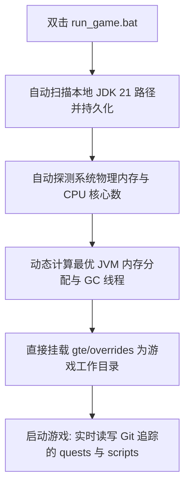

# 联调本地热与启动器快速运行

GTE 设计了一套对整合包策划、任务编写者与模组程序员极其友好的无感联调系统。

---

## ⚡ 1. 免启动器极速启动脚本 (`run_game.bat` / `run_game.sh`)

对于任务书作者（FTB Quests）和 KubeJS 配方策划人员，**无需打开 IntelliJ IDEA，也无需安装任何第三方启动器**，直接双击项目根目录下的 **`run_game.bat`** 即可极速进入游戏！



### 核心特性
1. **全自动 JDK 21 探测**：自动检索 `.jdks`、`Adoptium`、`Zulu`、`Program Files` 下安装的 Java 21，并自动记忆于 `.jdk_path`。
2. **硬件自适应优化**：根据当前电脑的 RAM 总量自动按最优比例（50%~60% 可用物理内存）分配 JVM 堆大小，自动配置并行 GC 线程。
3. **零挪动工作流**：游戏内修改任务（`/ftbquests editing_mode true`）并保存，修改直接实时保存在 Git 仓库对应的 `config/ftbquests/` 中，打开 GitHub Desktop 即可一键提交！

---

## 🔗 2. 外部启动器零复制映射工具 (`link_to_launcher.bat`)

如果你习惯使用自己配置好皮肤、按键习惯的启动器（如 PCL2 / HMCL / Prism Launcher）：

1. 双击运行根目录的 **`link_to_launcher.bat`**。
2. 按提示将你的启动器游戏目录（例如 `D:\PCL2\.minecraft\versions\GTE-Dev\.minecraft\`）拖入控制台中并回车。
3. 脚本会自动建立 Windows 目录软链接 (Directory Junctions)：
   - `config` ➜ `gte/overrides/config`
   - `kubejs` ➜ `gte/overrides/kubejs`
   - `ftbquests` ➜ `gte/overrides/config/ftbquests`
   - `defaultconfigs` ➜ `gte/overrides/defaultconfigs`
4. 无论在启动器中如何修改任务或配方，**物理数据实时同步保存在主 Git 仓库中**！

---

## ☕ 3. 模组代码热编译影子环境 (`gte-dev-runtime`)

对于 Java/Kotlin 程序员，`modules/gte-dev-runtime` 是专用的影子调试模块：

### 工作原理与设计考量
- **定位**：纯本地热编译联调沙盒，**禁止打包发布，不会出现在任何玩家构件中**。
- **ModDevGradle 动态重映射**：自动将 `gtm-reborn` 与 `gtecore` 的最新源码热编译并挂载进 Mojang 反混淆命名空间。
- **启动方式**：
  - 在 IDEA 中选择运行配置 **`Run GTE Full Pack (Client - Hot Debug)`**。
  - 或命令行执行：
    ```powershell
    .\gradlew.bat :modules:gte-dev-runtime:runClient
    ```