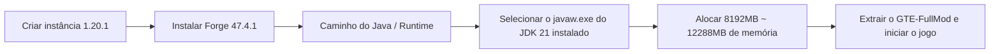

# Guia de Download do Modpack e Pacote Cliente Completo de Mods

GTE (GregTech Easy) oferece três formas de entrega para jogadores e administradores de servidores com diferentes níveis de conhecimento técnico:

1. **Pacote no formato CurseForge (`GTE-CurseForge-*.zip`)** : O formato padrão de importação dos launchers. Contém `manifest.json` e os mods ficam em `overrides/mods/`; o launcher instala o Forge automaticamente. **Esta é a opção recomendada para a maioria dos jogadores.**
2. **Pacote cliente completo de mods (`GTE-FullMod-*.zip`)** : Um zip plano que contém apenas o conteúdo do jogo no nível superior, para jogadores que configuram a própria instância.
3. **Pacote de servidor (`GTE-Server-*.zip`)** : Pacote de servidor dedicado Forge, com `mods/` no nível superior do zip, para criar servidores e jogar online.

---

## 📦 Pacote Cliente Completo de Mods

### Estrutura do Pacote

```text
README_安装必看.txt
mods/            (17 JARs)
config/
defaultconfigs/
kubejs/
```

Não há diretório `.minecraft/` aninhado, nenhum launcher embutido e nenhum `run_game.bat`. O Minecraft e o Forge são instalados pelo seu launcher, portanto este pacote pressupõe que **você já sabe criar uma instância no launcher**.

### Requisitos Obrigatórios de Ambiente

| Item | Versão | Observação |
| :--- | :--- | :--- |
| **Minecraft** | `1.20.1` | Nenhuma outra versão é aceita |
| **Forge** | `47.4.1` | Precisa ser exatamente esta versão |
| **Java** | `21` | Nunca use Java 17 ou Java 8 |

> [!CAUTION]
> **O Forge precisa ser 47.4.1, e não "47.4.1 ou qualquer versão superior".**
> - O mod `gtmthings` exige Forge `[47.4.1,)`, então qualquer versão inferior não será carregada;
> - mas o Forge 47.4.10 traz ASM 9.8 + coremods 5.2.4, o que quebra os mixins do `appliedenergistics2` 15.4.9 e o jogo nunca chega ao menu principal.
>
> 47.4.1 é a única versão viável.

### Passos de Instalação

=== "Método 1: Configurar a instância manualmente (uso deste pacote)"

    1. No seu launcher (PCL2 / HMCL / Prism / MultiMC / launcher oficial, todos funcionam), crie uma instância do Minecraft **1.20.1** e instale o **Forge 47.4.1**.
    2. Inicie uma vez e confirme que chega ao menu principal (isso descarta problemas do launcher e do Java).
    3. Abra o diretório de jogo dessa instância (a pasta `.minecraft`; os launchers normalmente têm um botão "abrir pasta").
    4. Extraia o conteúdo de `GTE-FullMod-<versão>.zip` para dentro dela, mesclando com as pastas de mesmo nome já existentes.
    5. Nas configurações da instância, defina o Java como **Java 21** e aloque **8G ~ 12G** de memória.
    6. Inicie o jogo. A primeira execução gera as configurações e é mais lenta que o normal.

=== "Método 2: Importação com um clique no launcher (recomendado)"

    Use `GTE-CurseForge-<versão>.zip` e escolha **importar modpack** no CurseForge App / PCL2 / HMCL / Prism Launcher / MultiMC. Esse pacote traz `manifest.json`, então o launcher instala o Forge para você e não é necessária configuração manual.

=== "Método 3: Abrir um servidor"

    Use `GTE-Server-<versão>.zip`; nele o `mods/` fica no nível superior do zip. Extraia na raiz do servidor, execute `java -jar forge-*-installer.jar --installServer` e depois inicie com `@libraries/net/minecraftforge/forge/1.20.1-47.4.1/unix_args.txt nogui`.

> [!WARNING]
> JARs cujos nomes terminam em `-slim.jar` ou `-dev-slim.jar` são artefatos para consumidores Maven e deliberadamente não empacotam dependências jar-in-jar; eles **nunca** devem ser colocados em `mods/`. O Forge escolheria uma build do `gtceu` sem o `ldlib` embutido e abortaria com `Missing or unsupported mandatory dependencies: Mod ID: 'ldlib' ... [MISSING]`. Nenhum dos três pacotes distribuídos contém esses arquivos.

---

## ⚠️ Requisitos do Ambiente de Execução Java 21 (Extremamente Importante)

> [!CAUTION]
> **Este modpack exige obrigatoriamente o ambiente de execução Java 21 (JDK 21)!**
> Não use **Java 17** ou **Java 8**, caso contrário o jogo irá travar ou se recusará a iniciar!

### Por que é necessário usar Java 21?
- Os mods principais do GTE (`gtecore`, `gtm-reborn`, `gt--`) utilizam amplamente **recursos modernos da linguagem Java 21** (como Record Patterns, Virtual Threads, Switch Pattern Matching aprimorado).
- Os scripts de build do Gradle configuram globalmente `JavaLanguageVersion.of(21)` para forçar a verificação da toolchain.

### Links de Download Recomendados para JDK 21

| Distribuição | Link de Download | Motivo da Recomendação |
| :--- | :--- | :--- |
| **Azul Zulu 21 (LTS)** | [Clique para ir ao site da Azul](https://www.azul.com/downloads/?version=java-21-lts) | Excelente desempenho, ótima otimização para multithreading em larga escala do Minecraft |
| **Eclipse Temurin 21 (LTS)** | [Clique para ir ao site da Adoptium](https://adoptium.net/temurin/releases/?version=21) | Recomendação oficial, alta compatibilidade e estabilidade |
| **Microsoft OpenJDK 21** | [Clique para ir ao site da Microsoft](https://learn.microsoft.com/zh-cn/java/openjdk/download) | Boa adaptação nativa para plataforma Windows |

### Configurando Java 21 no Launcher



---

## 🎮 Atalhos no Jogo e Comandos Comuns

| Comando / Atalho | Descrição da Função | Requisito de Permissão |
| :--- | :--- | :--- |
| `/ftbquests editing_mode true` | Ativa o modo de edição visual do livro de missões (modo autor) | Permissão de OP |
| `/ftbquests reload` | Recarrega os arquivos de configuração do FTB Quests | Todos |
| `/kubejs reload server_scripts` | Recarrega os scripts de modificação do servidor e receitas | Permissão de OP |
| `/kubejs reload client_scripts` | Recarrega os scripts de modificação do cliente e lógica de exibição | Sem permissão necessária |
| `/dumpmultiblock` | Exporta o código da estrutura multibloco com um clique após selecionar a área com o machado de madeira | Permissão de OP |
| <kbd>U</kbd> / <kbd>R</kbd> | Ver o uso (Usage) / receita (Recipe) do item sob o cursor | Atalhos do EMI / JEI |
| <kbd>F7</kbd> | Ver o nível de luz ao redor (X vermelho indica área de spawn de mobs) | Atalho do cliente |
