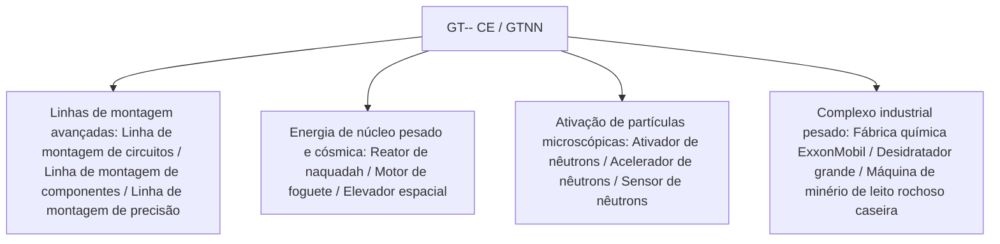

# GT-- Edição Comunitária (GTNN)

`modules/gt--` (nome do pacote `dev.arbor.gtnn`) é um mod da Edição Comunitária oficial do GT-- construído com arquitetura híbrida **Kotlin + Java** (branch de desenvolvimento `kotlin`).

---

## 🏗️ Arquitetura e Pilha Tecnológica

- **Linguagem de desenvolvimento**: Kotlin 2.0.21 + Java 21.
- **Posicionamento**: introduz as linhas de montagem gigantes, reatores de núcleo pesado, sistemas de desidratadores e a indústria de exploração espacial, muito apreciados pelos jogadores no GT 5.09 clássico e nas extensões modernas.



---

## 🏭 Máquinas e instalações multibloco principais

### 1. Matriz de linhas de montagem
- **Linha de montagem de circuitos (`circuit_assembly_line`)**: Especializada na produção eficiente em massa de chips de nível médio a alto e circuitos compostos, suporta carcaças de precisão de vários níveis.
- **Linha de montagem de componentes (`component_assembly_line`)**: Utiliza carcaças de nível correspondente de acordo com a tensão (LV a MAX), montando em massa motores e sensores principais.
- **Linha de montagem de precisão (`precision_assembly_line`)**: Produz máscaras de nanolitografia de altíssima precisão e barramentos de supercomputação.

### 2. Sistemas de aceleração de partículas e ativação de nêutrons
- **Ativador de nêutrons (`neutron_activator`)** e **Acelerador de nêutrons (`neutron_accelerator`)**:
  - Simula colisores de alta energia e reações de captura de nêutrons rápidos, ativando isótopos estáveis comuns em materiais de núcleo pesado radioativos ou elementos supercondutores superpesados.
- **Sensor de nêutrons (`neutron_sensor`)**: Detecta em tempo real o fluxo de energia cinética de nêutrons dentro da câmara de reação, fornecendo feedback de sinal de redstone ou computador.

### 3. Energia de núcleo pesado e indústria aeroespacial
- **Reator de naquadah grande (`large_naquadah_reactor`)**: Alimentado por liga de naquadah e combustível enriquecido, fornece saída de energia EU estável e de alta densidade.
- **Motor de foguete (`rocket_engine`)**: Consome combustível de foguete avançado, fornecendo energia pulsada para equipamentos de alta carga.
- **Elevador espacial (`space_elevator`)**: Atravessa a órbita terrestre baixa, permitindo coleta de minerais baseada no espaço e fabricação industrial em microgravidade.

### 4. Instalações combinadas de química e mineração
- **Fábrica química ExxonMobil (`exxonmobil_chemical_plant`)**: Unidade combinada de processamento profundo de petróleo em escala ultra-grande, realizando todos os processos de craqueamento, reforma, aromatização e polimerização em uma única máquina.
- **Desidratador grande (`large_dehydrator`)**: Remove eficientemente água cristalina e umidade livre de fluidos ou minerais químicos.
- **Máquina de minério de leito rochoso caseira (`homemade_bedrock_ore_machine`)**: Implanta brocas artificiais na camada de leito rochoso, extraindo continuamente veios de minério infinitos em profundidade.

---

## 🌿 Normas de fluxo de trabalho Git do submódulo

`modules/gt--` corresponde ao repositório Git independente `takanashisatou/GT---Community-Edition`, com branch de desenvolvimento `kotlin`:

```bash
# Desenvolva e faça commit independentemente no submódulo
cd modules/gt--
git checkout kotlin
git add .
git commit -m "feat: add precision assembly line recipes"
git push origin kotlin

# Volte ao projeto principal e atualize o ponteiro do submódulo
cd ../..
git add modules/gt--
git commit -m "chore: bump gt-- submodule pointer"
```