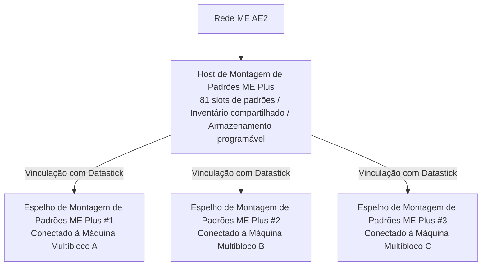

# Sistema de Integração Profunda AE2 e Montagem de Padrões Plus

O GTECore estabelece uma ponte de dados extremamente poderosa e direta entre o Applied Energistics 2 (AE2) e as estruturas multibloco do GregTech.

---

## 🧩 Montagem de Padrões ME Plus (`me_pattern_buffer_plus`)

Em mods de tecnologia tradicionais, conectar um Fornecedor de Padrões AE2 a uma máquina multibloco geralmente enfrenta os problemas de **espaço de slots insuficiente, impossibilidade de misturar saídas de fluidos e itens, e dificuldade em compartilhar padrões entre múltiplas máquinas**.

O **Montagem de Padrões ME Plus** desenvolvido pelo GTECore resolve completamente esse problema:

### Características Principais
1. **Capacidade Massiva de Padrões**: Um único host de montagem possui **81 slots de padrões** (equivalente à soma de 9 Fornecedores de Padrões AE2 padrão).
2. **Capacidade de Compartimento Universal**: Possui simultaneamente as capacidades `IMPORT_ITEMS`, `IMPORT_FLUIDS`, `EXPORT_ITEMS` e `EXPORT_FLUIDS`, suportando interação mista de fluidos e itens no mesmo compartimento.
3. **Suporte a Armazenamento Programável**: Integra internamente o mecanismo de Armazenamento Programável, suportando alimentação precisa e cache para receitas complexas.

---

## 🪞 Espelho de Montagem de Padrões ME Plus (`me_pattern_buffer_proxy_plus`)

O **Espelho de Montagem de Padrões ME Plus** é um componente estrutural revolucionário para automação distribuída:

### Princípio de Funcionamento e Compartilhamento entre Máquinas
- Instale o espelho de montagem na posição de compartimento de qualquer máquina multibloco.
- Segure um **Datastick** e clique com o botão direito no **Montagem de Padrões ME Plus** principal para ler as coordenadas, depois clique com o botão direito no **Espelho de Montagem de Padrões ME Plus** para vincular.
- **Todos os espelhos vinculados compartilharão em tempo real todos os 81 padrões colocados no host principal**!
- Quando a rede AE2 inicia uma tarefa de automação de síntese, a rede automaticamente distribui a carga de forma balanceada para todas as máquinas espelho ociosas, que trabalham em paralelo!

### Exibição de Status Flutuante Jade
Ao mirar no montagem de padrões ou no espelho, o Jade exibirá automaticamente:
- Host principal: `Número de espelhos conectados: X`
- Componente espelho: `Vinculado a - X: ..., Y: ..., Z: ...`

---

## 💨 Compartimento de Vapor ME (`me_steam_hatch`)

- **Função**: Conecta diretamente a rede de fluidos AE2 à estrutura multibloco de vapor.
- **Efeito**: A estrutura multibloco de vapor não precisa de tubulações e tanques de vapor complexos e de alta velocidade externos; ela extrai vapor diretamente da rede ME com a máxima taxa de transferência para fornecimento de energia, eliminando gargalos de transmissão por tubulações.