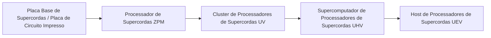

# Sistema de Circuitos Avançados e Materiais de Supercordas e Yin-Yang

O GTECore expande dois ramos principais de circuitos avançados ao longo de todo o ciclo de ZPM a MAX — **Sistema de Circuitos de Supercordas** e **Sistema de Circuitos Yin-Yang Taiji**, juntamente com o Centro de Processamento Integrado de Minérios para realizar um ciclo automático de materiais.

---

## 🌌 Sistema de Circuitos de Supercordas (Super String Circuitry)

Os circuitos de supercordas obtêm poder computacional superluminal a partir de cordas oscilantes de alta dimensão, cobrindo principalmente o gradiente de voltagem **ZPM ➜ UEV**:

### Materiais de Supercordas e Substâncias de Cordas
- **Corda Original (`item.gtecore.original_string`)**: A origem oscilante do universo de alta dimensão.
- **Cordas α / β / γ (`alpha_string`, `beta_string`, `gamma_string`)**: Polímeros de supercordas com diferentes níveis de energia e estados de polarização.
- **Misturador de Supercordas (`super_string_mixer`)**, **Corda da Criação (`string_of_creation`)** e **Matriz de Oscilação de Supercordas (`super_string_oscillator_array`)**: Usados para divisão, sintonização e solidificação avançada de matéria de supercordas.

---

## ☯️ Sistema de Circuitos Yin-Yang Taiji (Yin-Yang Circuitry)

O sistema de circuitos Yin-Yang segue a filosofia cíclica de **“Yin gera Yang, Yang gera Yin, geração infinita”**, cobrindo **UV ➜ UIV** e até limites mais altos:

### Talismãs Exclusivos de Bagua e Cinco Elementos
- **Cinco Elementos**: Elemento Metal (`jinyuansu`), Elemento Madeira (`muyuansu`), Elemento Água (`shuiyuansu`), Elemento Fogo (`huo`), Elemento Terra (`tuyuansu`).
- **Talismãs dos Cinco Elementos**: Talismã do Metal, Talismã da Madeira, Talismã da Água, Talismã do Fogo, Talismã da Terra.
- **Símbolos Bagua e Chips**: Pedras de símbolos e chips centrais dos oito trigramas: Qian, Kun, Zhen, Xun, Kan, Li, Gen, Dui.
- **Pepita dos Três Puros (`god_nugget`)**: Meio de síntese de alto nível que condensa a essência do céu e da terra.

---

## 💎 Padrões de Receitas do Centro de Processamento Integrado de Minérios

O **Centro de Processamento Integrado de Minérios (`ore_process_center`)** possui 7 modos de circuito padronizados, que podem ser alternados configurando o número do circuito programado na máquina:

| Número do Circuito | Rota de Processamento | Tipos de Minérios Aplicáveis e Características dos Produtos | Multiplicador de Produção |
| :---: | :--- | :--- | :---: |
| **Circuito 1** | Trituração ➜ Trituração ➜ Lavagem | Produção rápida de minérios metálicos básicos (ferro, cobre, estanho, etc.) | 5x produto principal + subprodutos |
| **Circuito 2** | Trituração ➜ Trituração ➜ Centrifugação | Minérios de metais leves raros de alto valor associados | 5x produto principal + subprodutos refinados por centrifugação |
| **Circuito 3** | Trituração ➜ Lavagem ➜ Separação Térmica ➜ Trituração | Minérios refratários de alta temperatura, minérios de metais preciosos (platina, ouro, prata, etc.) | 5~6x + pó de metal puro |
| **Circuito 4** | Trituração ➜ Separação Térmica ➜ Trituração | Sulfetos e minérios complexos de inclusão pesada | 5x + subprodutos especiais de separação térmica |
| **Circuito 5** | Trituração ➜ Lavagem ➜ Trituração ➜ Lavagem | Minérios de terras raras e minérios de sais solúveis em múltiplas etapas | 6x + subprodutos de lavagem dupla |
| **Circuito 6** | Trituração ➜ Lavagem ➜ Trituração ➜ Centrifugação | Minérios pesados radioativos (urânio, tório, plutônio) e terras raras | 6x + metais pesados refinados por centrifugação |
| **Circuito 8** | Trituração ➜ Lavagem ➜ Trituração ➜ Separação Eletromagnética | Minérios fortemente magnéticos e paramagnéticos (magnetita, cromo, titânio, etc.) | 6~8x + pó puro eletromagnético |