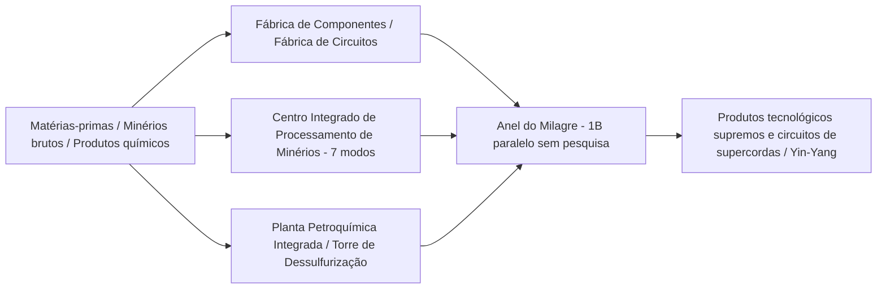

# GTECore Guia de Máquinas Multibloco

O GTECore foi projetado para lidar com as complexas linhas de produção do meio ao fim do jogo tecnológico, oferecendo uma vasta gama de máquinas multibloco com **capacidade de processamento paralelo extremamente alta** e **lógica de produção agregada**.

---

## 🏭 Grandes Multiblocos da Era do Vapor

Para resolver os problemas de baixa produtividade e uso excessivo de espaço das máquinas individuais na Era do Vapor, o GTECore introduziu uma série de grandes multiblocos a vapor, todos com suporte a processamento paralelo entre receitas e grande capacidade de fluxo de vapor:

| Nome da Máquina (ID do Bloco) | Função Principal e Tipos de Receita | Características e Vantagens |
| :--- | :--- | :--- |
| **Grande Forno de Ligas a Vapor** (`gtceu:big_alloy`) | Fundição de ligas (`alloy_smelter`) | Produção de ligas em alta taxa no início do jogo, suporta vapor de alta pressão |
| **Grande Compressor a Vapor** (`gtceu:big_compressor`) | Processamento de compressão (`compressor`) | Prensagem em massa de placas e blocos metálicos densos |
| **Grande Martelo de Forja a Vapor** (`gtceu:big_forge_hammer`) | Martelo de forja para pó/placas (`forge_hammer`) | Automação de placas e trituração rápida de minério bruto |
| **Grande Extrator a Vapor** (`gtceu:big_steam_extractor`) | Extração de borracha/fluidos (`extractor`) | Extração em larga escala de resinas e fluidos industriais |
| **Moedor de Minério a Vapor Simples** (`gtceu:steam_grinder_easy`) | Moagem de minério (`macerator`) | Processamento múltiplo de minérios no início do jogo |
| **Forno de Fusão a Vapor Simples** (`gtceu:steam_oven_easy`) | Fusão por pirólise (`pyrochlore_oven`) | Produção industrial em massa de coque e carvão vegetal |
| **Planta de Processamento de Minério a Vapor** (`gtecore:steam_op`) | Trituração e refino integrado de minérios | **Paralelismo de 1 bilhão (1B)**, todas as receitas executadas em **1 tick**! Suporta qualquer compartimento de entrada/saída |

---

## ⚡ Multiblocos Industriais Super Elétricos

Ao entrar na era elétrica, o GTECore oferece centros de processamento integrados e de alta complexidade:

### 1. Fábricas de Produção Principais

- **§6Fábrica de Componentes (`gtceu:component_factory`)**:
  - **Função**: Produzir motores, bombas, pistões, braços mecânicos, correias transportadoras, diodos emissores de luz e outros componentes básicos comuns em uma única etapa.
  - **Características**: Pula diretamente os subprocessos intermediários complicados, produzindo rapidamente peças industriais padrão da tensão especificada.
- **§6Fábrica de Circuitos (`gtceu:circuit_factory`)**:
  - **Função**: Integra substratos de circuitos integrados, gravação de chips e encapsulamento integrado.
  - **Características**: Suporta compartimentos paralelos entre receitas, acelerando totalmente a produção de placas de circuito de ULV a MAX em toda a faixa de tensão.
- **§6Anel do Milagre (`gtceu:miracle_ring`)**:
  - **Função**: Instalação final de montagem de maravilhas industriais.
  - **Características**: Possui **paralelismo de 1 bilhão (1B)** e **overclock de 1 tick Subtick**, **sem necessidade de qualquer pesquisa/estudo de linha de montagem** para executar receitas de linha de montagem diretamente!
- **Terminador Químico (`gtecore:chemistry_terminator`)**:
  - **Função**: "Subverte a existência da química e da física, representando o fim da química".
  - **Características**: Agrega reações químicas complexas de várias etapas em um único clique, sintetizando rapidamente vários polímeros finais e meios ácidos.
- **Fábrica de Processamento Universal Dez-em-Um (`gtecore:ten_in_one`)**:
  - **Função**: Caixa integrada universal que combina 10 processos básicos, incluindo centrifugação, eletrólise, lixiviação química de minérios, polimerização e reação de alta pressão.

### 2. Sistema de Refino de Minérios e Fluidos

- **§6Centro Integrado de Processamento de Minérios (`gtecore:ore_process_center`)**:
  - Suporta **7 modos de circuito programável**, permitindo diferentes orientações de produtos com refino de minérios de 5 a 8 vezes (trituração, lavagem, separação térmica, centrifugação e separação eletromagnética totalmente integradas), com suporte a overclock de 1 tick Subtick.
- **Planta Petroquímica Integrada (`gtecore:integrated_petrochemical_plant`)**:
  - Integra toda a cadeia de destilação de petróleo bruto, craqueamento catalítico, reforma e dessulfurização, produzindo todos os gases leves de hidrocarbonetos e aromáticos em uma única máquina.
- **Dessulfurizador (`gtceu:desulfurization`)**:
  - Purifica rapidamente vários combustíveis pesados sulfurosos, recuperando subprodutos de enxofre de alta pureza.
- **Sonda de Fluidos Simples/Avançada (`gtecore:easy_fluid_drilling_rig` / `not_hard_fluid_drilling_rig`)**:
  - Extrai automaticamente veios de fluidos do leito rochoso, sem nunca esgotar, sem necessidade de exploração complexa de tubulações.

### 3. Processamento de Cabos de Alta Tensão e Supercondutores

- **§6Fábrica de Fiação (`gtecore:wiremill_factory`)**: Produz em um único clique todos os fios metálicos de fio único, duplo, quádruplo, óctuplo, dezesseis fios e cabos supercondutores.
- **§6Núcleo de Cristais (`gtecore:crystal_center`)**: Cultivo automatizado em larga escala de pilares de silício monocristalino, esmeraldas, safiras e cristais de Sextil carregado.
- **§6Motor Quântico de Cabos (`gtecore:quantum_cable_assembler`)**: Especializado na fabricação em alta velocidade de fibras ópticas quânticas e cabos de transmissão de energia de dimensões superiores.
- **§3Gravador de Lâminas Estelares (`gtecore:starblade_etching_machine`)**: Utiliza feixes de alta energia na faixa de ultravioleta extremo/raios X para gravar chips de microescala de nível galáctico.

---

## 🔋 Sistemas de Energia e Geradores

| Nome da Máquina | Saída de Energia/Nível | Mecanismo Principal e Características |
| :--- | :--- | :--- |
| **§6Motor de Combustível Universal** (`gtceu:general_fuel_engine`) | Adaptativo dinâmico (máximo MAX) | **Suporta todos os tipos de combustível do mundo** (diesel, biomassa, gás natural, combustível de foguete, etc.), com **paralelismo de 2 bilhões (2B)**, liberando energia colossal em um instante! |
| **Grande Gerador Universal** (`gtecore:large_general_generator`) | Tensão multi-nível selecionável | Compatível com rotores de geradores a gás, vapor e plasma convencionais |
| **Reator de Fusão Super** (`gtecore:super_fusion_reactor`) | Saída de plasma de fusão | Elimina completamente a longa espera de aquecimento da fusão comum, **suporta perfeitamente overclock de 1T Subtick**, produzindo instantaneamente produtos de fusão de alta temperatura |
| **Bateria Super de Tensão Máxima** (`gtecore:max_super_battery_buffer_1x`) | **MAX (2.147.483.647 V)** | Armazena uma quantidade imensa de EU, suporta interface de carregamento sem fio interdimensional com zero perdas |