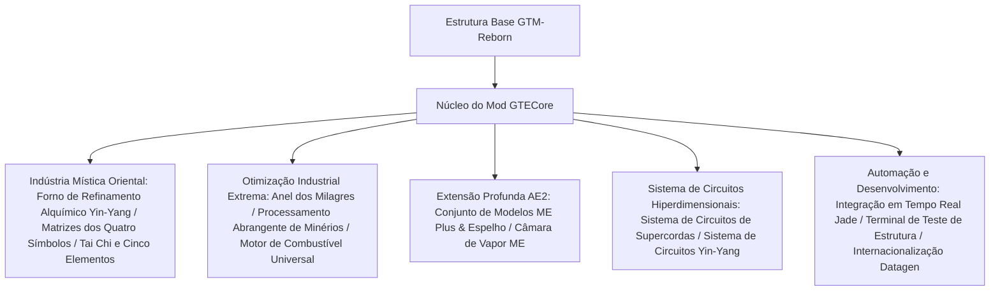

# Visão Geral do Núcleo do Mod GTECore

**GTECore** é o núcleo Java personalizado do projeto GregTech Easy. Ele depende diretamente do código-fonte do `gtm-reborn`, expandindo estruturas industriais multibloco em grande escala, tecnologia de matrizes de alto nível, interações profundas com AE2 e sistemas de fabricação de circuitos super avançados.

---

## 🏛️ Arquitetura do Mod e Posicionamento de Design

---

## 📦 Abas de Inventário do Modo Criativo e Classificação

O GTECore registra abas separadas no modo criativo dentro do jogo:

1. **Máquinas GregTech Easy (`itemGroup.gtecore.gtecore_machines`)**:
   - Inclui todos os blocos principais multibloco originais do GTE (Alto-Forno Yin-Yang Bagua, Anel dos Milagres, Centro de Processamento de Minérios, Finalizador Químico, etc.).
   - Inclui Buffers de Bateria Super de vários níveis (Max Super Battery Buffer), Câmara de Vapor ME, Conjunto de Modelos ME Plus e Espelho.
2. **Itens GregTech Easy (`itemGroup.gtecore.gtecore_items`)**:
   - Inclui a série de circuitos de Supercordas e Yin-Yang (processadores, clusters, supercomputadores, hosts).
   - Inclui talismãs dos Cinco Elementos, chips Bagua, partículas dos Três Puros, Terminal de Teste de Estrutura e outros itens especializados.

---

## ⚙️ Configuração Global do Mod (`GTEConfig`)

O GTECore oferece opções de configuração ricas dentro do jogo e em arquivos (localizados em `config/gtecore-common.toml` ou no menu de configuração do jogo):

| Item de Configuração | Valor Padrão | Descrição Detalhada |
| :--- | :--- | :--- |
| `superPeace` (Modo Super Paz) | `false` | Quando ativado, desativa completamente a geração de mobs hostis, proporcionando um ambiente absolutamente puro para construção tecnológica |
| `durationMultiplier` (Multiplicador de Duração de Receitas) | `1.0` | Ajusta globalmente o multiplicador de tempo das receitas personalizadas do GTECore |

---

## 🔍 Integração Nativa com Jade / TOP

O GTECore possui suporte integrado ao plugin **`GTEJadePlugin`**:
- **Status do Conjunto de Modelos ME Plus**: Exibe em tempo real o número de modelos vinculados ao conjunto atual, bem como os modos de saída de fluidos e itens.
- **Informações de Vinculação do Espelho do Conjunto de Modelos ME Plus**: Ao passar o mouse, exibe diretamente as coordenadas `(X, Y, Z)` do conjunto principal vinculado e o estado de conectividade da rede.
- **Indicador de Ativação de Matriz**: Exibe em tempo real no Forno de Refinamento Alquímico Yin-Yang o estado de prontidão das matrizes dos Quatro Símbolos: Dragão Azul, Tigre Branco, Pássaro Vermelho e Tartaruga Negra.

---

## 🛠️ Terminal de Teste de Estrutura (`Structure Testing Terminal`)

O GTECore fornece uma ferramenta portátil exclusiva — o **Terminal de Teste de Estrutura** (`item.gtecore.check_structure_terminal`):
- **Clique direito no controlador multibloco**: Escaneia a integridade da estrutura em tempo real.
- **Dicas de diagnóstico de erro**: Se a estrutura não estiver formada, o terminal indicará com precisão no chat e nas dicas flutuantes as **coordenadas dos blocos incorretos e as posições que não deveriam estar lá**, acelerando enormemente a construção e a correção de grandes multiblocos.