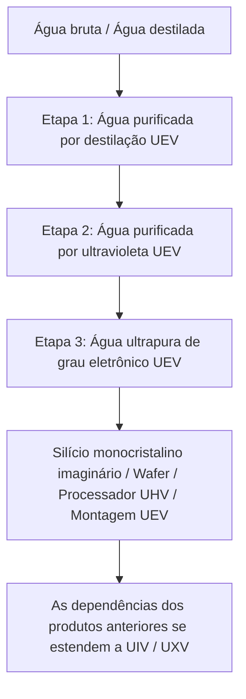

# Sistema de purificação de água em três etapas e circuito de água industrial

**Todo o sistema de purificação de água em três etapas do GTECore pertence ao nível UEV**. As etapas descrevem tratamentos sucessivos e a qualidade da água, não eras de voltagem diferentes. A central, as três unidades de purificação e suas escotilhas de controle usam componentes, circuitos e voltagem de montagem UEV. As três etapas de tratamento e a regeneração EDI operam em UEV.

A linha consiste em **uma central e três unidades de purificação**. As unidades não têm escotilhas de energia: conecte-as à central com um dispositivo de dados para receber energia e um limite de processamento em paralelo.

## 💧 Especificações dos fluidos de água das três etapas

| Fluido registrado | Nome do material | Nível tecnológico |
| :--- | :--- | :---: |
| `distilled_purified_water` | Água purificada por destilação | UEV |
| `uv_purified_water` | Água purificada por ultravioleta | UEV |
| `ultrapure_water` | Água ultrapura de grau eletrônico | UEV |

As descrições de qualidade da água industrial fornecem contexto; as receitas, a estabilidade térmica, a dose UV e a carga EDI determinam o comportamento real no jogo.

## 🏭 Quatro máquinas multibloco

| Máquina | ID de registro | Nível tecnológico |
| :--- | :--- | :---: |
| Central de purificação de água | `central_water_purification_plant` | UEV |
| Unidade de purificação por clarificação de nível 1 | `t1_clarifier_purification_unit` | UEV |
| Unidade de purificação por oxidação UV de nível 2 | `t2_uv_oxidation_purification_unit` | UEV |
| Unidade de purificação ultrapura por EDI de nível 3 | `t3_edi_ultrapure_purification_unit` | UEV |

A antiga `ultrapure_water_refinery` continua registrada por compatibilidade, mas está desativada. Ela não pode executar toda a cadeia de purificação; migre para a central e as três unidades.

### 1. Central de purificação de água

A central não processa receitas de purificação. Ela armazena as conexões, distribui energia às unidades conectadas e com estrutura formada, exibe a potência real de saída em EU/s e transmite o limite de processamento em paralelo configurado. Uma unidade não pode operar sem uma central conectada e com estrutura formada.

### 2. Nível 1: clarificação e tratamento térmico (UEV)

A primeira etapa separa as impurezas da água recebida. As receitas nominais são:

- Água 1000 mB + Floculante composto 50 mB + 1 Microesfera de carbono modificada → Água purificada por destilação 900 mB / 60 ticks, com chances de obter pó de sal e de terras raras.
- Água destilada 1000 mB + Floculante composto 25 mB + 1 Microesfera de carbono modificada → Água purificada por destilação 1000 mB / 30 ticks, com chance de obter pó de sal.

A quantidade real de água produzida também depende da estabilidade térmica. Este é o ponto de entrada da linha de purificação UEV.

### 3. Nível 2: oxidação por ultravioleta profundo (UEV)

A irradiação UV e os oxidantes decompõem as impurezas orgânicas. As receitas nominais são:

- Água purificada por destilação 800 mB + Ozônio 50 mB → Água purificada por ultravioleta 800 mB + Oxigênio 25 mB / 40 ticks.
- Água purificada por destilação 800 mB + Peróxido de hidrogênio 50 mB → Água purificada por ultravioleta 800 mB + Oxigênio 25 mB / 20 ticks.

As duas rotas também precisam atingir a dose UV exigida antes de serem concluídas.

### 4. Nível 3: eletrodeionização e polimento (UEV)

A etapa EDI remove os íons residuais. A operação no jogo exige reagente e resina, além de uma receita de regeneração separada para eliminar a carga iônica acumulada:

- Água purificada por ultravioleta 800 mB + Reagente ácido-base de grau eletrônico 20 mB + 1 Esfera de resina de leito misto → Água ultrapura de grau eletrônico 800 mB / 30 ticks.
- Regeneração EDI: Água purificada por ultravioleta 100 mB + Reagente ácido-base de grau eletrônico 1 mB / 2 ticks. Isso elimina a carga iônica e não produz água.

## 🔌 Conexão e operação da linha

1. Agache-se e clique com o botão direito na central usando um dispositivo de dados do GT para copiar suas coordenadas.
2. Clique com o botão direito em uma unidade de purificação com esse dispositivo para conectá-la. A sequência inversa também funciona: copie as coordenadas da unidade e depois clique com o botão direito na central.
3. Alimente a central por escotilhas de energia (1–4; há suporte a entrada a laser). A central encaminha energia às unidades conectadas.
4. Defina o limite de processamento em paralelo na interface da central, de 1 a 65536.
5. Confira na interface de cada unidade as coordenadas da central conectada, o limite de processamento em paralelo e a reserva interna de energia.

Cada unidade consome a potência da receita multiplicada pelo número real de operações em paralelo. As três unidades têm o mesmo limite de potência de `UEV voltage × 256 A`. As etapas 1, 2 e 3 descrevem processos de tratamento, não voltagens de operação nem níveis de desbloqueio diferentes. O paralelismo real também depende dos ingredientes disponíveis e da capacidade de saída, portanto aumentar apenas o limite da central não garante maior produção.

## 🔄 Produção imaginária e ordem de inicialização

As receitas a seguir da Árvore do Imaginário consomem diretamente `ultrapure_water` da terceira etapa. As quantidades são por lote da receita:

| Produto | Produção por lote | Água de grau eletrônico |
| :--- | ---: | ---: |
| Silício monocristalino imaginário | 4 | 4000 mB |
| Wafer imaginário comum | 16 | 1000 mB |
| Processador imaginário UHV | 4 | 1000 mB |
| Montagem de processadores imaginários UEV | 2 | 2000 mB |

O Supercomputador imaginário UIV e o Host imaginário UXV não consomem água adicional diretamente. Eles herdam a dependência de água por meio das montagens e dos computadores necessários à sua fabricação. O nível de circuito de um produto e a voltagem de sua receita não alteram a exigência de progressão UEV do sistema de purificação.

A ordem de inicialização é **componentes UHV + produção Yin-Yang → oito componentes UEV → equipamentos de purificação UEV → água de grau eletrônico da terceira etapa → produtos imaginários essenciais**. O modpack adiciona receitas para os oito componentes UEV. As receitas Yin-Yang e as desses componentes não exigem água de grau eletrônico diretamente, evitando um ciclo de dependências em que os equipamentos de purificação precisariam do próprio produto para serem construídos.

Os materiais de construção imaginários, a rota da primeira árvore e a produção de silício monocristalino e wafers comuns estão conectados; consulte [Materiais imaginários e a primeira árvore](circuits-and-materials.md). O Núcleo do Tao do Sol Vermelho consome 4000 mB de água de grau eletrônico por lote de 32 Meios de crescimento. As matrizes de folhas continuam sendo blocos estruturais, enquanto a produção de silício monocristalino consome meios de crescimento repetidamente.

O **Centro de litografia imaginária por imersão** consome água de grau eletrônico da terceira etapa para processar wafers imaginários comuns por meio de suas receitas específicas. Wafers de CPU, chips brutos, chips gravados, chips de circuito e chips de CPU agora têm rotas de produção conectadas, todas em UEV. Seus custos diretos de água por lote são de **2000, 1000, 500, 1000 e 500 mB**, respectivamente. A exposição e a gravação usam uma lente de vidro Yin-Yang reutilizável, que não é consumida. Consulte o [Centro de litografia imaginária por imersão](circuits-and-materials.md) para ver as duas ramificações e todas as quantidades de ingredientes. Seu controlador pode ser construído usando circuitos Yin-Yang UIV e wafers imaginários comuns, sem exigir os chips que ele próprio produz.

### Fabricador de circuitos imaginários

O [Fabricador de circuitos imaginários](circuits-and-materials.md) começa com chips de CPU e chips de circuito do centro de litografia, circuitos UIV da geração anterior e componentes UEV. Ele não exige suas próprias placas nem SoCs para iniciar a produção. Os três processos usam UEV:

| Produto do processo | Produção por lote | Consumo direto de água de grau eletrônico | Duração base |
| :--- | ---: | ---: | ---: |
| Placa de circuito da Árvore do Imaginário | 4 | 2000 mB | 30 s |
| Placa de circuito impresso da Árvore do Imaginário | 1 | 1000 mB | 20 s |
| SoC da Árvore do Imaginário | 2 | 2000 mB | 30 s |

A cadeia de receitas agora conecta placas, placas impressas, SoCs e os quatro níveis de circuitos acabados. A Árvore do Imaginário continua produzindo os quatro circuitos acabados com **voltagem de fabricação UEV**, com produção por lote de **4 / 2 / 1 / 1**. Suas **tags de circuito UHV / UEV / UIV / UXV** permanecem inalteradas. UIV e UXV herdam o consumo de água por meio dos produtos necessários à sua fabricação.

A reciclagem de água degradada na Máquina de gravação Starblade e na Fábrica de circuitos, os rendimentos adicionais no processamento de minérios e um circuito de recuperação de 90% continuam sendo propostas não implementadas, e não recursos disponíveis.
