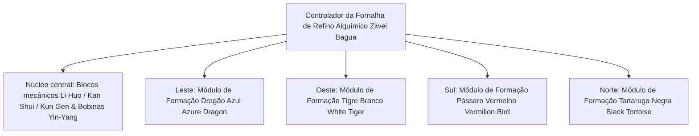

# Sistema de Fornalha de Refino Alquímico Yin-Yang e Formação dos Quatro Símbolos

O GTECore criou exclusivamente o **"Sistema de Taiji Bagua e Formação dos Quatro Símbolos"**, que combina a filosofia taoista oriental com a engenharia pesada industrial moderna. Este sistema constitui o núcleo central para a metalurgia, síntese de materiais supercondutores e a transição tecnológica imortal no meio e fim do jogo.

---

## 🌌 Fornalha de Refino Alquímico Yin-Yang Bagua (`yin_yang_eight_trigmas_blast_furnace`)

A **Fornalha de Refino Alquímico Ziwei Bagua** é uma das estruturas multibloco mais grandiosas e mecanicamente precisas do cenário de mods de tecnologia (ocupando mais de 55×55 blocos):



### 🧭 Lei da Orientação Feng Shui (Mecanismo Crítico)
> [!IMPORTANT]
> **Lei da Orientação Feng Shui**: Devido a restrições de Feng Shui e campos magnéticos, **o controlador principal da fornalha deve ser colocado voltado para o sul**, para que possa se conectar com a energia Yin-Yang do céu e da terra e formar e operar corretamente!

### Capacidades Básicas do Corpo da Fornalha
- **Biblioteca de Receitas Suportadas**: Compatível nativamente com receitas de alto-forno convencionais (`blast_recipes`), receitas de forno de fusão (`furnace_recipes`), receitas de forno de liga (`alloy_smelter_recipes`), receitas de alto-forno de liga gigante GCYM (`alloy_blast_recipes`) e as exclusivas **receitas Yin-Yang Bagua (`yin_yang_eight_trigmas_blast`)**.
- **Recurso de Overclock**: Suporta perfeitamente **overclock instantâneo de 1T Subtick** e **modo de processamento em lote (Batch Mode)**.

---

## 🐉 Módulos de Formação dos Quatro Símbolos e Detecção Dinâmica de Condições

Ao redor da fornalha, podem ser estendidos quatro módulos de formação: **Leste Dragão Azul, Oeste Tigre Branco, Sul Pássaro Vermelho, Norte Tartaruga Negra**:

| Módulo de Formação | Orientação da Formação | Blocos da Formação | Condição de Receita (`RecipeCondition`) | Bônus e Efeitos quando Ativado |
| :--- | :--- | :--- | :--- | :--- |
| **Formação Dragão Azul** (`Qing Long`) | **Leste (East)** | `qinglong_module` | `QING_LONG_CONDITION` | Ativa a tendência da madeira gerar fogo, reduz drasticamente o consumo de energia em fundição de altas temperaturas, desbloqueia receitas catalíticas avançadas de crescimento contínuo |
| **Formação Tigre Branco** (`Bai Hu`) | **Oeste (West)** | `baihu_module` | `BAI_HU_CONDITION` | O metal maligno domina a purificação, desbloqueia receitas de fissão de metais divinos de alta dureza, elementos de núcleo pesado superdensos e transmutação de metais quânticos |
| **Formação Pássaro Vermelho** (`Zhu Que`) | **Sul (South)** | `zhuque_module` | `ZHU_QUE_CONDITION` | Fogo de Nanming, fornece temperatura máxima ilimitada do forno, desbloqueia receitas de fusão de plasma estelar e refino de pílulas divinas |
| **Formação Tartaruga Negra** (`Xuan Wu`) | **Norte (North)** | `xuanwu_module` | `XUAN_WU_CONDITION` | Água Kan guarda, resfriamento extremamente rápido de produtos de alta temperatura, desbloqueia receitas de solidificação instantânea e estabilização de antimatéria |

### Detecção Dinâmica e Feedback de Estado
- O controlador, a cada varredura de estrutura e correspondência de receita, chama automaticamente `checkModule()` para calcular se os blocos de formação nas coordenadas de deslocamento dos quatro lados estão prontos.
- Usando **Jade** para mirar no controlador, é possível visualizar diretamente o estado de ativação das quatro formações atuais (verde indica ativado, vermelho indica não pronto).

---

## 🔮 Núcleos Derivados do Caminho e Matriz de Constelações

Com base na Fornalha de Refino Alquímico Bagua, o GTECore estende ainda mais uma série de multiblocos de magia celestial:

```
Grupo Industrial de Arranjos Avançados GTE
├── Arranjo de Separação dos Cinco Elementos Taiji (Tai Chi Five Elements Separation Array)
├── Núcleo Estelar Kun Gen (Kun Gen Star Hub)
├── Motor Qian Qiong (Qian Qiong Engine)
├── Núcleo do Caminho do Sol Vermelho (Red Sun Tao Core)
└── Arranjo de Fusão Estelar em Cinzas (Ashing Star Fusion Array)
```

1. **Arranjo de Separação dos Cinco Elementos Taiji (`taichi_five_elements_separation_array`)**:
   - Separa e analisa qualquer mineral e substância química, tanto real quanto fictícia, nos elementos primordiais puros **Metal, Madeira, Água, Fogo e Terra**.
2. **Núcleo Estelar Kun Gen (`kun_gen_star_hub`)**:
   - Conecta as ondas gravitacionais da terra e das estrelas, usado para concentrar grávitons microscópicos e construir micro buracos negros.
3. **Motor Qian Qiong (`qian_qiong_engine`)**:
   - Motor de extração de energia do vácuo, extrai energia do vácuo ilimitada das flutuações quânticas do nada.
4. **Núcleo do Caminho do Sol Vermelho (`red_sun_tao_core`)**:
   - Núcleo estelar artificial em miniatura, simulando condições físicas extremas de trilhões de graus da coroa solar.
5. **Arranjo de Fusão Estelar em Cinzas (`ashing_star_fusion_array`)**:
   - Matriz de fusão de aniquilação de remanescentes de supernova, usada para reconstruir o equilíbrio entre matéria escura e antimatéria.