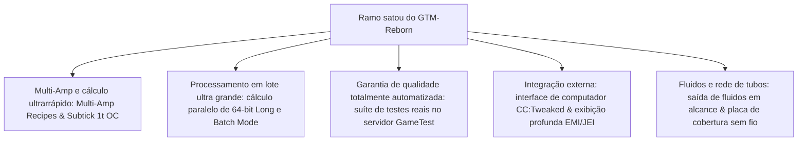

# GregTech Modern Reborn (GTM Reborn)

`modules/gtm-reborn` é um ramo independente do GregTech Modern profundamente personalizado pelo GTE-Multi (nome do ramo: `satou`).

---

## 🚀 Principais recursos aprimorados do ramo `satou`

Em comparação com o original upstream, o GTM-Reborn implementa várias evoluções tecnológicas revolucionárias e melhorias na experiência industrial no Minecraft 1.20.1 moderno de alta versão:



### 1. Paralelismo de inteiro longo de 64 bits e modo de processamento em lote (Batch Mode)
- **Superando o limite de inteiro de 32 bits**: o cálculo paralelo adota totalmente o tipo de dados `long`, resolvendo completamente problemas de estouro numérico ou truncamento de cálculo em grupos industriais ultra grandes sob paralelismo extremamente alto.
- **Modo de processamento em lote inteligente**: quando as matérias-primas são extremamente abundantes, a máquina pode empacotar centenas ou milhares de micro receitas em um único ciclo para execução, reduzindo drasticamente a carga de Tick do servidor.

### 2. Overclock instantâneo de 1T Subtick (OC_PERFECT_SUBTICK)
- Otimizou o pipeline de execução da Recipe Logic da máquina, permitindo que máquinas avançadas designadas concluam múltiplas iterações de receitas em 1 Tick, liberando o puro limite da produção industrial.

### 3. Suporte a entrada e receitas de múltiplos amperes (Multi-Amp)
- As receitas de máquinas suportam consumo/saída de corrente de múltiplos amperes (Amperes) em uma única receita, e suportam a renderização intuitiva de valores de múltiplos amperes e dicas de especificações de fios na interface EMI/JEI.

### 4. Saída de fluidos em alcance (Ranged Fluid Outputs)
- Permite que torres de destilação avançadas e reatores químicos produzam produtos fluidos com variação de alcance de acordo com diferentes condições de temperatura e pressão.

### 5. Integração moderna de periféricos CC:Tweaked (ComputerCraft)
- Todas as máquinas padrão abrem interfaces periféricas para o ComputerCraft:
  - Consulta em tempo real do progresso da receita, tempo restante e consumo atual de EU/t.
  - Ativar, pausar ou alternar o modo de operação dinamicamente via scripts Lua.

---

## 🧪 Testes automatizados e verificação GameTest

O GTM-Reborn inclui uma suíte completa de testes automatizados GameTest nativos do Minecraft (localizada em `src/test`):

```powershell
# Executa o teste automatizado do servidor GameTest
$env:JAVA_HOME='C:\Users\Ex_Je\.jdks\ms-21.0.11'
.\gradlew.bat :modules:gtm-reborn:runGameTestServer
```

### Escopo de cobertura de testes
- **Sistema Cover**: testa a lógica de throughput e prevenção de vazamentos das placas de bomba de fluidos, placas de transporte de itens e placas de condução de energia.
- **Recipe Logic de máquinas**: testa multi-ampere, processamento em lote, paralelismo entre receitas e cálculo de overclock.
- **Formação e rotação de multiblocos**: testa a validação estrutural de vários invólucros e compartimentos em diferentes orientações.

---

## 🌿 Especificações do fluxo de trabalho Git do submódulo

`modules/gtm-reborn` corresponde ao repositório Git independente `takanashisatou/GregTech-Modern-Reborn`, com o branch de desenvolvimento padrão `satou`:

```bash
# Desenvolver e commitar independentemente no submódulo
cd modules/gtm-reborn
git checkout satou
git add .
git commit -m "feat: optimize multiblock recipe logic"
git push origin satou

# Voltar ao projeto principal para atualizar o ponteiro do submódulo
cd ../..
git add modules/gtm-reborn
git commit -m "chore: bump gtm-reborn submodule pointer"
```