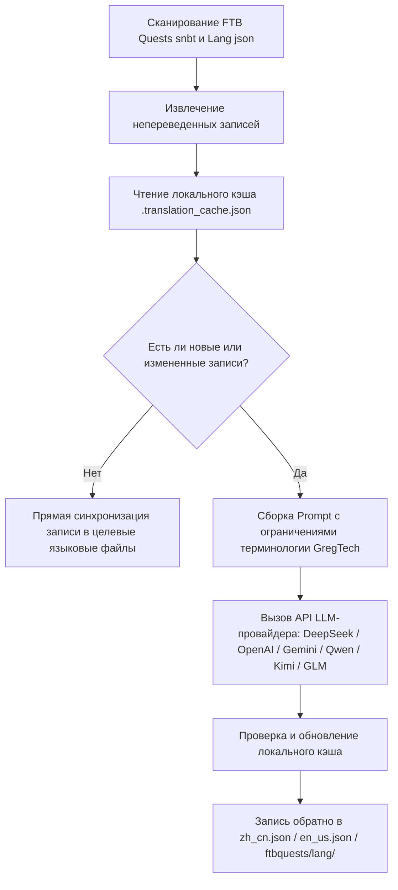

# AI-движок интернационального перевода (`opencode_translate.py`)

GTE спроектировал и реализовал полностью автоматизированную систему интернационального перевода между модами на основе современных больших языковых моделей (LLM) (расположена в `scripts/opencode_translate.py`).

---

## 🤖 Архитектура движка перевода

Традиционные сообщества по локализации полагаются на ручное сопровождение громоздких JSON и SNBT текстов, что приводит к задержкам обновлений и высокой вероятности ошибок и пропусков.

Движок AI-перевода GTE использует стандартизированный OpenAI-совместимый API для реализации **автоматизированного инкрементального извлечения, выравнивания терминологии и конкурентного перевода** файлов заданий FTB Quests и языковых файлов основных модов:



---

## 🔑 Поддерживаемые LLM-провайдеры и переменные окружения

Скрипт поддерживает бесшовное переключение между различными AI-провайдерами через переменные окружения:

| Провайдер | Переменная окружения API Key | Переменная окружения Base URL | Модель по умолчанию |
| :--- | :--- | :--- | :--- |
| **DeepSeek** | `DEEPSEEK_API_KEY` | `DEEPSEEK_BASE_URL` | `deepseek-chat` |
| **OpenAI** | `OPENAI_API_KEY` | `OPENAI_BASE_URL` | `gpt-4o-mini` |
| **Google Gemini** | `GEMINI_API_KEY` | `GEMINI_BASE_URL` | `gemini-3.5-flash` |
| **Tongyi Qianwen (DashScope)** | `DASHSCOPE_API_KEY` | `DASHSCOPE_BASE_URL` | `qwen-plus` |
| **Moonshot AI** | `MOONSHOT_API_KEY` | `MOONSHOT_BASE_URL` | `moonshot-v1-8k` |
| **Zhipu GLM** | `ZHIPU_API_KEY` | `ZHIPU_BASE_URL` | `glm-4-flash` |
| **Платформа OpenCode** | `OPENCODE_API_KEY` | `OPENCODE_BASE_URL` | `deepseek-v4-flash` |
| **Универсальный агрегатор** | `LLM_API_KEY` | `LLM_BASE_URL` | `LLM_MODEL` (пользовательский) |

---

## 🎯 Принципы промышленных ограничений Prompt

При вызове API для перевода система включает строгие правила терминологии Minecraft и GregTech:
1. **Абсолютное сохранение форматтеров**: Полное сохранение нативных цветовых кодов форматирования Minecraft (например, `§a`, `§c`, `§6`) и плейсхолдеров (`%s`, `%d`, `{0}`).
2. **Стандартизация технической терминологии**: Строгая фиксация перевода технических терминов (например, `UHV`, `EU/t`, `Amps`, `Voltage`, `Overclock`, `Subtick` и т.д.).
3. **Инкрементальный хэш-кэш**: Все переведенные записи автоматически сохраняются в `.translation_cache.json`; сетевые запросы отправляются только для новых или измененных текстов, что значительно экономит затраты на токены и время CI.

---

## 💻 Команда локального запуска

Запустите полный перевод одним нажатием в локальной среде разработки:

```powershell
# Установите любой действительный API Key перед выполнением
$env:DEEPSEEK_API_KEY="sk-..."
python scripts/opencode_translate.py
```