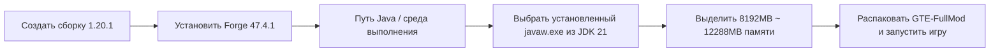

# Руководство по загрузке сборки и клиентскому пакету со всеми модами

GTE (GregTech Easy) предлагает три формата поставки для игроков и владельцев серверов с разным техническим уровнем:

1. **Пакет в формате CurseForge (`GTE-CurseForge-*.zip`)** — стандартный формат импорта для лаунчеров: содержит `manifest.json`, моды лежат в `overrides/mods/`, а Forge лаунчер устанавливает автоматически. **Это рекомендуемый вариант для большинства игроков.**
2. **Клиентский пакет со всеми модами (`GTE-FullMod-*.zip`)** — плоский архив, содержащий только игровое наполнение на верхнем уровне, для игроков, которые сами настраивают сборку.
3. **Серверный пакет (`GTE-Server-*.zip`)** — выделенный серверный пакет Forge, где `mods/` находится на верхнем уровне архива, для создания сервера и совместной игры.

---

## 📦 Клиентский пакет со всеми модами

### Структура архива

```text
README_安装必看.txt
mods/            (17 Jar-файлов)
config/
defaultconfigs/
kubejs/
```

Вложенного каталога `.minecraft/` нет, лаунчер и `run_game.bat` в архив не входят. Сам Minecraft и Forge устанавливает ваш лаунчер, поэтому этот пакет предполагает, что **вы уже умеете создавать сборку в лаунчере**.

### Обязательные требования к окружению

| Параметр | Версия | Примечание |
| :--- | :--- | :--- |
| **Minecraft** | `1.20.1` | Другие версии не подходят |
| **Forge** | `47.4.1` | Ровно эта версия, без исключений |
| **Java** | `21` | Ни в коем случае не Java 17 и не Java 8 |

> [!CAUTION]
> **Forge должен быть именно 47.4.1, а не «47.4.1 или любая более новая сборка».**
> - Мод `gtmthings` требует Forge `[47.4.1,)`, поэтому всё, что ниже, просто не загрузится;
> - но Forge 47.4.10 поставляется с ASM 9.8 + coremods 5.2.4, из-за чего ломаются миксины `appliedenergistics2` 15.4.9 и игра никогда не доходит до главного меню.
>
> 47.4.1 — единственная работоспособная версия.

### Шаги установки

=== "Способ 1: Настроить сборку самостоятельно (этот пакет)"

    1. В лаунчере (подойдут PCL2 / HMCL / Prism / MultiMC / официальный лаунчер) создайте сборку Minecraft **1.20.1** и установите **Forge 47.4.1**.
    2. Запустите её один раз и убедитесь, что доходите до главного меню (это исключает проблемы лаунчера и Java).
    3. Откройте игровой каталог этой сборки (папку `.minecraft`; в лаунчерах обычно есть кнопка «открыть папку»).
    4. Распакуйте туда содержимое `GTE-FullMod-<версия>.zip`, объединив с уже существующими папками с теми же именами.
    5. В настройках сборки укажите **Java 21** и выделите **8–12 ГБ** оперативной памяти.
    6. Запустите игру. Первый запуск создаёт конфигурации и идёт медленнее обычного.

=== "Способ 2: Импорт в лаунчер одним кликом (рекомендуется)"

    Возьмите вместо него `GTE-CurseForge-<версия>.zip` и выберите **импорт сборки** в CurseForge App / PCL2 / HMCL / Prism Launcher / MultiMC. В этом пакете есть `manifest.json`, поэтому лаунчер сам установит Forge и ручная настройка не потребуется.

=== "Способ 3: Запуск сервера"

    Возьмите вместо него `GTE-Server-<версия>.zip`: там `mods/` лежит на верхнем уровне архива. Распакуйте его в корень сервера, выполните `java -jar forge-*-installer.jar --installServer`, затем запускайте с `@libraries/net/minecraftforge/forge/1.20.1-47.4.1/unix_args.txt nogui`.

> [!WARNING]
> Jar-файлы, имена которых заканчиваются на `-slim.jar` или `-dev-slim.jar`, — это артефакты для потребителей Maven, они намеренно не содержат вложенных jar-in-jar зависимостей и **никогда** не должны попадать в `mods/`. Иначе Forge выберет сборку `gtceu` без встроенного `ldlib` и прервёт запуск с ошибкой `Missing or unsupported mandatory dependencies: Mod ID: 'ldlib' ... [MISSING]`. Ни в одном из трёх публикуемых пакетов таких файлов нет.

---

## ⚠️ Требования к среде выполнения Java 21 (крайне важно)

> [!CAUTION]
> **Для этой сборки обязательно требуется среда выполнения Java 21 (JDK 21)!**
> Не используйте **Java 17** или **Java 8**, иначе игра вылетит или откажется запускаться!

### Почему обязательно Java 21?
- Основные моды GTE (`gtecore`, `gtm-reborn`, `gt--`) полностью используют **современные возможности языка Java 21** (например, Record Patterns, Virtual Threads, улучшенный Switch).
- Скрипты сборки Gradle глобально настроены на `JavaLanguageVersion.of(21)` с принудительной проверкой инструментария.

### Рекомендуемые ссылки для загрузки JDK 21

| Дистрибутив | Ссылка для загрузки | Причина рекомендации |
| :--- | :--- | :--- |
| **Azul Zulu 21 (LTS)** | [Перейти на сайт Azul](https://www.azul.com/downloads/?version=java-21-lts) | Отличная производительность, превосходная оптимизация для многопоточности Minecraft |
| **Eclipse Temurin 21 (LTS)** | [Перейти на сайт Adoptium](https://adoptium.net/temurin/releases/?version=21) | Официально рекомендуется, высокая совместимость и стабильность |
| **Microsoft OpenJDK 21** | [Перейти на сайт Microsoft](https://learn.microsoft.com/zh-cn/java/openjdk/download) | Хорошая нативная адаптация для Windows |

### Настройка Java 21 в лаунчере



---

## 🎮 Горячие клавиши и часто используемые команды в игре

| Команда / горячая клавиша | Описание функции | Требуемые права |
| :--- | :--- | :--- |
| `/ftbquests editing_mode true` | Включить режим визуального редактирования книги заданий (режим автора) | Права оператора |
| `/ftbquests reload` | Горячая перезагрузка конфигурационных файлов FTB Quests | Для всех |
| `/kubejs reload server_scripts` | Горячая перезагрузка серверных скриптов модификаций и рецептов | Права оператора |
| `/kubejs reload client_scripts` | Горячая перезагрузка клиентских скриптов модификаций и логики отображения | Без прав |
| `/dumpmultiblock` | Экспорт кода мультиблочной структуры одним кликом после выделения области деревянным топором | Права оператора |
| <kbd>U</kbd> / <kbd>R</kbd> | Просмотр использования (Usage) / рецепта (Recipe) предмета под курсором | Горячие клавиши EMI / JEI |
| <kbd>F7</kbd> | Просмотр уровня освещённости вокруг (красный крест указывает зоны спавна мобов) | Клиентская горячая клавиша |
