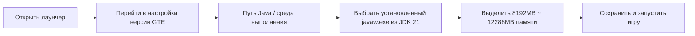

# Руководство по загрузке сборки и ленивому пакету для игроков

GTE (GregTech Easy) предлагает три готовых к использованию формата поставки для игроков и владельцев серверов с разным техническим уровнем:

1. **Полный ленивый пакет для игроков (`GTE-LazyPack-*.zip`)** — содержит все предварительно скомпилированные моды, конфигурации, скрипты модификаций и полную структуру каталога `.minecraft`. **Достаточно двойного клика или перетаскивания в лаунчер для игры.**
2. **Пакет в формате CurseForge (`GTE-CurseForge-*.zip`)** — стандартный формат CurseForge, можно импортировать одним кликом в PCL2 / HMCL / CurseForge App / Prism Launcher.
3. **Серверная сборка (`GTE-Server-*.zip`)** — содержит чистую серверную конфигурацию, моды и скрипты запуска для создания сервера и совместной игры.

---

## 🚀 Ленивый пакет для игроков (рекомендуется)

### Особенности и преимущества
- **0 зависимостей компиляции**: не требуется установка JDK, IntelliJ IDEA или Git.
- **Полная упаковка**: последние релизные Jar-файлы `gtecore`, `gtm-reborn`, `gt--` и дополнительные расширяющие моды уже встроены в каталог `mods/`.
- **Играй сразу**: поддержка перетаскивания в окно PCL2 / HMCL для импорта одним кликом.

### Шаги по импорту и запуску

=== "Способ 1: Перетаскивание в лаунчер (рекомендуется)"

    1. Откройте **PCL2 (Plain Craft Launcher 2)** или **HMCL (Hello Minecraft! Launcher)**.
    2. Перетащите загруженный `GTE-LazyPack-<версия>.zip` **левой кнопкой мыши** в главное окно лаунчера.
    3. Лаунчер автоматически распознает и распакует его в список версий игры.
    4. Перейдите в **настройки версии** и укажите **Java 21** в качестве среды выполнения.
    5. Выделите **8–12 ГБ** оперативной памяти и запустите игру!

=== "Способ 2: Ручная распаковка"

    1. Распакуйте архив в любой путь без кириллицы и пробелов (например, `D:\Games\GTE\`).
    2. После распаковки вы получите каталог `.minecraft`, содержащий `mods/`, `config/`, `kubejs/`.
    3. В лаунчере добавьте версию игры и укажите корневой каталог игры как распакованную папку `.minecraft`.
    4. Убедитесь, что выбран **Java 21** и запустите игру.

---

## ⚠️ Требования к среде выполнения Java 21 (крайне важно)

> [!CAUTION]
> **Для этой сборки обязательно требуется среда выполнения Java 21 (JDK 21)!**
> Не используйте **Java 17** или **Java 8**, иначе игра вылетит или откажется запускаться!

### Почему обязательно Java 21?
- Основные моды GTE (`gtecore`, `gtm-reborn`, `gt--`) полностью используют **современные возможности языка Java 21** (например, Record Patterns, Virtual Threads, улучшенный Switch).
- Скрипты сборки Gradle глобально настроены на `JavaLanguageVersion.of(21)` с принудительной проверкой инструментария.

### Рекомендуемые ссылки для загрузки JDK 21

| Дистрибутив | Ссылка для загрузки | Причина рекомендации |
| :--- | :--- | :--- |
| **Azul Zulu 21 (LTS)** | [Перейти на сайт Azul](https://www.azul.com/downloads/?version=java-21-lts) | Отличная производительность, превосходная оптимизация для многопоточности Minecraft |
| **Eclipse Temurin 21 (LTS)** | [Перейти на сайт Adoptium](https://adoptium.net/temurin/releases/?version=21) | Официально рекомендуется, высокая совместимость и стабильность |
| **Microsoft OpenJDK 21** | [Перейти на сайт Microsoft](https://learn.microsoft.com/zh-cn/java/openjdk/download) | Хорошая нативная адаптация для Windows |

### Настройка Java 21 в лаунчере

---

## 🎮 Горячие клавиши и часто используемые команды в игре

| Команда / горячая клавиша | Описание функции | Требуемые права |
| :--- | :--- | :--- |
| `/ftbquests editing_mode true` | Включить режим визуального редактирования книги заданий (режим автора) | Права оператора |
| `/ftbquests reload` | Горячая перезагрузка конфигурационных файлов FTB Quests | Для всех |
| `/kubejs reload server_scripts` | Горячая перезагрузка серверных скриптов модификаций и рецептов | Права оператора |
| `/kubejs reload client_scripts` | Горячая перезагрузка клиентских скриптов модификаций и логики отображения | Без прав |
| `/dumpmultiblock` | Экспорт кода мультиблочной структуры одним кликом после выделения области деревянным топором | Права оператора |
| <kbd>U</kbd> / <kbd>R</kbd> | Просмотр использования (Usage) / рецепта (Recipe) предмета под курсором | Горячие клавиши EMI / JEI |
| <kbd>F7</kbd> | Просмотр уровня освещённости вокруг (красный крест указывает зоны спавна мобов) | Клиентская горячая клавиша |