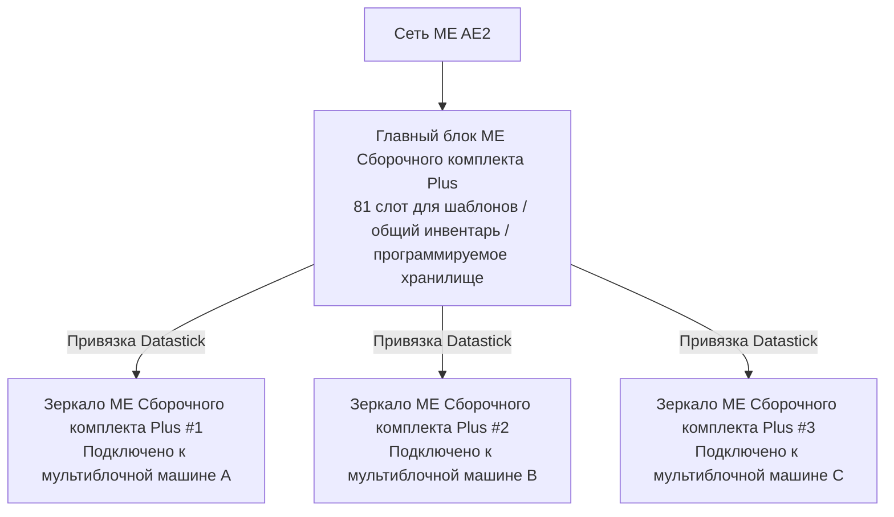

# Система глубокой интеграции AE2 и сборочного комплекта Plus

GTECore создает чрезвычайно мощный прямой мост данных между Applied Energistics 2 (AE2) и мультиблочными структурами GregTech.

---

## 🧩 ME Сборочный комплект Plus (`me_pattern_buffer_plus`)

В традиционных технических модах подключение интерфейса AE2 к мультиблочным машинам обычно сталкивается с такими проблемами, как **недостаточное количество слотов, невозможность смешивать жидкости и предметы в одном выводе, а также сложность совместного использования шаблонов несколькими машинами**.

Разработанный GTECore **ME Сборочный комплект Plus** полностью решает эту проблему:

### Основные возможности
1. **Огромная емкость шаблонов**: Один главный блок имеет **81 слот для шаблонов** (эквивалент 9 стандартных интерфейсов AE2).
2. **Универсальные возможности**: Одновременно поддерживает `IMPORT_ITEMS`, `IMPORT_FLUIDS`, `EXPORT_ITEMS`, `EXPORT_FLUIDS`, что позволяет смешивать жидкости и предметы в одном контейнере.
3. **Поддержка программируемого хранилища**: Встроенный механизм Programmable Storage обеспечивает точную подачу и кэширование для сложных рецептов.

---

## 🪞 Зеркало ME Сборочного комплекта Plus (`me_pattern_buffer_proxy_plus`)

**Зеркало ME Сборочного комплекта Plus** — это революционный компонент распределенной автоматизации:

### Принцип работы и совместное использование между машинами
- Установите зеркало в любой слот мультиблочной машины.
- Держите **Datastick** в руке, нажмите ПКМ по главному **ME Сборочному комплекту Plus**, чтобы считать координаты, затем нажмите ПКМ по **Зеркалу ME Сборочного комплекта Plus** для привязки.
- **Все привязанные зеркала будут в реальном времени разделять все 81 шаблон, размещенные в главном блоке**!
- Когда сеть AE2 запускает автоматическое создание, сеть автоматически распределяет нагрузку между всеми свободными зеркальными машинами для параллельной работы!

### Отображение состояния в Jade
При наведении на главный блок или зеркало Jade автоматически показывает:
- Главный блок: `Количество подключенных зеркал: X`
- Зеркало: `Привязано к - X: ..., Y: ..., Z: ...`

---

## 💨 ME Паровой шлюз (`me_steam_hatch`)

- **Функция**: Прямое подключение сети жидкостей AE2 к паровой мультиблочной структуре.
- **Действие**: Паровой мультиблочной структуре больше не нужны сложные высокоскоростные паропроводы и резервуары; она может мгновенно получать пар из сети ME с максимальной пропускной способностью, устраняя узкие места в трубопроводах.