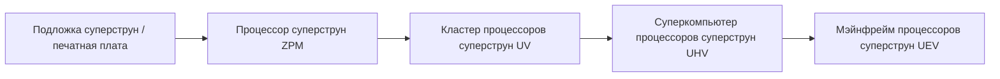
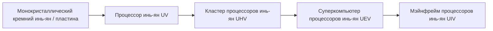

# Система высокоуровневых схем и материалов суперструн и инь-ян

GTECore расширяет две основные ветви высокоуровневых схем на протяжении всего цикла от ZPM до MAX — **систему схем суперструн** и **систему схем инь-ян тайцзи**, а также автоматизирует большой цикл материалов с помощью центра комплексной обработки руды.

---

## 🌌 Система схем суперструн (Super String Circuitry)

Схемы суперструн получают сверхсветовую вычислительную мощность из высокоразмерных колеблющихся струн и охватывают в основном диапазон напряжений **ZPM ➜ UEV**:

### Материалы суперструн и струнные вещества
- **Струна происхождения (`item.gtecore.original_string`)**: источник колебаний высокоразмерной вселенной.
- **α-струна / β-струна / γ-струна (`alpha_string`, `beta_string`, `gamma_string`)**: полимеры суперструн с разными уровнями энергии и поляризации.
- **Смеситель суперструн (`super_string_mixer`)**, **Струна творения (`string_of_creation`)** и **Массив осцилляторов суперструн (`super_string_oscillator_array`)**: используются для расщепления, настройки и высокоуровневого затвердевания суперструнных материалов.

---

## ☯️ Система схем инь-ян тайцзи (Yin-Yang Circuitry)

Система схем инь-ян следует философии циклического взаимопорождения и взаимопреодоления **«инь рождает ян, ян рождает инь, бесконечное продолжение»** и охватывает **UV ➜ UIV** и даже более высокие пределы:

### Специальные талисманы восьми триграмм и пяти элементов
- **Пять элементов**: элемент металла (`jinyuansu`), элемент дерева (`muyuansu`), элемент воды (`shuiyuansu`), элемент огня (`huo`), элемент земли (`tuyuansu`).
- **Талисманы пяти элементов**: талисман металла, талисман дерева, талисман воды, талисман огня, талисман земли.
- **Символы восьми триграмм и чипы**: символьные камни и основные чипы восьми триграмм: Цянь, Кунь, Чжэнь, Сюнь, Кань, Ли, Гэнь, Дуй.
- **Частица трёх чистых (`god_nugget`)**: высочайшая синтетическая среда, концентрирующая энергию неба и земли.

---

## 💎 Режимы рецептов центра комплексной обработки руды

**Центр комплексной обработки руды (`ore_process_center`)** имеет 7 стандартных режимов схем, которые можно переключать, устанавливая номер программируемой схемы в машине:

| Номер схемы | Технологический маршрут | Типы применимых минералов и особенности продукции | Коэффициент выхода |
| :---: | :--- | :--- | :---: |
| **Схема 1** | Дробление ➜ Дробление ➜ Промывка | Быстрое массовое производство основных металлических руд (железо, медь, олово и т.д.) | 5x основной продукт + побочные продукты |
| **Схема 2** | Дробление ➜ Дробление ➜ Центрифугирование | Сопутствующие ценные редкие лёгкие металлические руды | 5x основной продукт + очищенные побочные продукты центрифугирования |
| **Схема 3** | Дробление ➜ Промывка ➜ Термическое разделение ➜ Дробление | Высокотемпературные огнеупорные руды, руды благородных металлов (платиновая группа, золото, серебро и т.д.) | 5-6x + чистый металлический порошок |
| **Схема 4** | Дробление ➜ Термическое разделение ➜ Дробление | Сульфидные и сильно сложные вкрапленные руды | 5x + специальные побочные продукты термического разделения |
| **Схема 5** | Дробление ➜ Промывка ➜ Дробление ➜ Промывка | Редкоземельные руды и многостадийные растворимые соляные руды | 6x + двойные побочные продукты промывки |
| **Схема 6** | Дробление ➜ Промывка ➜ Дробление ➜ Центрифугирование | Радиоактивные тяжёлые руды (уран, торий, плутоний) и редкоземельные элементы | 6x + тонко очищенные тяжёлые металлы центрифугированием |
| **Схема 8** | Дробление ➜ Промывка ➜ Дробление ➜ Электромагнитное обогащение | Сильномагнитные и парамагнитные минералы (магнетит, хром, титан и т.д.) | 6-8x + электромагнитный чистый порошок |